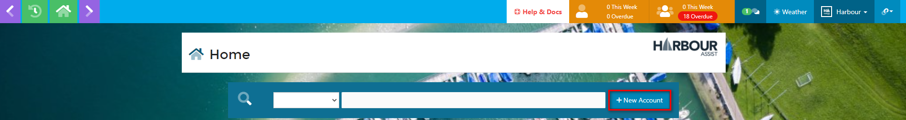
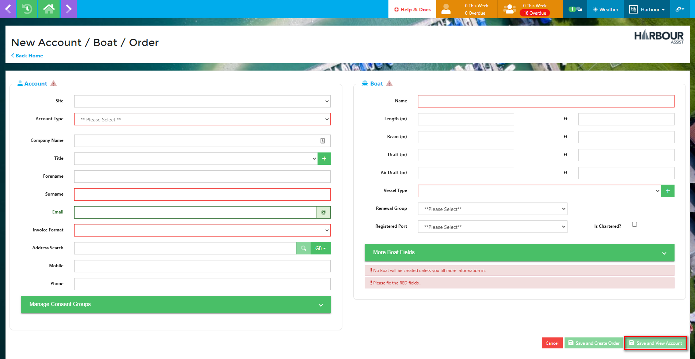
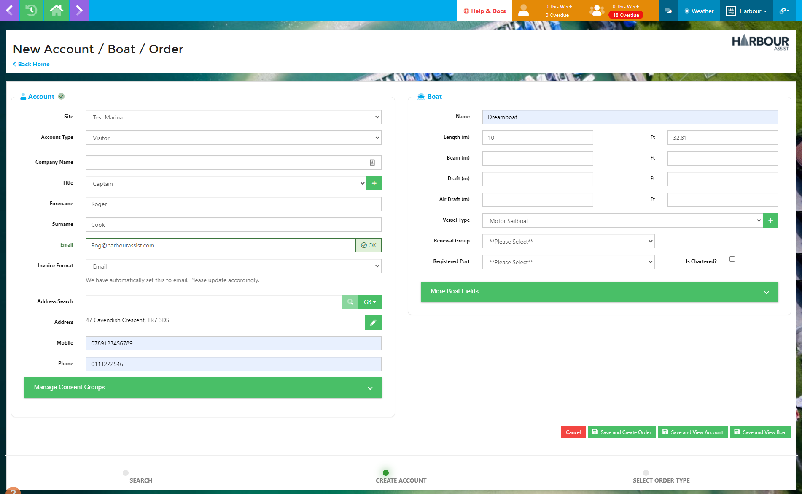
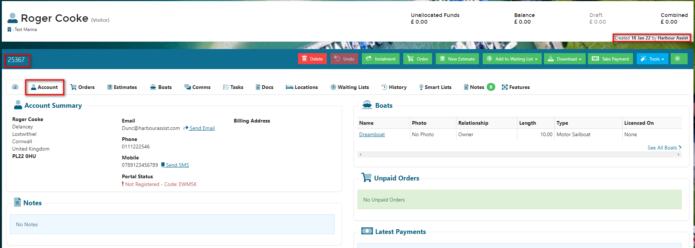

# Creating an Account #

Before creating any new account, you should first check the customer does not already have an account by following the **Finding a Customer** process noted in the **Home Page Layout** section.  

?> More documentation [here](GeneralNavigation/HomepageLayout).

This is to avoid duplicate accounts being set up.

From the **HOME** page, click on the new account button.

This will take you to the **Enter Account and Boat Details** page.  Firstly select the correct Site and Account Type by using the drop down keys, then enter as much customer and boat information as is available.  Use the *Postcode Search* facility to ensure an accurate address is entered.  Click on *Save and View Account* when you have finished.

?> NB: Accounts can be set up without a boat, just don't enter any information at all in the boat details part of the screen.

?> NB. If you enter an email address the *Invoice Format* will automatically set to 
Email - please update this accordingly if the customer wishes to be contacted by letter.

When you have saved the account, the account number, who created the account and when, will show at the top of the screen.  You can now add any further detail that you have by clicking on the Account tab.

