# Estimates

## Overview

If a customer enquires about "how much will it cost for .....?", you should create an Estimate, which can if/when the Customer decides to take it up, be converted into a Draft Order.  Estimates have the following characteristics:

- They are valid for a configurable number of days.  Once expired, they cannot be converted to a Draft Order.
- Expired Estimates can be "Regenerated" to a new Estimate, which will pick up any changes in pricing.
- Estimates can be emailed to Customers, and the email body can be edited.

?> NB: If you have not used Estimates before and cannot see the Estimates tab and button please just submit a help ticket and we can enable the feature for you.

## Viewing and Creating Estimates

Created Estimates are stored on an account in the same way that orders are.  To view any created Estimates just click on the Estimates tab on the account.

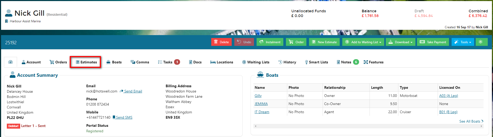

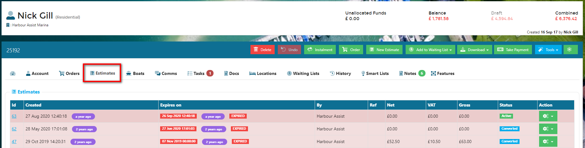

To create a new Estimate, click on the green Estimate button.

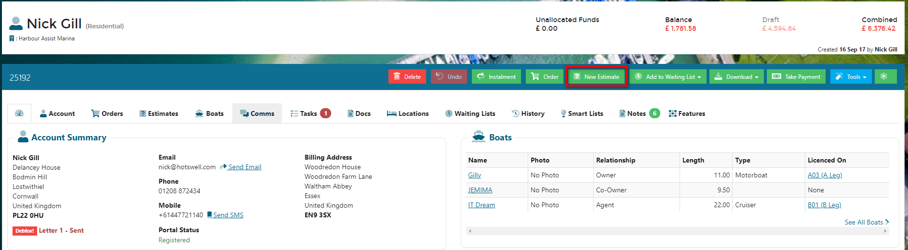

If the Estimate is for a product that has a time duration ie. a berthing contact, select the start date and departure date using the calendar pickers.  For non-duration products, such as a boat lift, just leave these blank.

Enter an expiry date for the Estimate if you wish to override the default expiry date, then click *Save*.

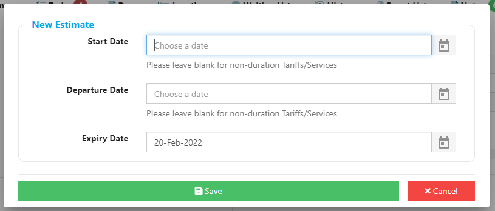

Now you can add your tariffs by clicking on the *+ Add tariffs* button.

All tariffs in your pricebook will show, so if you need to filter these down to make it easier to find the correct one, please use the tariff category filters at the top of the list.

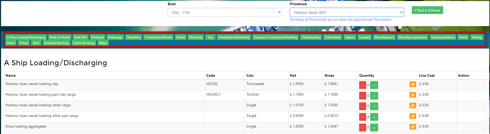

Select the quantity for the tariff(s) you want to add and then click on *Back to Estimate*.

?> NB: Duration based tariffs (ie. per night/per day calculations) will calculate automatically based on the Start Date and Departure Date you have entered on the Estimate - the quantity of 1 should be selected in these cases.

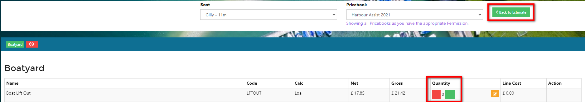

You can optionally add any notes for the customer or a reference if you wish.

The Estimate is now ready to send to the customer.  Using the *PDF* button select Download to print or Email to send via email.

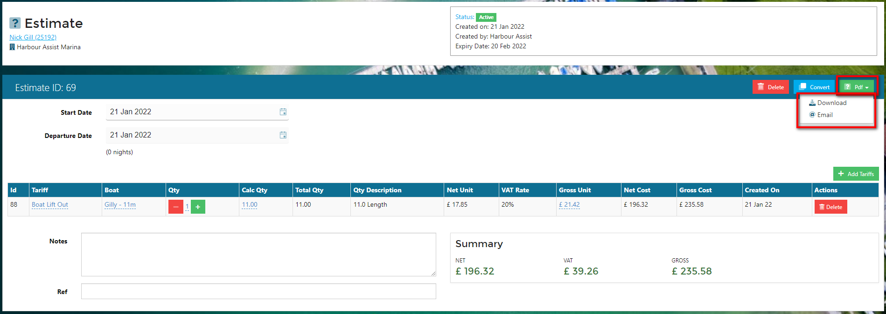

If you have selected Email a pop-up will appear where you can amend the cover email if you wish.  Once this is done click *Send*.

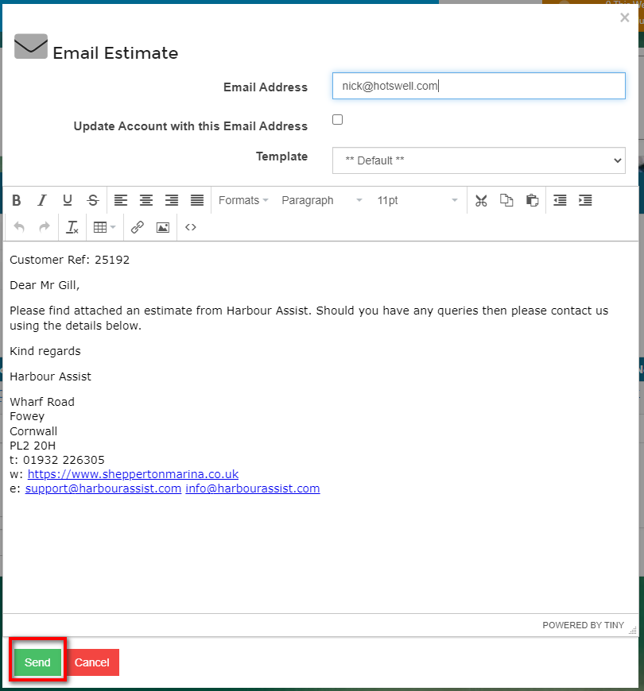

## Converting an Estimate to an Order

If a customer confirms they wish to proceed based on the Estimate price, you can convert the Estimate to an Order.

From the Estimates tab, open up the Estimate by clicking on the Actions button and Edit.

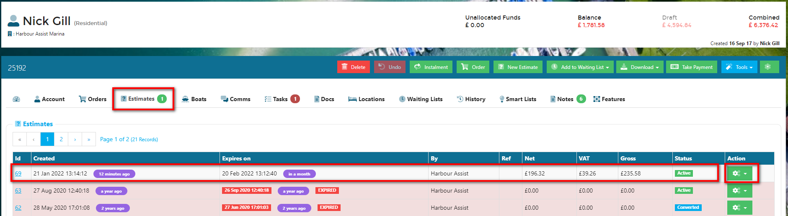

Click on the blue *Convert* button.

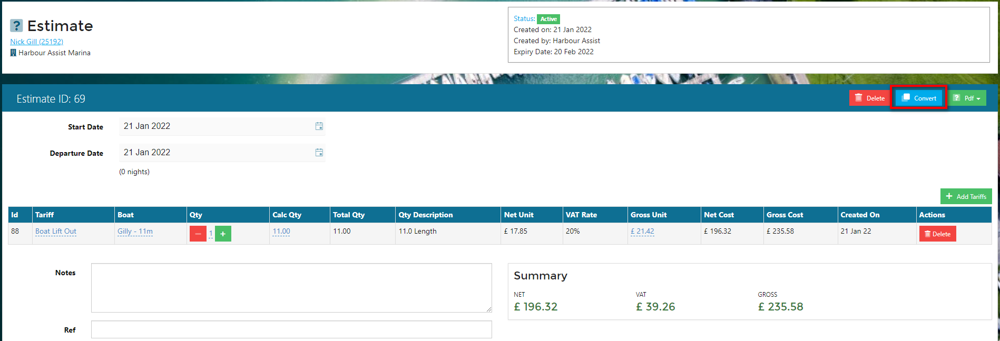

Select the relevant Order Type from the list.

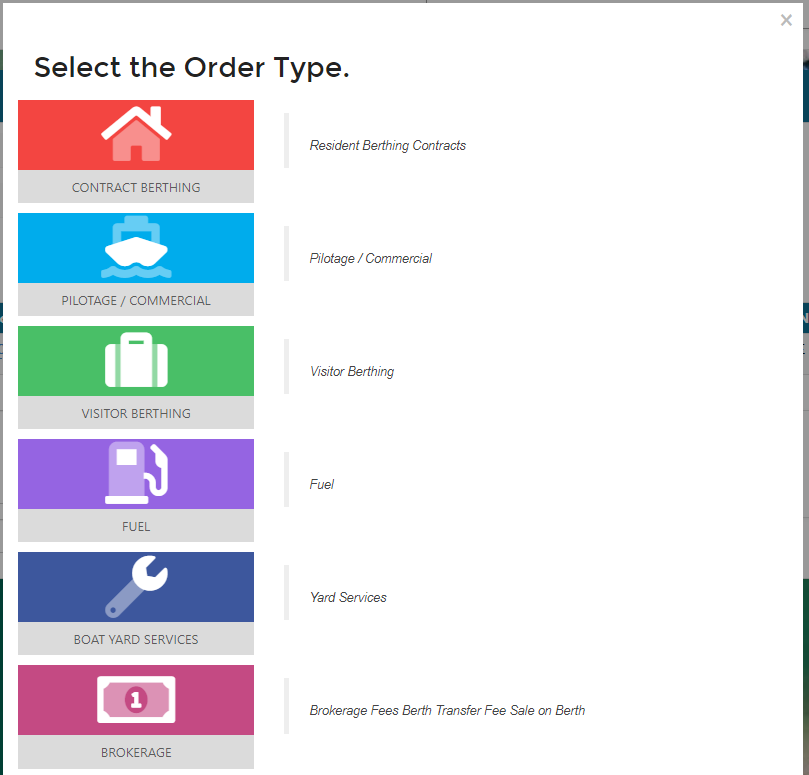

This has now converted the Estimate to a Draft Order.  As the Order is Draft you can still make any changes as necessary.

?> NB: If your Estimate had the Start and Departure dates populated the same dates will populate on the Draft Order.  All you need to do is select the Asset by clicking on the red *Asset* button; just the same as when raising an order from scratch.

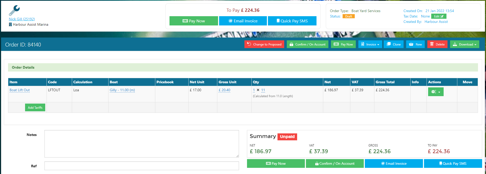

Back in the Estimates tab, the Estimate status will now show as Converted.

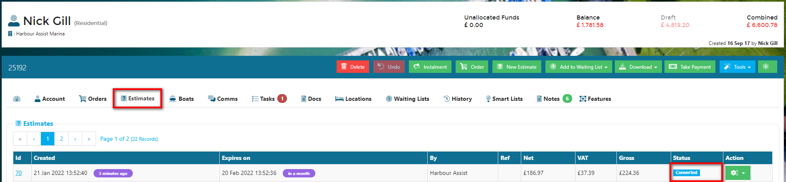

If you open up the Estimate you can see details of the Order ID it has been converted to and you can also go straight through to the Order from here.

?> NB: You are not able to make any changes to an Estimate once it has been converted.

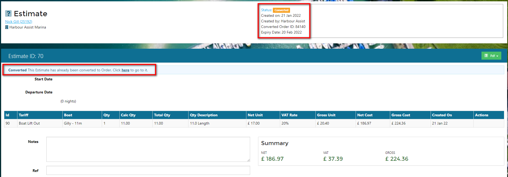

The Order will show that it was created by being converted from an Estimate.

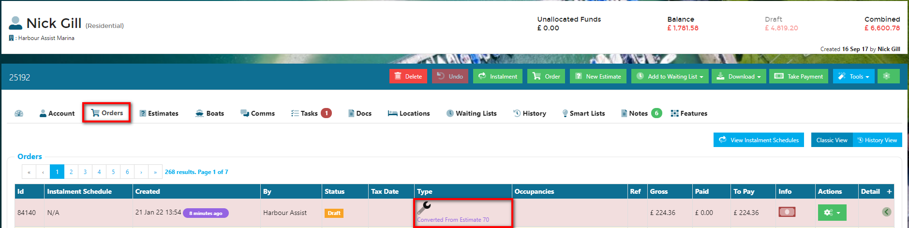