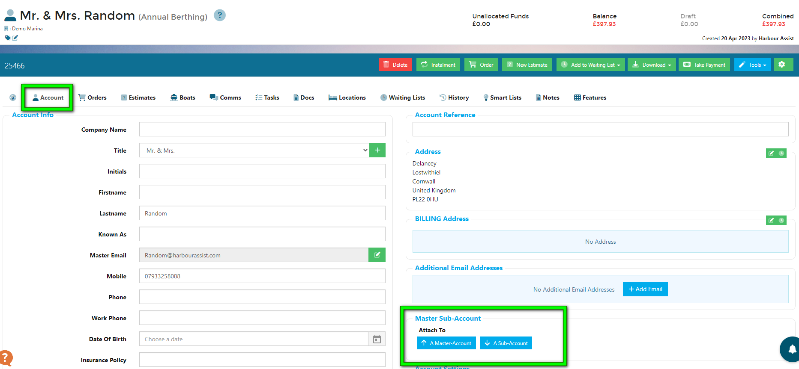
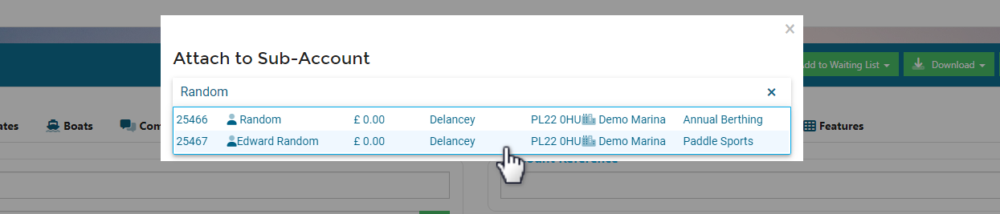
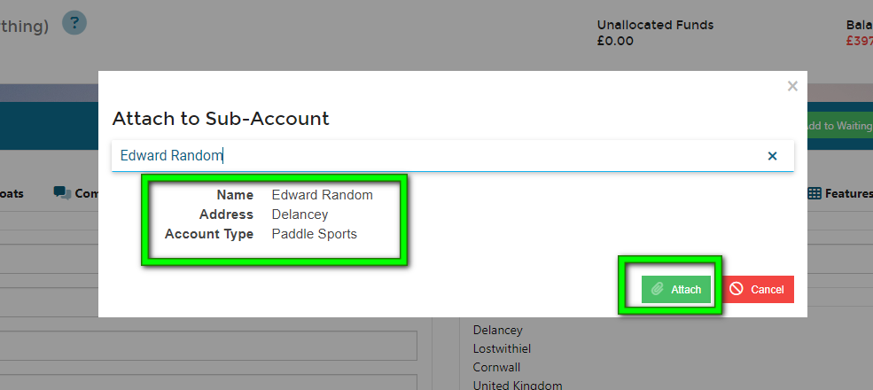
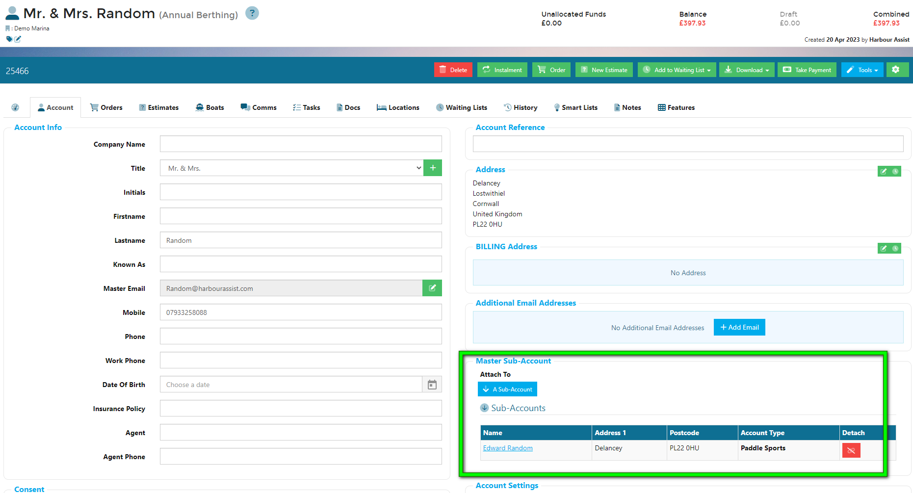
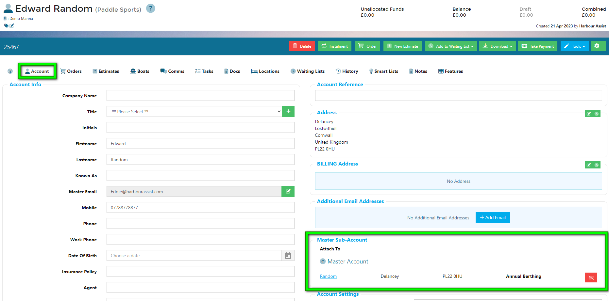

# Master & Sub-Accounts

Sometimes you might have an account under one name but is associated to another account, such as a junior membership attached to an adult membership account.

Like a Boat Relationship, you can attach a Sub-account to a Master Account and vice versa, creating a link between the two.

In the Account, go to the Account tab and on the right, select the appropriate option to attach the account you are on to either a Master Account or a Sub-Account.

Use the search tool to find the account you want to attach to and select the correct one from the list.

Check the details are correct, then click *Attach*.

The Account details will update to show the attached account.

The attached account will automatically update accordingly to show the same connection.

?> NB: Attaching accounts does not merge or link in any way the financial information of either account.  It is simply a way of seeing any relationship between accounts.
