# Plaques

Plaques are a tool that can be used against a boat for anything that you issue to a customer that has a number; things such as Harbour Dues stickers, car parking permits or a membership card.

You can have as many Plaque Types as you like and if you require any setting up just let us know by submitting a support ticket.

 

To add a Plaque to a Boat, from the Boat Page, go to the *Plaques* tab.

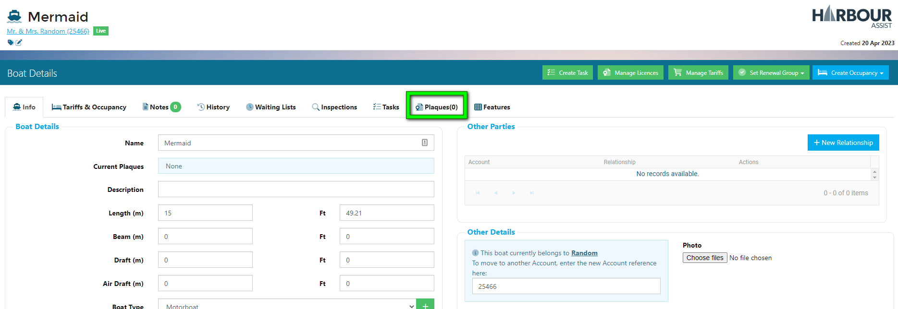

This page will display any current Plaques registered to the Boat.

To add a new Plaque, click on *+ New Plaque*.

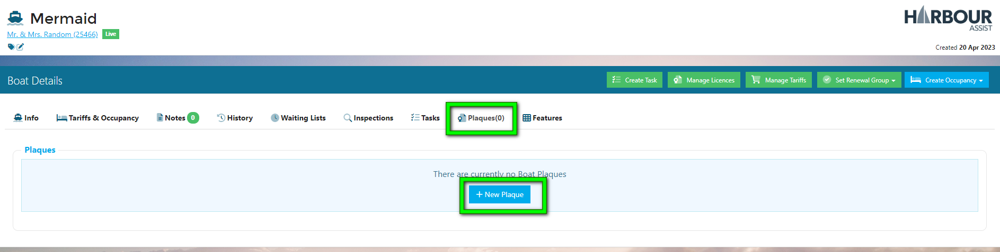

Enter in the number of the sticker/permit/card you are issuing.

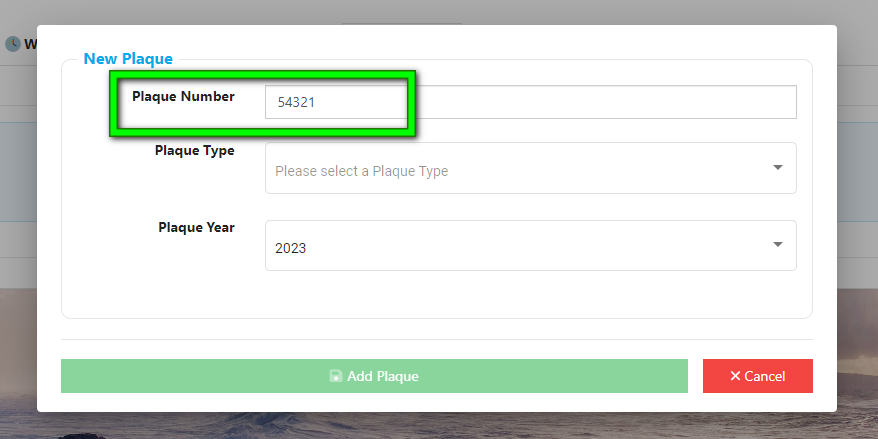

Next, select the Plaque Type from the drop-down list. 

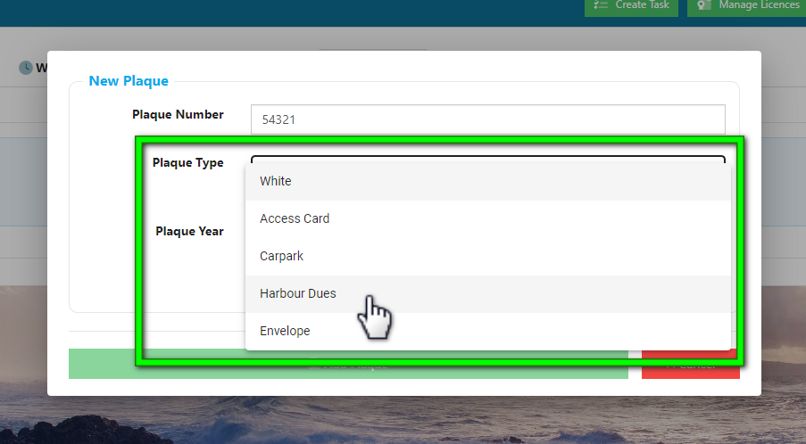

The Plaque Year will default to the current year - you can override this if necessary.

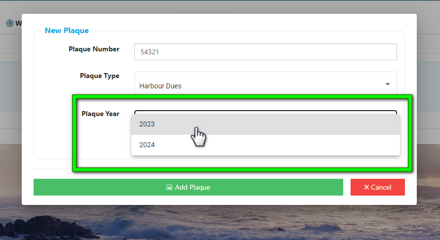

When finished, select *Add Plaque*.

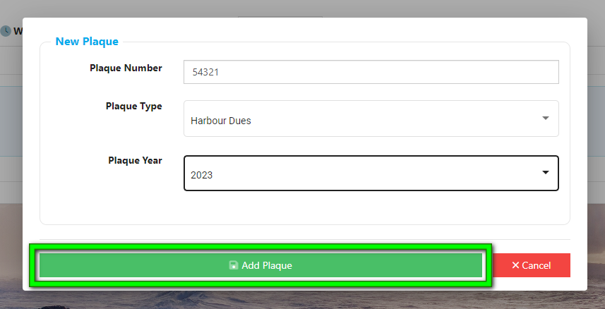

?> NB: The system will not allow you to duplicate a previously entered number of the same Plaque Type for the same year - you will receive an error message warning you of the duplication when you click on Add Plaque.

The new Plaque will now appear in the Plaques page.

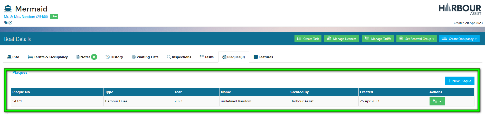

The Plaque details will also display in the overview in the Boat Info tab.

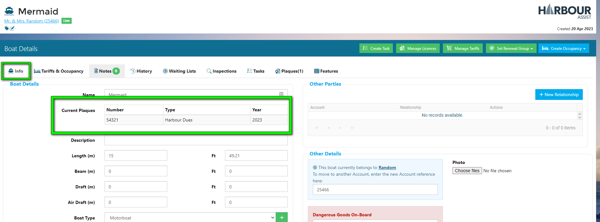

## Searching for Plaques

You can search for Plaques using the Search Tool in the Home Page.

Change you search setting to *Plaque* and begin typing in the Plaque number.

The Search Tool will display Account details associated to the characters you type in.

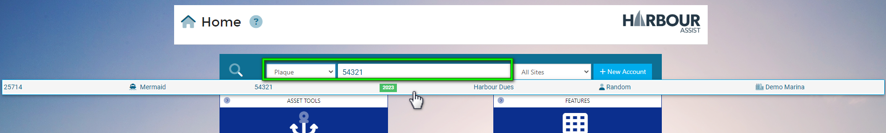

## Reporting on Plaques

There is an Issued Plaques Report in Reporting located under the Operational section.

?> More information on Reporting can be found [here](Reporting/ReportsOverview.md).

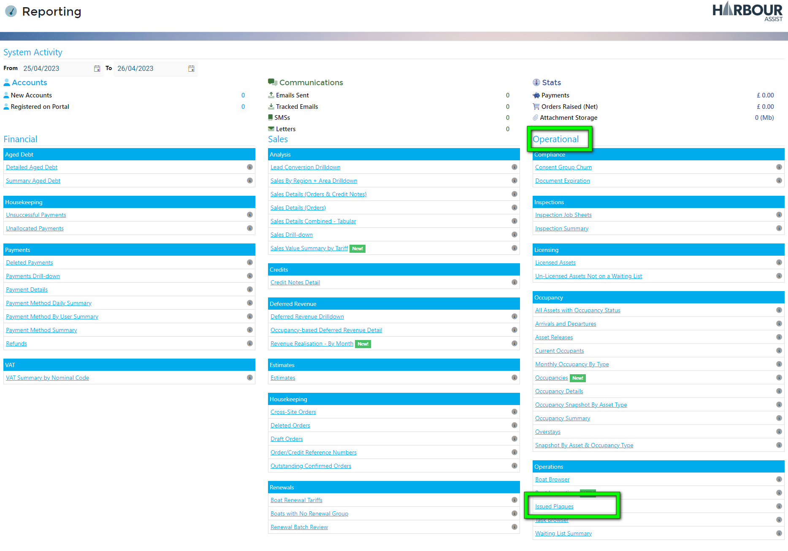

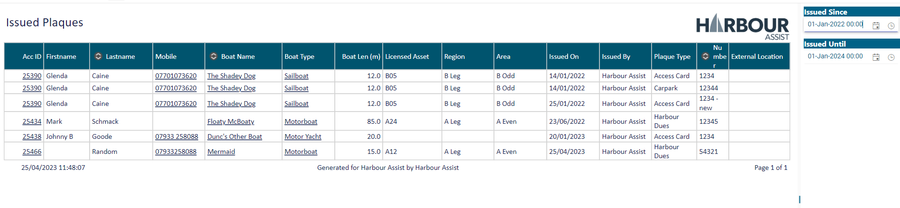