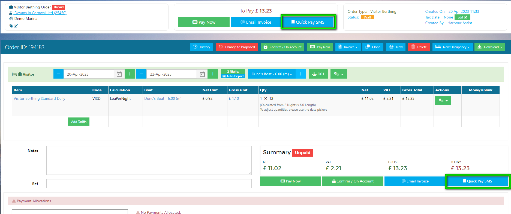
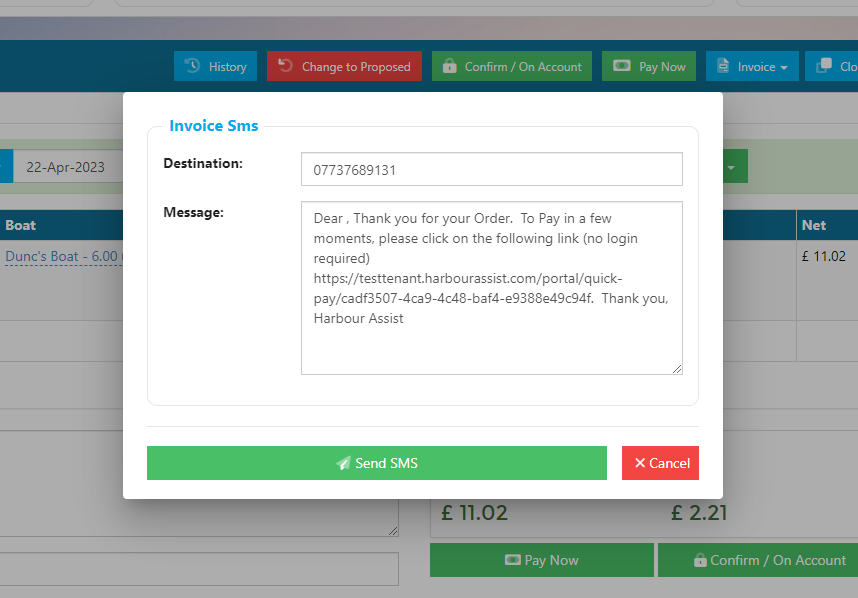
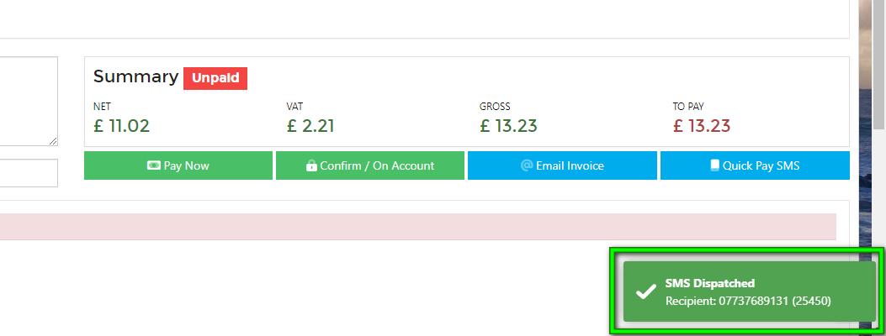
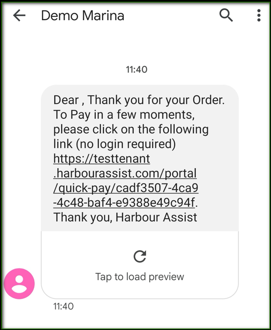
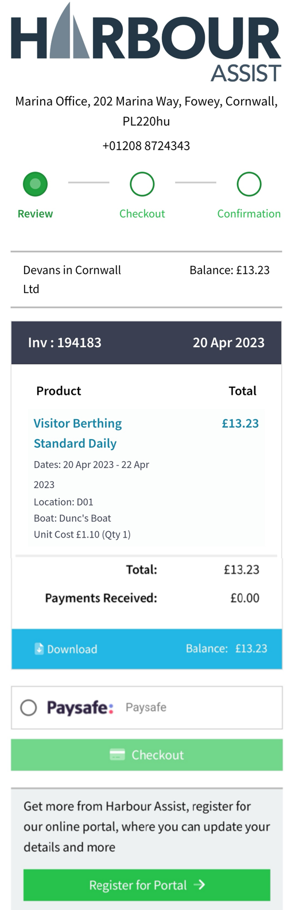

# Quick Pay - SMS

As well as sending an invoice to a customer by email for payment, you can also send an SMS to a customer containing a Quick Pay link.

?> NB.  SMS credits are required to send text messages from Harbour Assist - if you don't have any credits and would like to purchase some please contact us using the help question mark for more details. 

#### 

## Using Quick Pay by SMS

Raise an order as normal, then select *Quick Pay SMS*.

A window will pop up, confirming the contact number and draft message the customer will receive.

You can edit the message to suit, ***but don't make any changes to the link***.

When finished, click *Send SMS*.

A message will pop up confirming the SMS has been dispatched.

The customer will receive an SMS containing a link.

Customers won't even need to sign into their Portal, the link will take them to the Quick Pay process, where they can proceed to the Checkout and pay.

