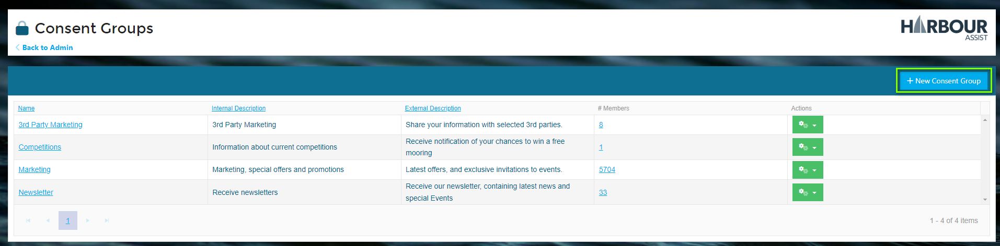
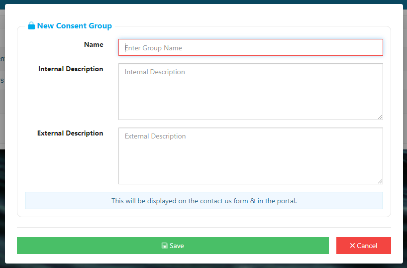

# Creating a New Consent Group

From the **Home Page**, go to *Administration*.

Next, go into *Consent Groups*.

To create a new Consent Group, click the *+New Consent Group* button.

Give your Consent Group a **Name**. 

Add an **Internal Description** - this will be what other Users of Harbour Assist will see.

Add an **External Description** - this will what your customers will see. 

When finished, click *Save*. Your new Consent Group will now appear in the list and will be visible to both Users and Customers.

