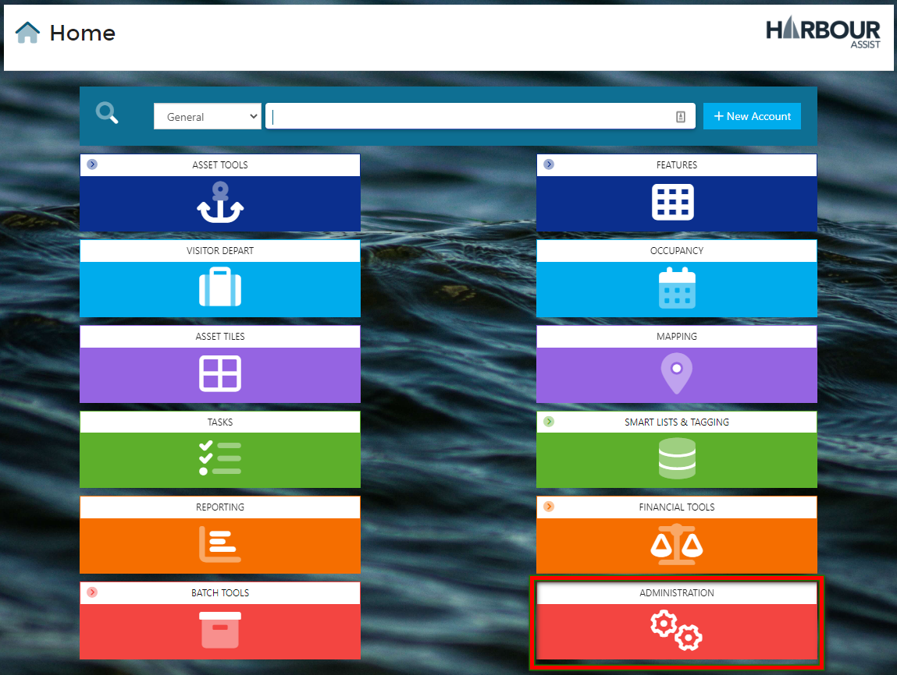
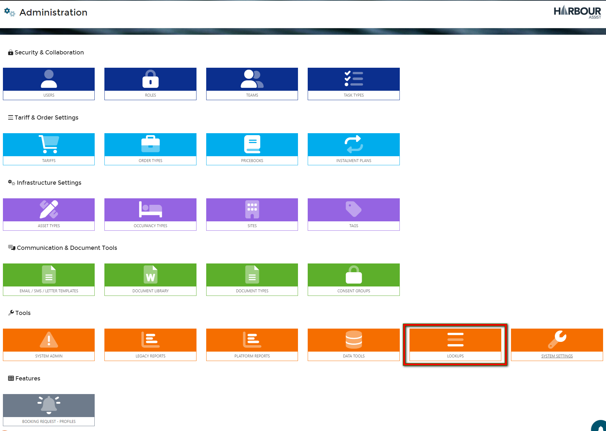
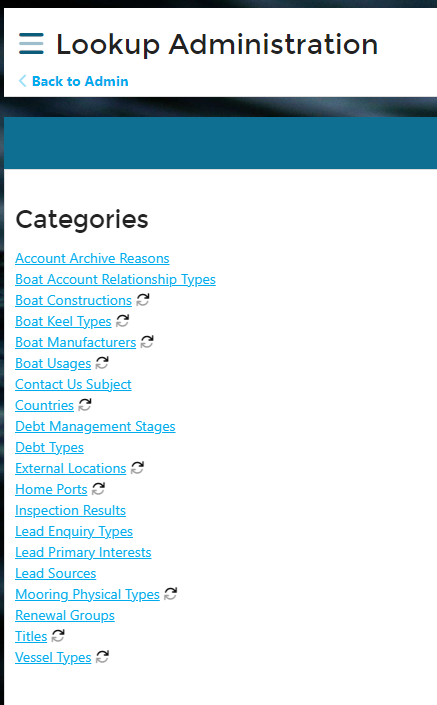
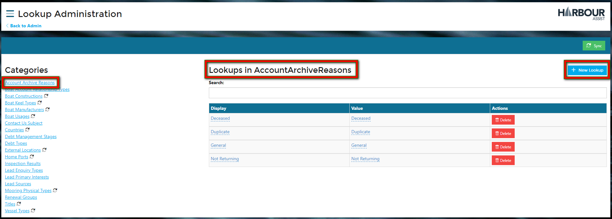
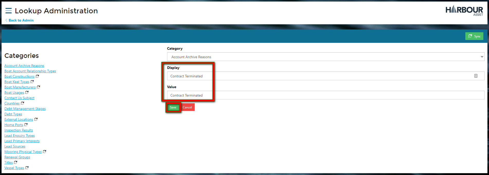
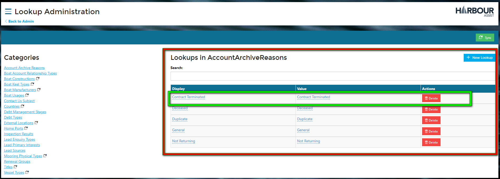
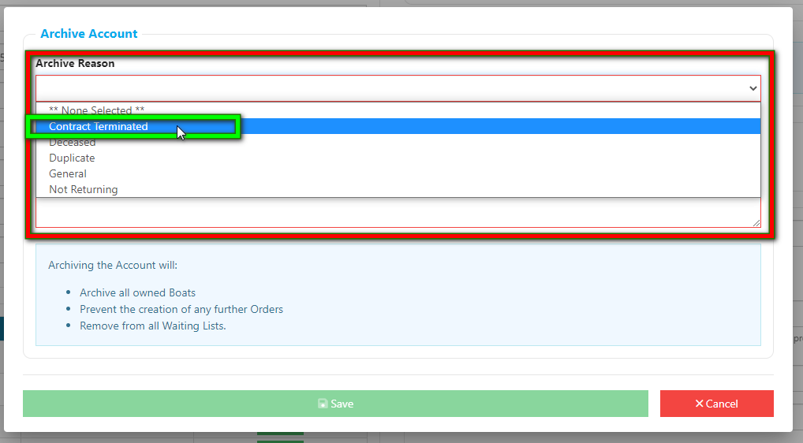

# Lookups #

Lookups are the drop down lists that appear on the Account and Boat Details pages - they are there to help speed up the process of entering data.

You can add to and edit the Lookups by accessing them through the Administration tile on the *Home* page.

Select *Lookups*.

This will show you a list of the different Lookups.

Select the Lookup list that you wish to edit or add to by clicking on the name.  In this example we are adding to *Account Archive Reasons*.  You will be shown the full details of that Lookup list.  To add to the list click on *New Lookup*.

Add the detail as you wish it to appear in the drop down list - the Display and Value cells should normally have the same information entered.  The click *Save*.

You will see that the new Lookup has now been added to the list.

The new Lookup will now appear for selection.

