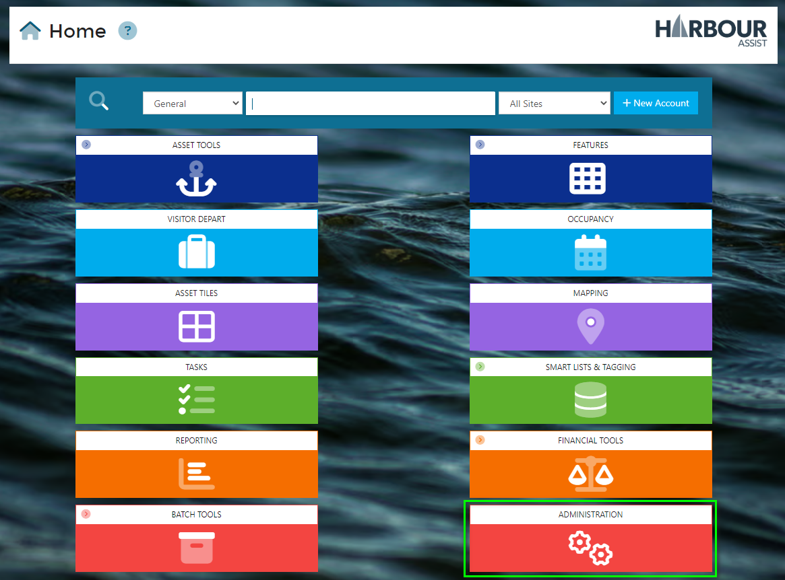
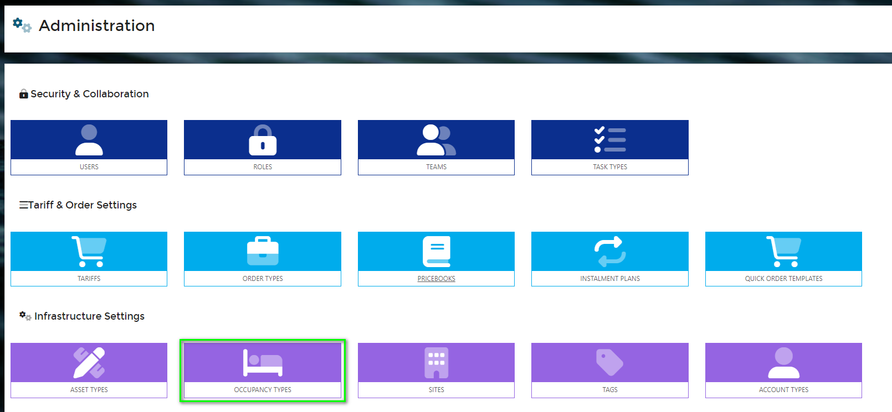
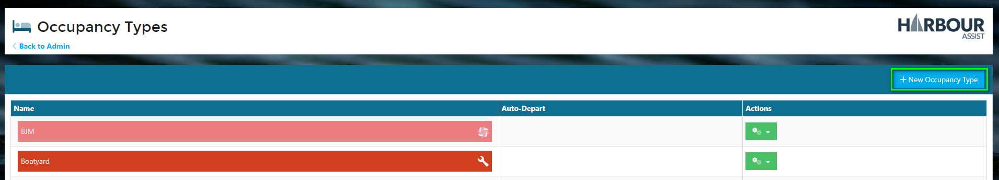
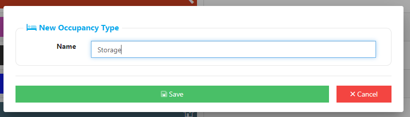

# Creating a new Occupancy Type

To create a new *Occupancy Type* or amend an existing one, from the Home page select *Administration*.

Then select *Occupancy Types*.

Select *New Occupancy Type*.

Give the *Occupancy Type* a name and click *Save*.

Now you can complete the set up of the *Occupancy Type* by adding all the configuration:-

