# Order Types #

## Explaining Order Types ##

**Order Types** are a description of the goods or services that are being provided and purchased.

Once an Account is created with an *Account Type* (see below for more information) an Order can be raised.   Multiple orders with different **Order Types** can be raised for an Account.

?> More documentation on Accounts can be found [here](AccountsOrdersPayments/Accounts)

Each Order is assigned a single **Order Type**, and the **Order Type** will determine:-

- The *Tariffs* available for composing the Order (see Tariffs and Pricebooks)
- The Invoice/Receipt template format
- Whether an Occupancy should be created and what type of Occupancy
- Custom Order-level data capture.

?> More documentation on Tariffs and Pricebooks can be found [here](AccountsOrdersPayments/TariffsPricebooks)

**Order Types** are bespoke to each business using the Harbour Assist system. 

Amendments to existing **Order Types** and creation of new ones can be carried out by Users who have the relevant permissions to enable them to do so.  

## Creating an Order Type

To create a new Order Type, from the Home Screen go to *Administration*.

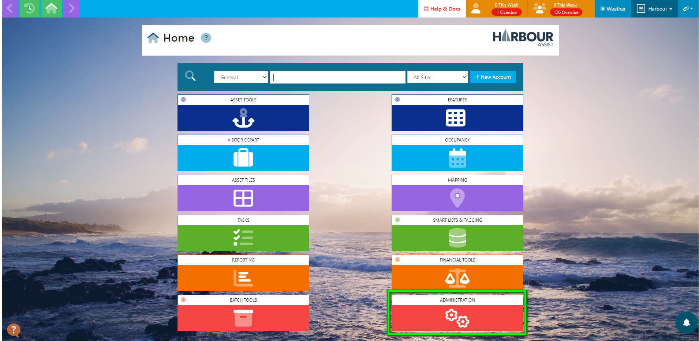

Then go into *Order Types*.

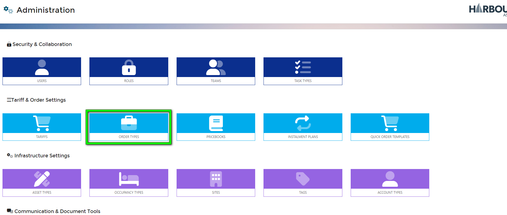

The current Order Types available are displayed in a list format.

To create a new Order Type, click 

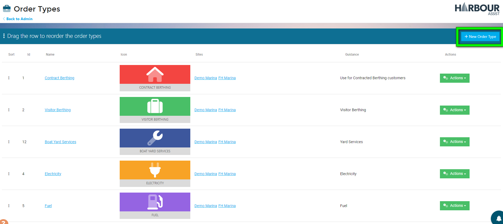

This will open the settings page on the Info Tab.

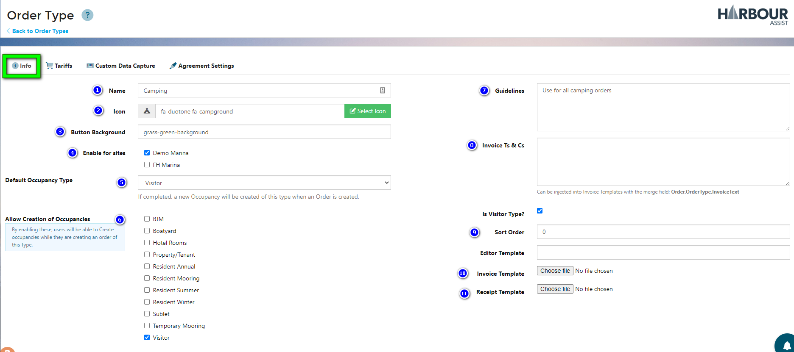

1. **Name** - Give your Order Type a name.
2. **Icon** - Choose an Icon for your Order Type. Do do this, click on *Select Icon*, enter a key word and select a suitable icon for your Order Type. 

3. **Button Background** - Enter a background colour for your Order Type. This would normally be in the format ***[colour]*-background**. 

4. **Enable for sites** - Select a site this Order Type will be available on.

5. **Default Occupancy Type** - Select the default Occupancy Type. If the Order is a type that does not allow occupancies, leave this as *None*.

6. **Allow Creation of Occupancies** - Tick the Occupancy Type boxes for all Occupancies that can be created for this Order Type. Leave unticked if no Occupancies are to be created.

7. **Guidelines** - Add any Guidelines to keep Users fully informed.

8. **Invoice Ts & Cs** - Add any specific Terms & Conditions relative to this Order Type. These can be merged into your Invoice Template, using the merge field *Order.OrderType.InvoiceText*

9. **Sort Order** - You can dictate which position this Order Type will display in when a User raises an Order. Ranked in order of most frequently used, **1** being the most frequent.

10. **Invoice Template** - If this Order Type requires a specific invoice relative to this Order Type only, you can upload your template here.

11. **Receipt Template** - If this Order Type requires a specific invoice relative to this Order type only, you can upload your template here.

  ​    

    Your work is automatically saved each time you click outside of the box you have just edited.
    
    You can check your work by clicking *< Back to Order types* to review how your new Order Type will appear.

You can continue to edit your new Order Type by clicking on the *Name*, *Icon* or by using the green actions button and selecting *Edit*.

## Adding Tariffs to an Order Type

You can restrict the Tariffs that are available to be added to an Order Type to help guide Users to use the correct Tariff.  By default only these tariffs will show for selection when adding tariffs to an Order.

Click on the *Tariffs* Tab.

Even though you only want certain Tariffs to show by default for a certain Order Type, there may be occasions when other Tariffs need to be added.  For instance, whilst raising an order for a Leisure Mooring the customer may also want to purchase a gas bottle at the same time.  To give flexibility to Users to add items such as this, ensure the *Allow User to Override Visible Tariffs* box is ticked.

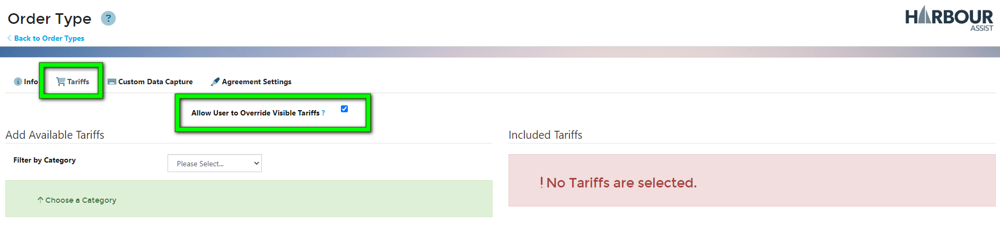

Any Tariff already attached to this Order Type will appear on the right, and you can select any available Tariffs using the tool on the left.

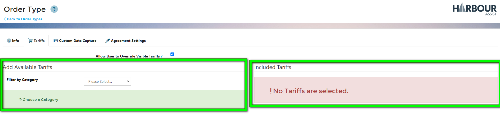

To add a Tariff to your Order Type, click on the *Filter by Category* drop-down box.

Select a Category, and the Tariffs available will appear in a list underneath. 

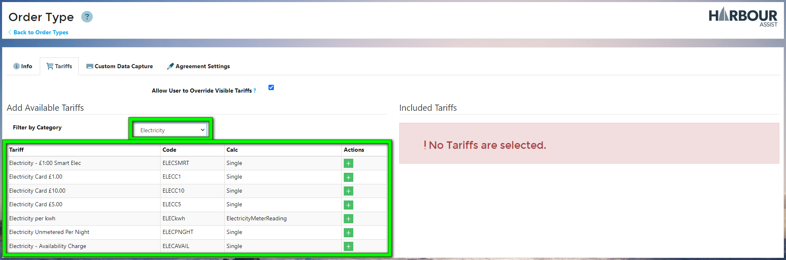

To add a Tariff to your Order type, click on the 

The selected Tariffs will appear on the right hand side, and the will turn to 

If you select a Tariff in error, you can remove the Tariff by clicking on the and the Tariff will be removed from the Included Tariff list.

Continue to work through all of your Tariff categories, adding any Tariffs required for your Order Type.

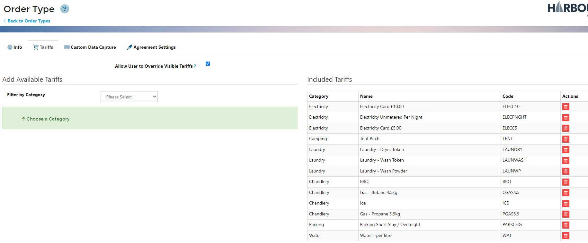

## Adding Custom Data Capture to an Order Type

Some Order Types may require some additional data to be captured when raising an order.  If your Order Type does not require additional data simply leave this empty.

You have a list of input formats, such as *Text*, *Numbers* through to *Checkboxes*.

To add a data capture, click on the 

Give your data capture a name - this is how it will appear in your Order page.

Tick the *Required* box if this data capture is mandatory, leave unticked if it is optional.

Then click *Save*.

Your capture field will appear on the right hand side, in the order they will appear on the Order Page.

To edit any of your data capture fields, click on the 

To remove a capture field, click on 

To change the order in which they will appear, click & hold the and drag it to the preferred order.

This is how they might appear in the Order Page.

## Adding an Agreement, Declaration or Signature to an Order Type

There may be some Order Types where you need to insert an Agreement or Declaration and capture a customer signature on the Order, such as Fuel or Orders with Contracts or Terms and Conditions.

?> For full instructions and a video about adding Agreements click [here](Agreements/Agreements)

## Editing Order Types

From the *Home* page, select *Administration*.

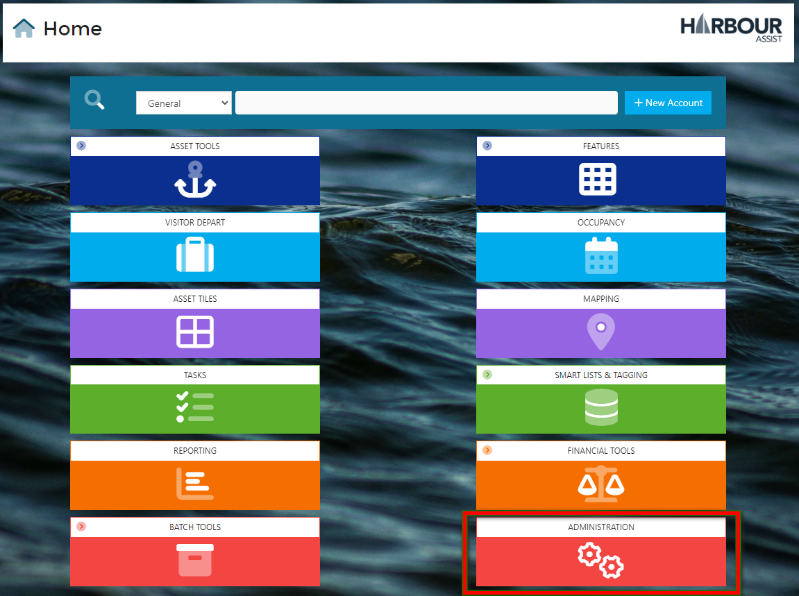

Then select *Order Types*.

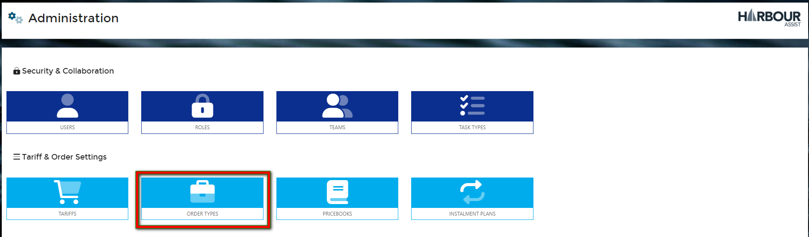

Click on the name of the Order Type you wish to amend to open the details.

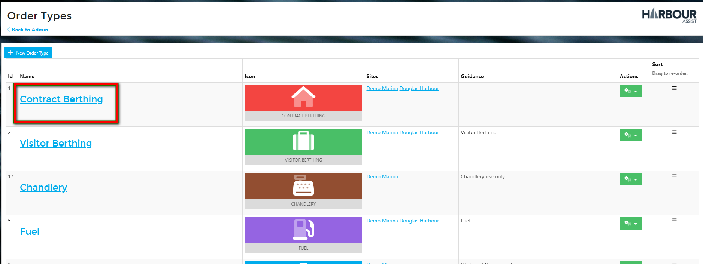

After the initial set up of Order Types there should be very little need to amend any of the details within the *info* tab of the Order Types.

You can add or edit the description in the *Guidelines* box - this is what users see when they are selecting the Order Type.  A detailed, accurate description in here will help users make the correct Order Type selection and avoid incorrect orders being raised.

If necessary, you can upload an invoice template or receipt that is bespoke to this particular Order Type.

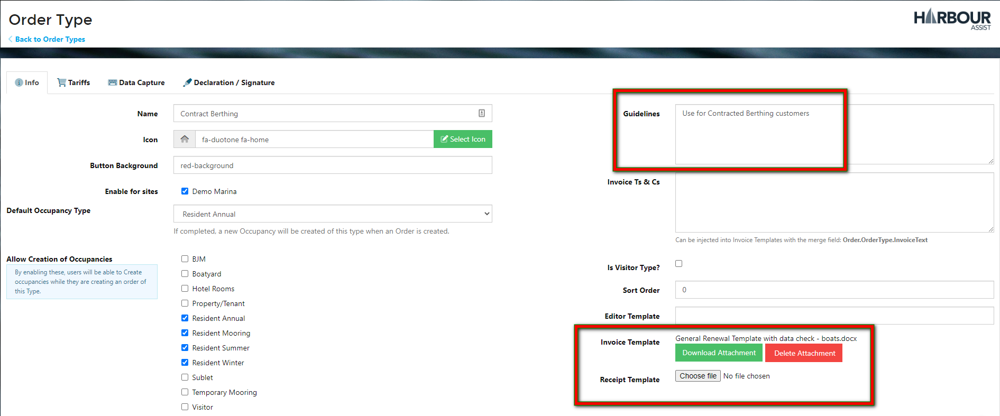

## Sorting Order Types

Order Types can be sorted so that when you create a new order the most used Order Type appears at the top of the list and so on.

In the Sort column, click and hold on the icon to drag the Order Type to the desired position.

