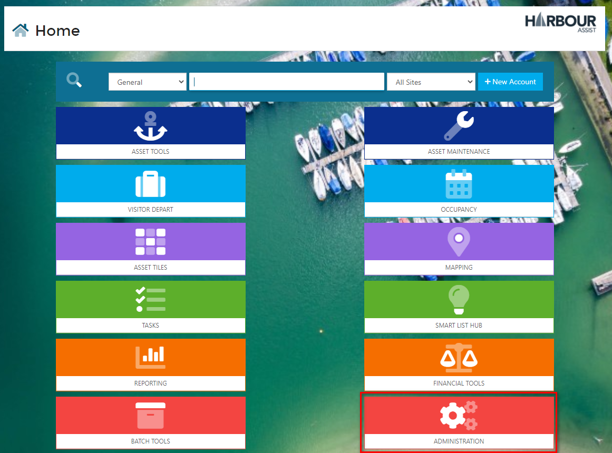

# Task Types

Additional Task Types can be created by any User with the Permission of **TaskTypeAdministration**.

To create a new Task Type, from the *Home* page select *Administration*.

Then *Task Types*.

Now click on *New Task Type*.

Give the *Task Type* a name and then *Save*.

Now you can complete the details of the Task Type:-

1. **Default Description** - this is an optional cell where you can add a description or instructions that you always want to appear each time a Task of this type is created.  Just leave this cell empty if no default description is required.
2. **Text Colour** - when you click in this cell a colour chart will appear.  Use this chart to select the colour of the text that will show on the Tasks Calendar.
3. **Background Colour** - when you click in this cell a colour chart will appear.  Use this chart to select the colour of the background that will show on the Tasks Calendar.
4. **Preview** - this shows you how the Task will look on the Tasks Calendar.  If your chosen text colour doesn't show up very well on the background, go back to either the Text or Background Colour options to choose an alternative.
5. **Start Date Delay** - this is an optional cell.  If you wish the Start Date and time of the task to be delayed you can set that here by setting the number of minutes, hours, days etc.  For example - if you always want an Estimate Follow Up task to be set for 7 days in the future, enter 7 in the number cell and select Days from the dropdown cell.  If this cell is not completed the Start Date of the Task will default to the current date.  
6. **Default Duration** - this is an option cell.  You can set a default duration so that each time a Task of this type is created it will set the end date and time for that duration after the start date and time.  For instance on a Boat Lift task you might always want the duration of the task to be 1 hour to help with scheduling of the lift team.  If this cell is not completed the Duration of the Task will default to 30 minutes.

