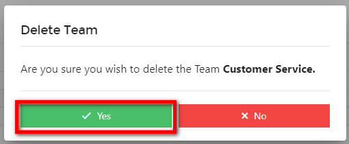

# Teams

## Overview

*Teams* on Harbour Assist are used for the sole purpose of setting *Tasks* and each *User* can belong to an unlimited number of *Teams*. 

*Teams* can be added, removed and administered, and *Users* can be added and removed from a *Team* by users with the appropriate permissions.

?> NB. Permissions required are TeamAdministration and AdministrationUsers.

## Adding a Team

From the *Home* page select *Administration*.

Then select *Teams*.

Click on the *+ New Team* button.

Enter the *Team* name and click *OK*.

## Deleting a Team

From within *Administration*, select *Teams*.

Then click on the name of the *Team* you want to delete.

If the *Team* has any members these will need removing before you can delete the *Team*.  Just click on the *Remove* button of each member.

?> NB. You cannot delete a *Team* if they have any Active Tasks.  Please reassign any Active Tasks to another Team so that you can proceed with the deletion.

?> For more information about Tasks click  [here](ProductivityCollaboration/Tasks.md).

When the *Team* has no members or Active Tasks you can click on the *Delete Team* button.

Click *Yes* to confirm.

## Adding and Removing Users from a Team

From the *Home* page select *Administration*.

Then select *Users*.

Click on the *Edit/View* button for the relevant *User*.

At the bottom of the *User* profile you will see all the different *Teams*; use the check box to add or remove the *User* from a *Team*.

Alternatively, you can remove *Users* from a *Team* within the *Teams* administration page.

