# Users and Roles #

To set up a new user or edit the details of an existing user, from the *Home* screen, select *Administration*.

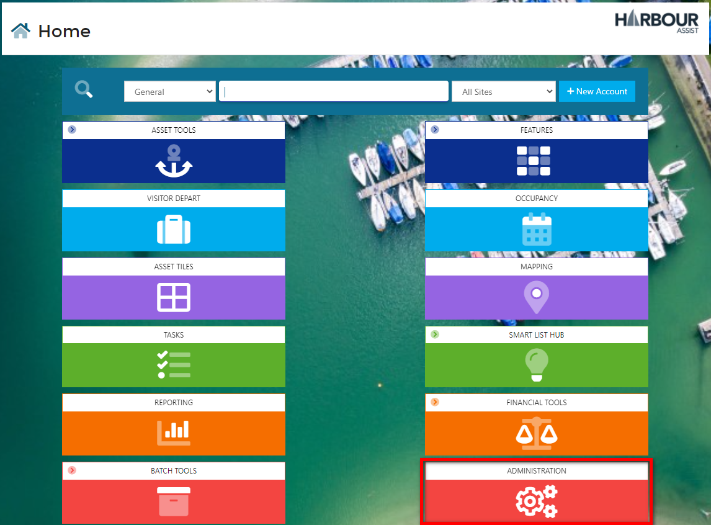

Select the *Users* tile.

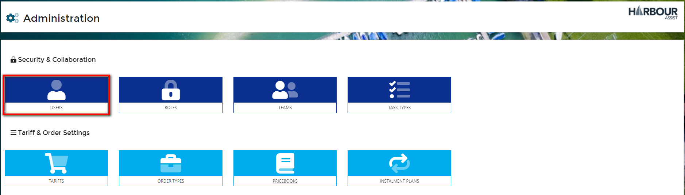

This will bring up a list of all users who are set up on the site.  

## To Edit an Existing User ##

Users will appear in alphabetical order of **Last Name**.

Select the *Edit/view* button for the User you wish to edit.

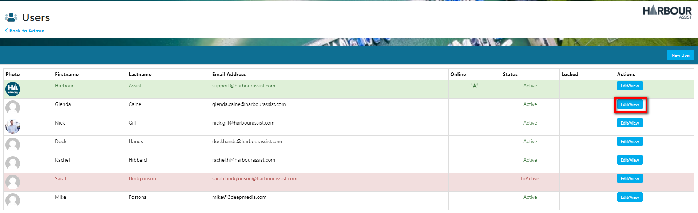

You can now update and amend their details, add them into a Team(s) (used when setting team Tasks), add or remove sites they can access, set their Home Site (this is the site that the system will default to when they log in) and set their Role (their permissions on the system are set according to their role).

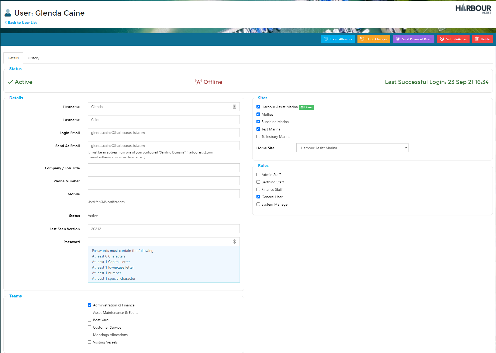 

At the top of the screen you can see the Users last Successful Login date and time and by clicking on the Login Attempts button you can view all their logins.

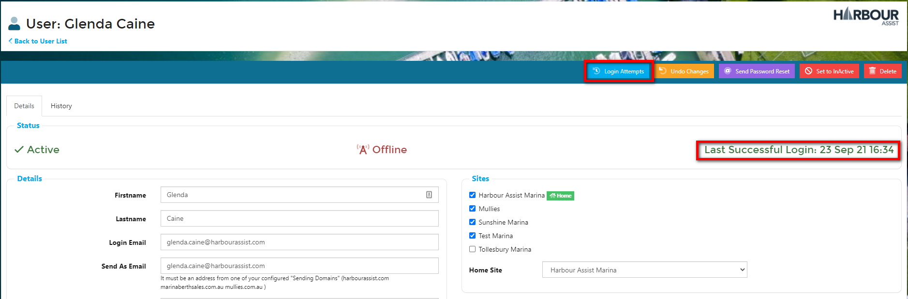

In the Login Attempts screen, successful/unsuccessful attempts are listed in order of most recent. 

A common cause for unsuccessful attempts are where the Cache might be full

?> More information on Clearing your Cache can be found [here](http://docs.harbourassist.com/#/Troubleshooting/ClearingCache)

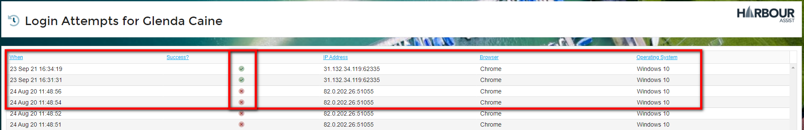

You can review the User History from the History Tab, this lists any changes made to the User Account, who made them and when

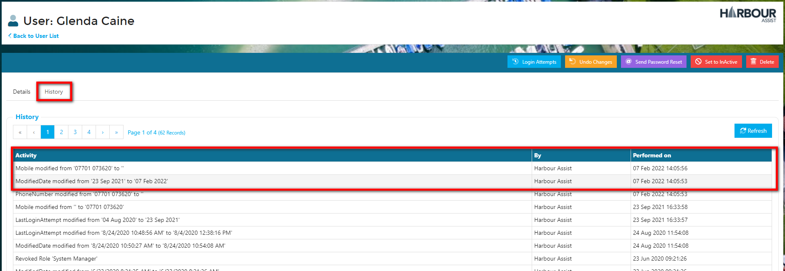

## Managing Existing Users

As Harbour Assist can be accessed via any device (at home or at work) it is important to manage your Users as situations change.

You have two options when managing Users - *Set to InActive* or *Delete*.

*Set to InActive* - this is mainly used for seasonal staff.  You would set them to inactive during the winter months so that they cannot access the system whilst they are not employed.

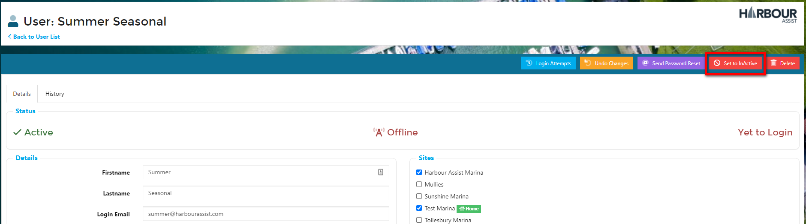

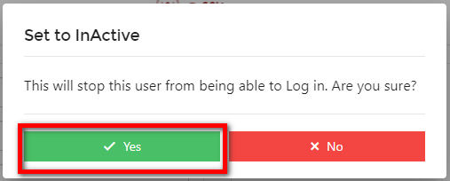

When they return to work for the following season you can reverse this by clicking the *Set to Active* button.

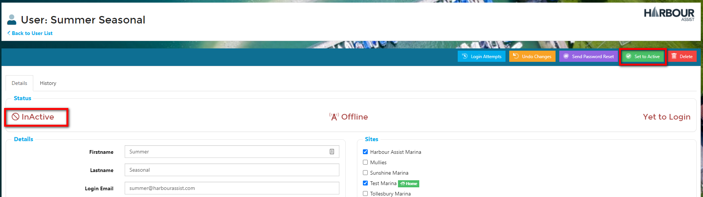

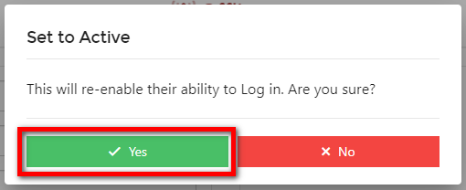

*Delete* - a user should be deleted if they leave and it is anticipated they will not return.

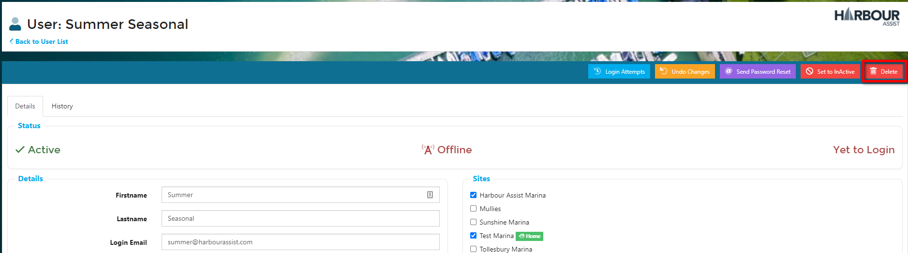

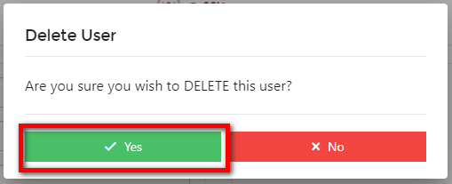

## To Add a New User

From the *Users* screen, select *New User*.

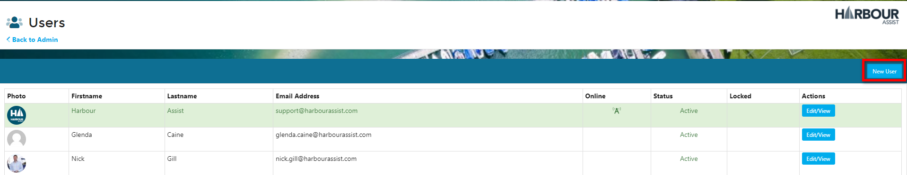

Complete the Users details, set the Team(s) they will be in and the Site(s) they should have access to.  You will also need to set a password - this can be anything as the User can change this at their first login.  

Once complete, click *Register* at the bottom of the page.

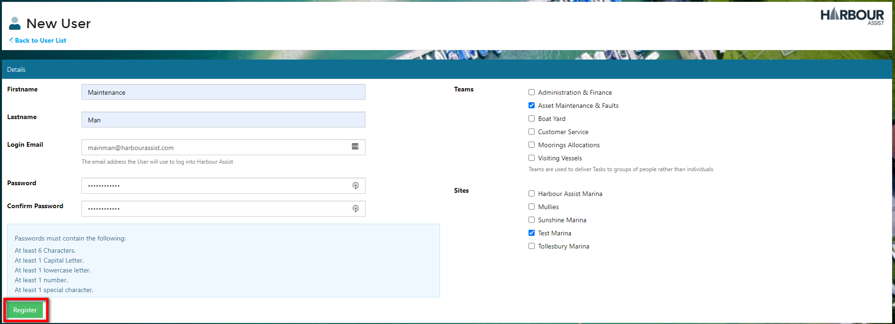

This will take you to the User details page where you can add a mobile number (if appropriate), set their Home Site (this should be the Site where the User is based (multi-site operators only)) and set their Role(s). (their permissions on the system are set according to their Role).  Then click *Save*.

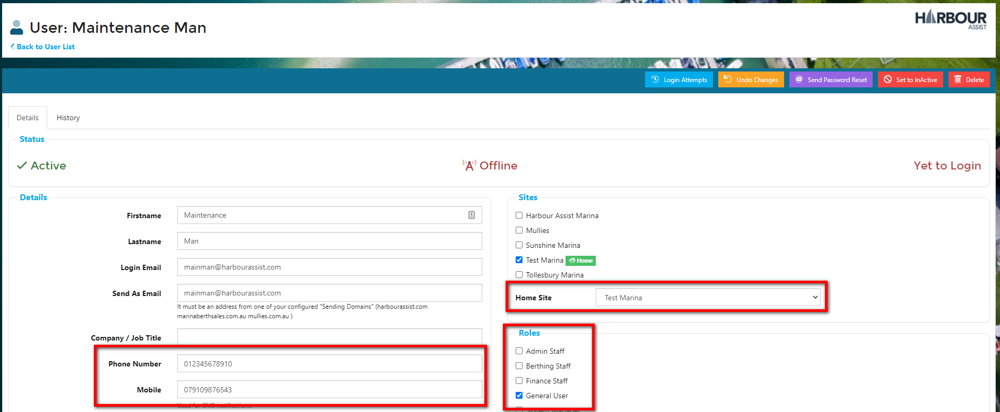

## Roles and Permissions ##

There are various Roles within Harbour Assist and each *Role* has a set of Permissions that enables Users to carry out functions on the system.  Each User should be assign the appropriate Role (set of permissions) to enable them to carry out all the functions they need in their day to day job.

You can access *Roles* from the *Administion* tile on the *Home* screen.

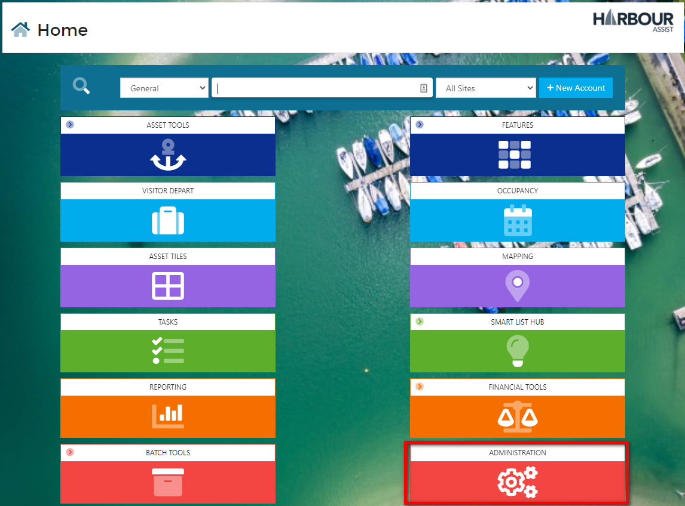 

Select *Roles*

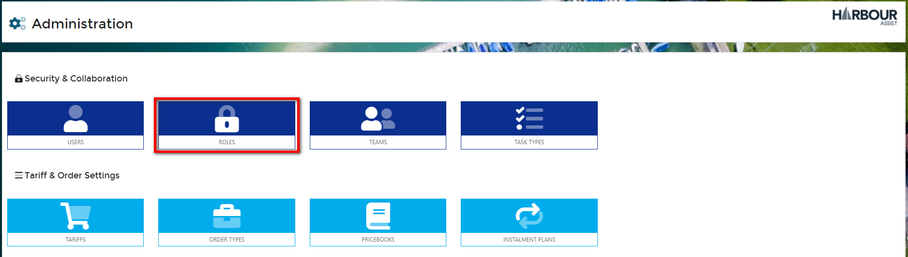

This will show you all the Roles that have been set up, the Permissions within that Role and the Members (Users) that have been set up in that Role.  To make changes within the Role, click on the *Actions* button against the Role you wish to edit and select *Edit*.

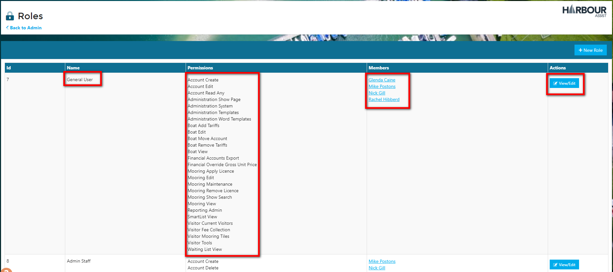

The Role that you are editing is shown at the top of the screen and you can check and uncheck each permission as required.

?> NB. Any changes made to Roles or Permissions within the Role will not take effect until the User logs out of the system and back in again.

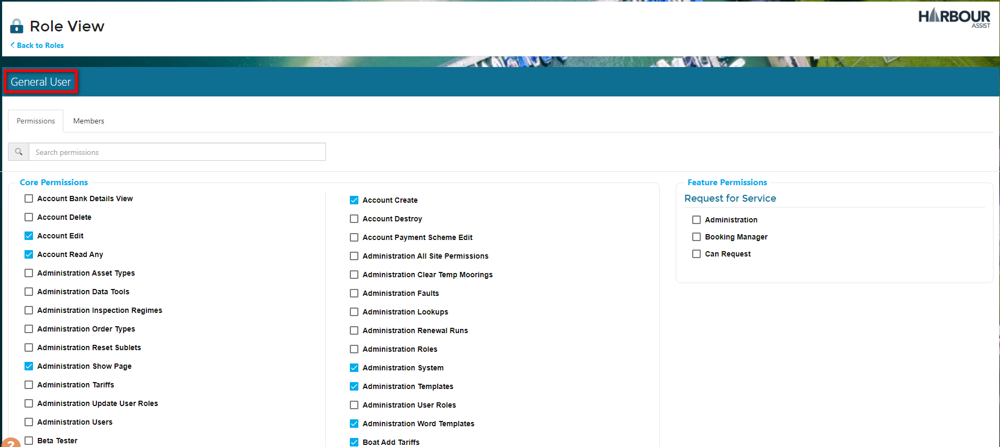