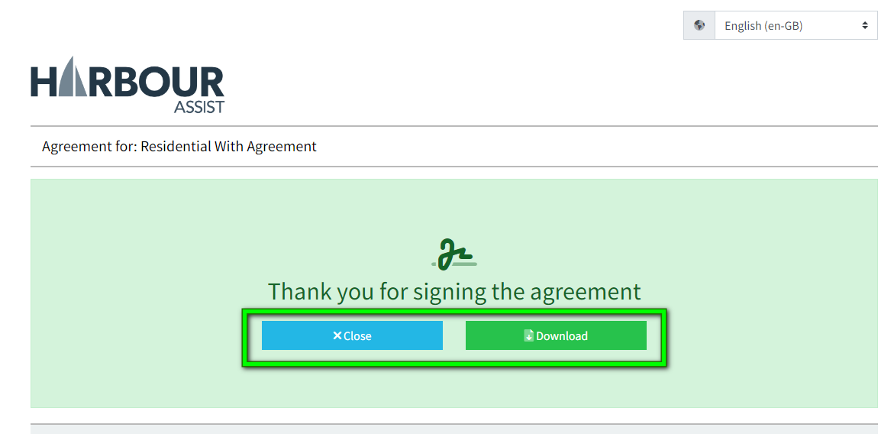
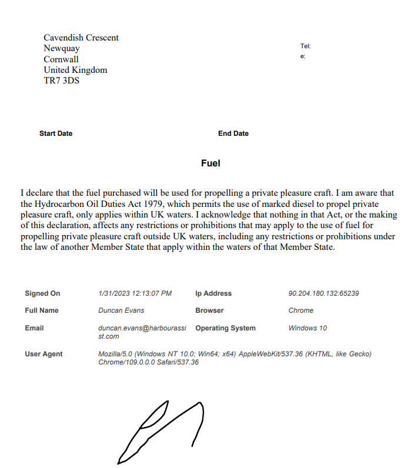

# Agreements, Declarations and Signature Capture

There may be some Order Types where you need to insert an Agreement or Declaration and capture a customer signature on the Order, such as Fuel or Orders with Contracts or Terms and Conditions.

To include an Agreement or Declaration, within the Order Type click on the Agreement Settings tab.

Tick the Enable Agreement Capture box, this will open the text box.

Add your Agreement/Declaration text, using the layout and formatting tools if required.

When finished, click *Save*.

Fuel declaration example:

Terms & Conditions Agreement example:

This will attach Agreements and Declarations to an Order, which will generate a number of options when in the Order screen when the Order is created.

You can **Edit**, **Sign Now** (online), **Download Agreement to Sign** (hard copy) and **Upload Signed Agreement** (hard copy).

Click on the *Sign Now* button to show the Agreement/Declaration wording so the customer can read the document before signing.

?> NB: The customer must sign an agreement before they will be able to pay

?> NB: The customer must scroll down and read the document contents before they can sign the Agreement/Declaration.

Once they have scrolled through and read the document, they can sign by using the mouse or a finger on a mobile device. 

?> NB: When signing in person, the customers email address and full name will need completing. The email address must match the one stored on their account.

If the customer makes an error signing, you can clear the signature and the customer can try again.

Once complete, click *Submit Signature*.

You then have the option to download the signed agreement to print, or close the window and return to the customer account.

Signed Agreement Documents are stored in the Docs section of an account.  Agreements with an Occupancy period will populate with an expiry to match the same day the Occupancy ends, and therefore the agreement with it.

Agreements are also stored in the Customer Portal.

## Customer Portal - Agreements

Customers can also sign their Agreements through their Customer Portal by clicking on Agreements in the index on their Dashboard page.

They can view all Agreements, see which Order the Agreement is associated with, sign any unsigned agreements, and view or download the signed documents.

If a customer tries to pay for an order that has an agreement associated to it they will be unable to do so until they sign the Agreement.

When signing an agreement through the Portal, the email address and full name self populate, so the customer just needs to read and sign.

Signed document example.

