# Assets #

An Asset within Harbour Assist can be anything, not just a berth or mooring.  Electricity meters, Meeting Rooms, Lockers and items of Plant etc can all be an Asset.

## Asset Types ##

To set up a new *Asset Type*, from the *Home* screen select *Administration*.

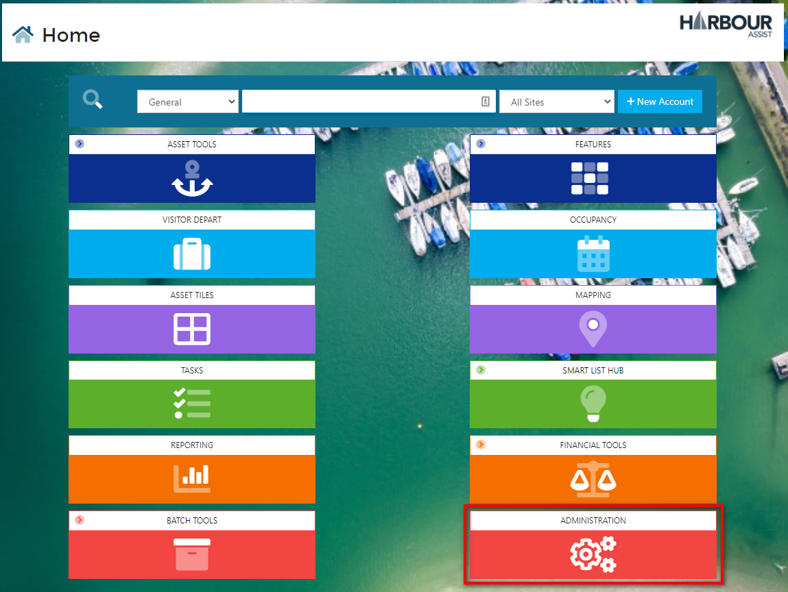

Then under *Infrastructure Settings* select *Asset Types*

Select *New Asset Type*

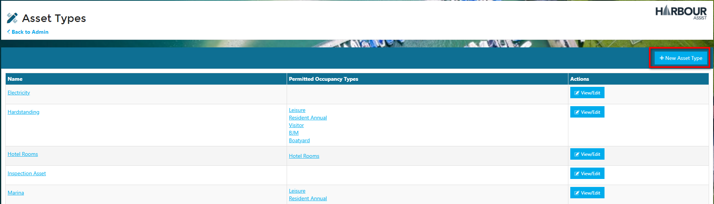

Give the new Asset Type a name.

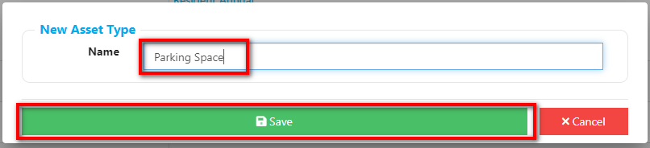

Set the *Licence Level* and the *Permitted Occupancy Types* - these are the types of occupancy that you will be able to put on the Asset.

?> More documentation [here](AssetsOccupancy/Occupancies)

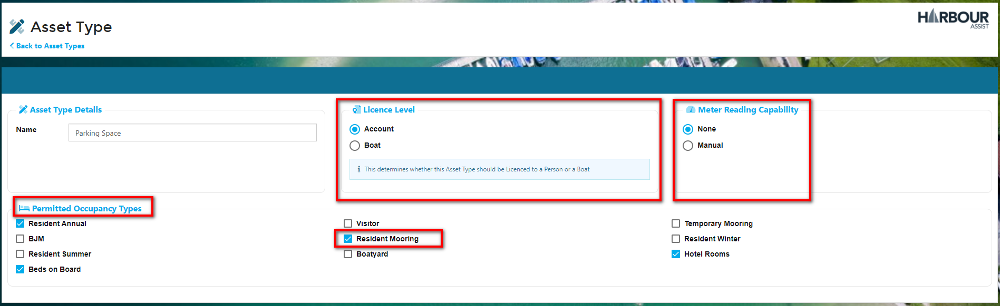

## Asset Areas & Regions ##

Each Asset created needs to be located within an *Area & Region* - this will help you to find an individual Asset from the Occupancy, Asset Tiles and Asset Tools screens.  Each Region within a Site can have multiple Areas.  Each Region represents a blue button at the top of these screens, and each Area is a drop-down entry when you click on the "down arrow" against these buttons.

To set us a new *Area or Region*, from the *Home* page select *Administration*.

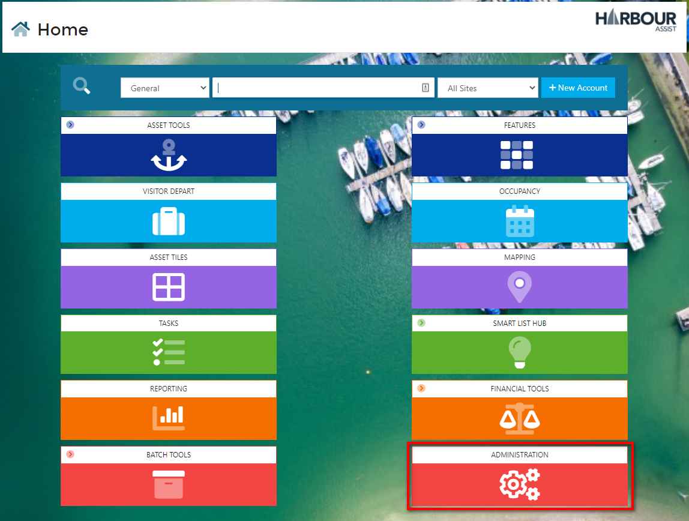 

Then select *Sites*.

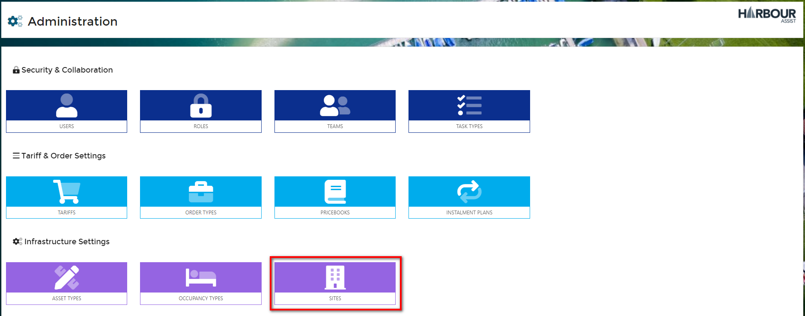

Select the Site that you want to create the new Area or Region for by clicking on the site name.

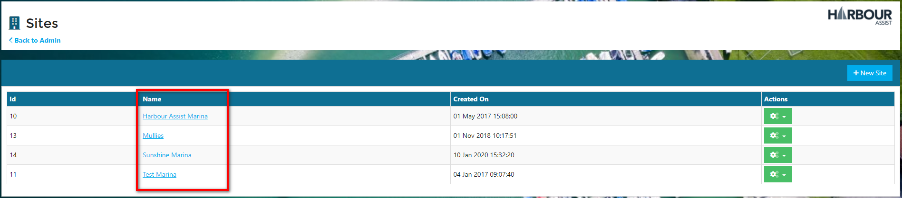

Within the *Site* screen you will find *Asset Areas & Regions*.

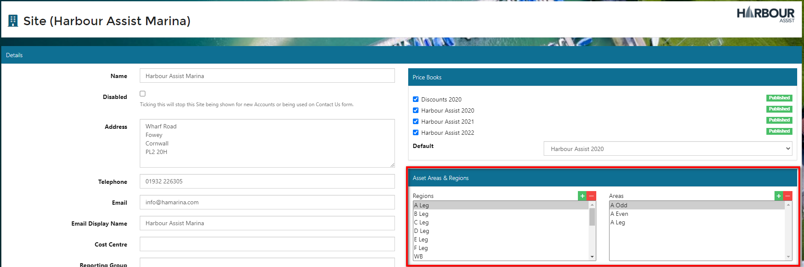

To add a new *Region*, click on the + icon.

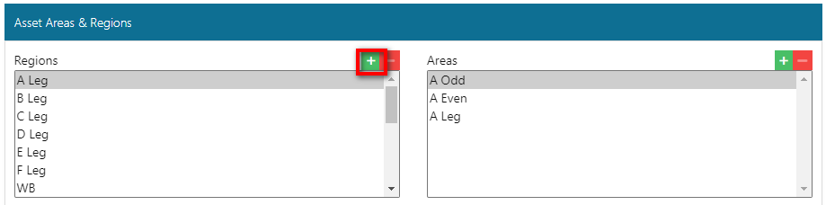

Give the *Region* a name and click OK.

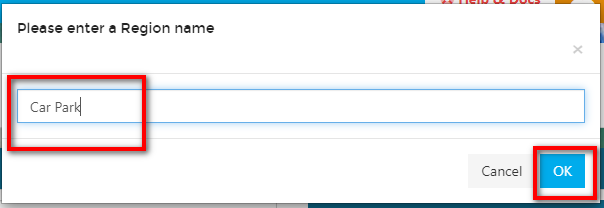

Now you can set the *Areas* within the *Region*.  First ensure you have selected the *Region* that you are setting an *Area* for, then click on the + icon.

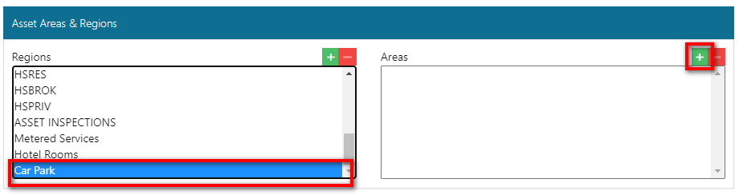

Give the *Area* a name and click OK.

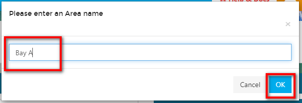

You can add as many *Areas* to a *Region* as you wish.

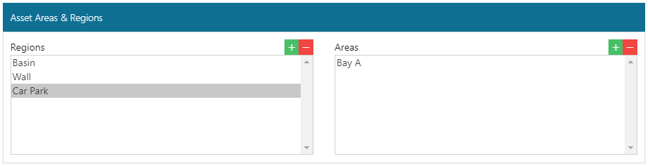

The new *Region* will show in the blue tiles on the Occupancy, Asset Tiles, Asset Tools and Mapping screens and any *Areas* will show in the drop down options.

?> NB: You may need to sign out and back into Harbour Assist for the new Region/Area to show.

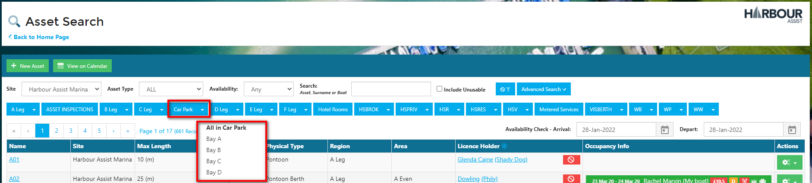

## Creating a New Asset ##

Once your Asset Types, Areas and Regions are set up you can create a new Asset.

From the *Home* page, go to *Asset Tools*.

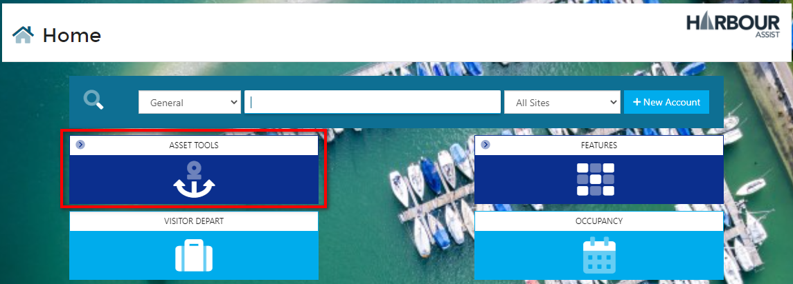

From the drop down list, click on *Asset List*.

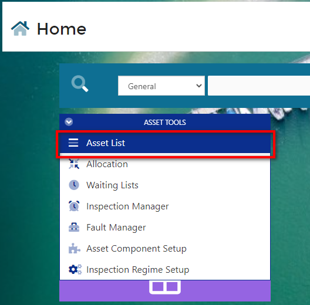

Click on *New Asset*.

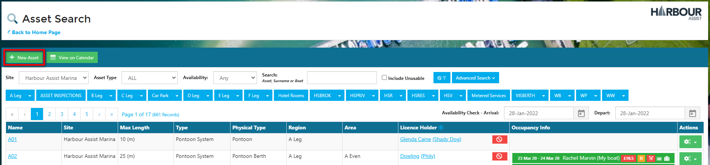

Give the Asset a name and complete the rest of the screen by using the drop down options.  When you have finished click on *Save*.

?> NB: Inspection Regime is not a mandatory field and only needs to be populated if you want to carry out routine inspections on the asset.

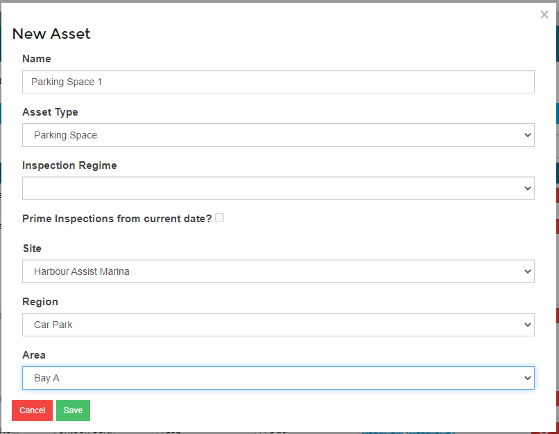

In the *Asset Details* screen you can add more detailed information, such as maximum sizes and any notes.

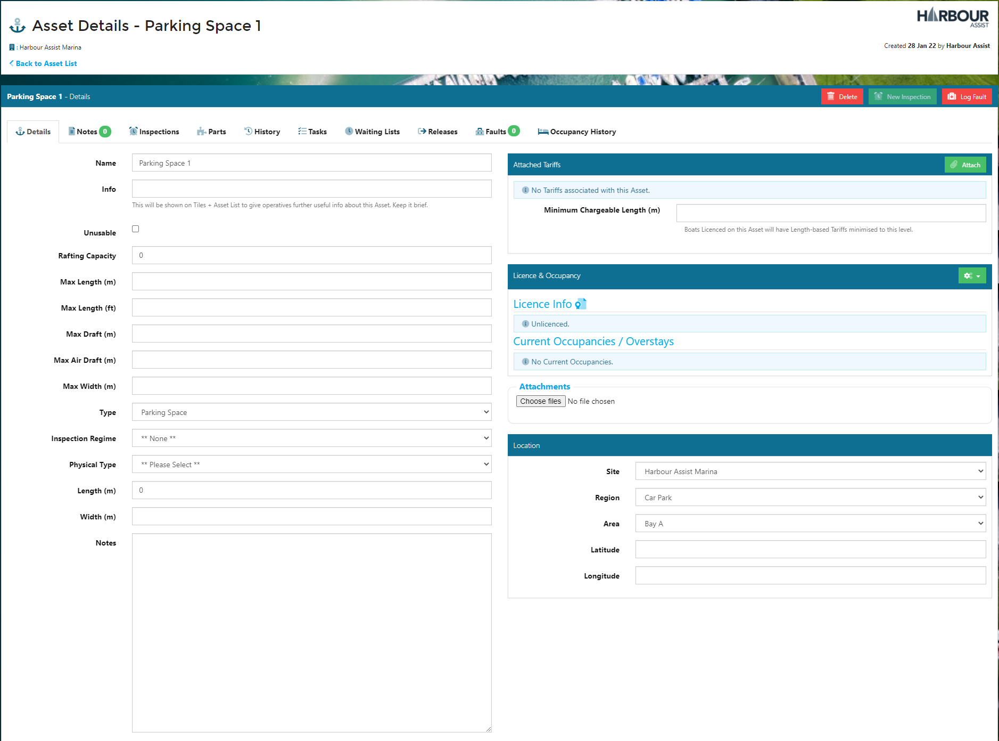

Your new Asset will now be visible in the Occupancy, Asset Tiles and Asset Tools screens.

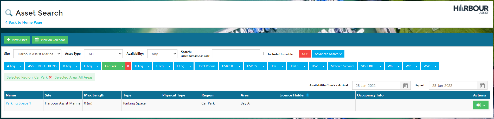

