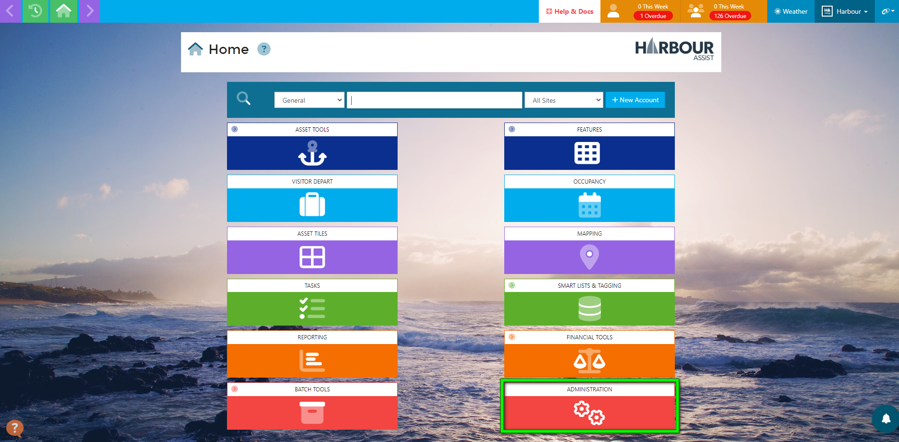
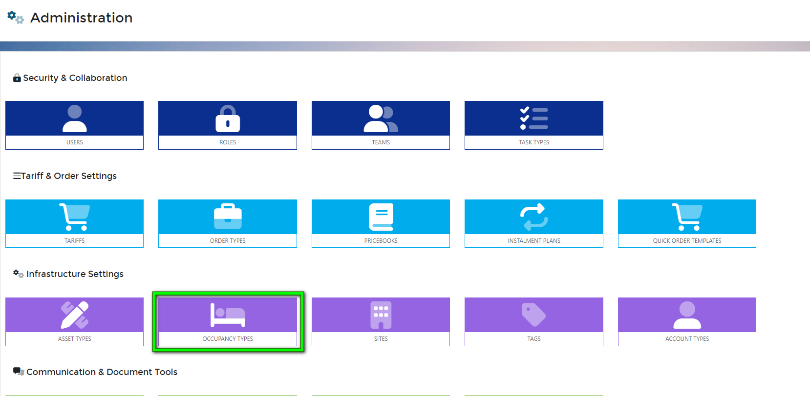
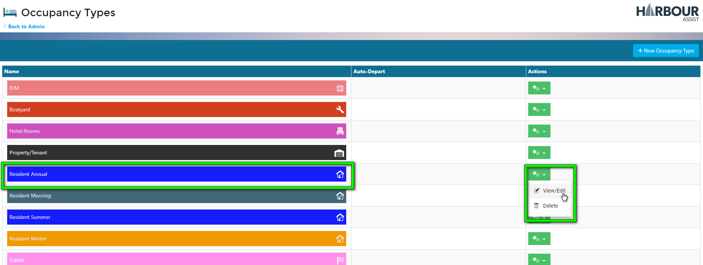
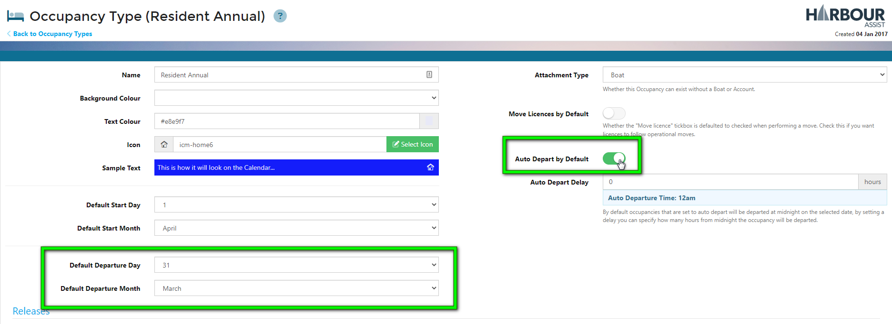
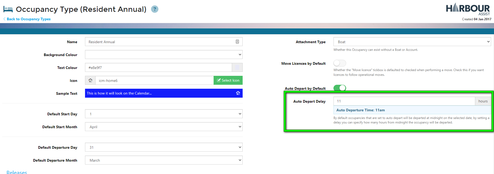
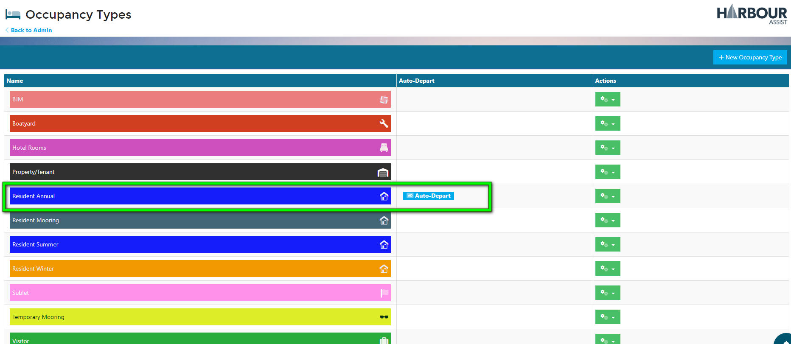
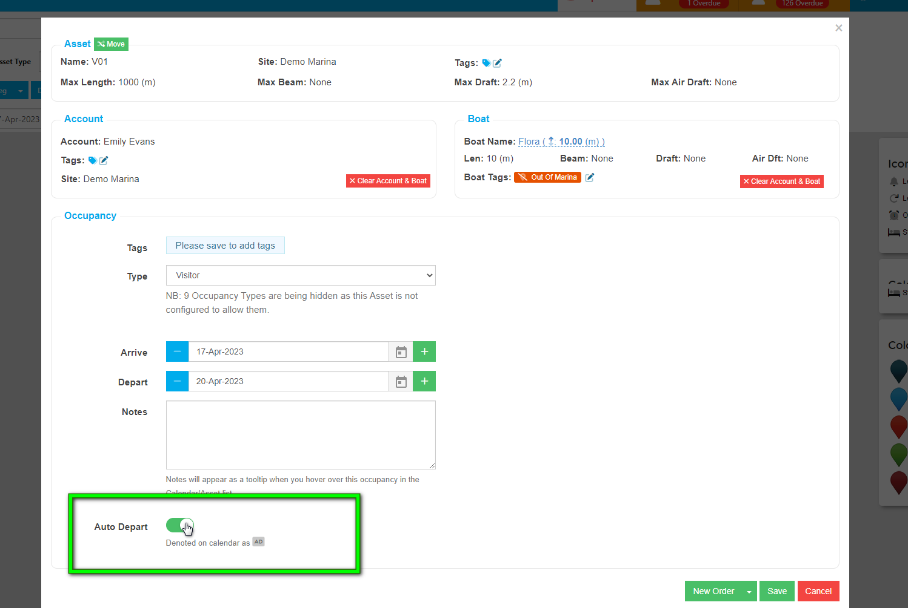

# Auto-Depart

You can instruct specific Occupancy Types to **Auto-Depart**.  These will be marked as Departed when they are due to depart, rather than relying on users manually departing them.  You can also specify what time in the day this departure takes place.  

## Auto Depart by Default

To set an Occupancy Type to Auto-Depart by default, from the Home Page go to *Administration*.

Then go to *Occupancy Types*.

Select the Occupancy Type you want to set as Auto-Depart. You can do this by clicking on the Occupancy Type, or by clicking on the green actions button, and selecting *View/Edit.*

Set the Occupancy Type to Auto-Depart by Default by toggling the button to 'on'.

This will ensure occupancies of this type are Auto-Departed at midnight on the selected date.

You can also edit the time of departure by adjusting the hours in the Auto Depart Delay, for example, if you want to set the departure time to 11am, you enter 11 in this box.

When you return to the Occupancy Types, any with an Auto-Depart set up will display in the list.

?> NB: When setting up Auto-depart this will only be applied to occupancies created after the Auto-Depart has been set.

## Auto-Depart by Occupancy

You may not want your Occupancy Type to Auto-Depart by default, preferring a more flexible process.

You can set Auto-Depart when raising an individual occupancy through the Occupancy Calendar or Mapping views.

?> NB: Visitors and Transient customers have a tendency to change their minds, opting to extend their stay or leave earlier than planned. For this reason, you may prefer to manually depart them via the Visitor Depart section.

