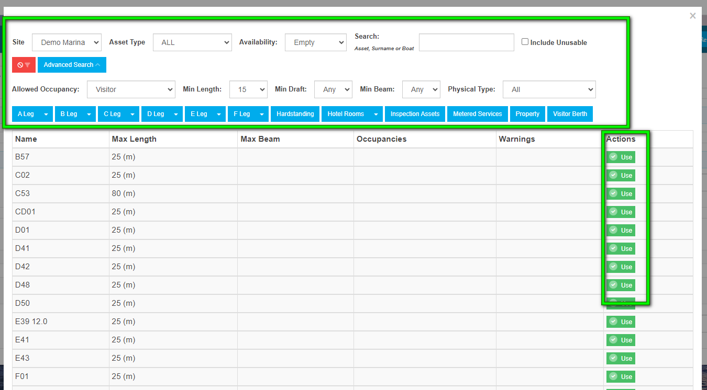
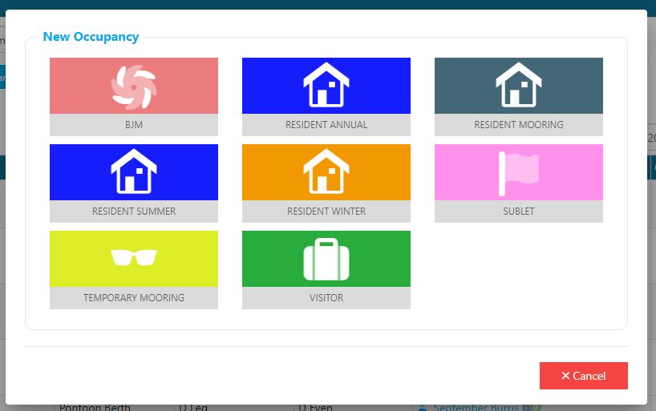
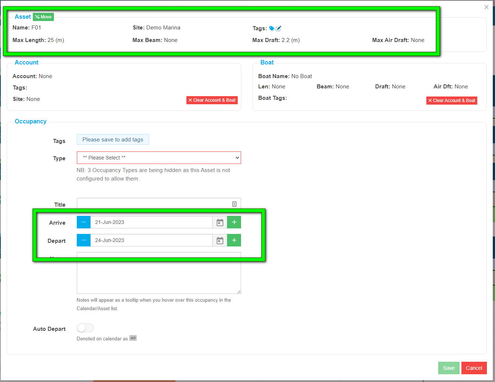
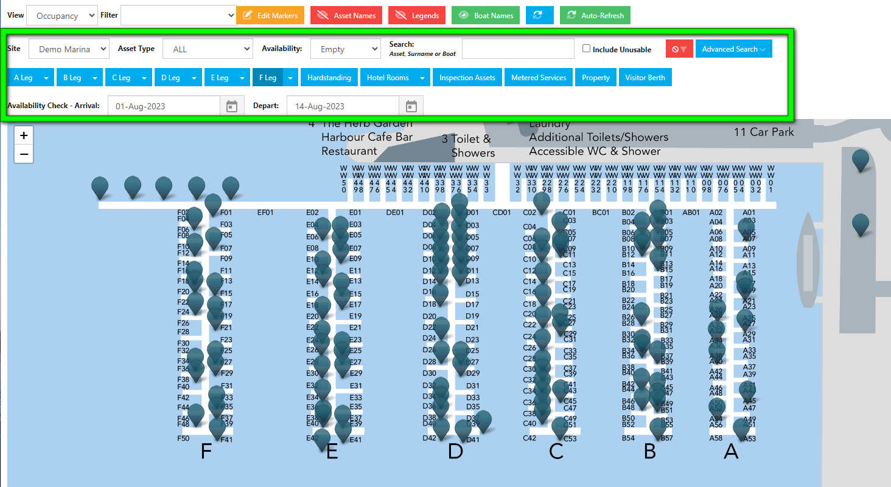

# Creating an Occupancy

You can create an Occupancy from a number of different areas within Harbour Assist.

You can create an Occupancy on the day of arrival, or to pre-book a Berth you can create an Occupancy in advance.

Each option has a slightly different sequence. There isn't a right or a wrong way, they all create an Occupancy, it is a case of simply choosing the right option for you.

## Creating an Occupancy from a Boat

In the Boat Page, go to the Tariff & Occupancy tab.

Next, click on the New Occupancy button and select the Occupancy Type from the drop-down list.

This will open a new window where you can confirm the details of your Occupancy.

Because you are creating an Occupancy through the Customer Account/Boat, the system already knows:

- What type of Occupancy it will be.

- Who the customer is
- Which boat they will be using (single boat owner). If the customer has more than one Boat, you can change the boat by clicking on the Boat name and selecting another boat.

Now you need to confirm their expected Arrival and Departure dates.

Use the **+/-** buttons for selecting a few days close by, or for longer date ranges, use the calendar pickers.

You have now confirmed who the Customer/Account is, which Boat they will be using, the type of Occupancy and their expected Arrival & Departure dates.

You now have two options.

To create an Occupancy without confirming a Berth/Asset (assigning a Berth/Asset on arrival), click *Save*.

To create an Occupancy reserving a Berth/Asset prior to their arrival, click on *Move*

Clicking on *Move* will open a new window, select *Entire Occupancy* and then click *Next*.

This will open a list of your Assets. Use the filters to identify a suitable Asset.

When you find a suitable Asset, click on *Use*.

Confirm your choice by clicking *Yes*.

Your Occupancy will now appear on the page. You can make changes to the Occupancy details at any time, by clicking on the green actions button and selecting *View/Edit*.

You can check your work and view the Occupancy in the Occupancy Calendar or Map & selecting the date range applied.

## Creating an Occupancy from an Asset

From the *Home Screen*, go to *Asset Tools* and select **Asset List** from the drop-down menu.

Use the filters to find a suitable Asset.

Click on the green actions button, and select *+ New Occupancy* from the drop-down list.

Confirm the Occupancy Type.

Because you are creating the Occupancy through the Asset, the system already knows which Asset you have selected, you have confirmed the Occupancy Type.

Now you need to confirm the Account & Boat using the search tool and confirm the dates of the Occupancy.

When you have completed the details, click *Save* to create the Occupancy, or use *New Order* to raise an Order for the Occupancy.

## Create an Occupancy in the Occupancy Calendar

From the *Home Screen*, go to *Occupancy*.

Use the filters to find a suitable Asset and use the Calendar Picker to select a date range.

On the line of the selected Asset, click on the date of Arrival.

The cell will turn green, confirming the *Start Date* of the Occupancy.

Now you need to select a Departure Date. If the departure date isn't visible in your screen, you can use the Calendar Picker or the back & forward arrows to find the departure date. You can also view extra dates on the screen using the *Three Days, Week, Two Weeks and Month* buttons.

Click on the Departure Date, the cell will briefly turn green, before taking you to the next stage.

When Creating an Occupancy in the Calendar, the system know which Asset the Occupancy will be on and the Dates the Occupancy will run for.

Now you need to confirm the Occupancy Type, and who the Customer & Boat will be.

Once the details have been entered, click on *Save* to create your Occupancy.

When complete, the Occupancy can be viewed in the Calendar.

## Creating an Occupancy from a Map

From the Home Screen, go to Mapping.

Use the filters to find a suitable Asset and set a date range.

Select a suitable Asset and click on the marker.

Next, click on *+ Add Occupancy*.

Confirm the Occupancy Type.

Creating an Occupancy in a Map, the system now knows which Asset and the Occupancy Type.

You now need to complete the remaining details - The Account/Boat and the Occupancy Dates.

When all details are entered, click on *Save* or *New Order*.

Once complete, the Occupancy can be viewed in the Map.

