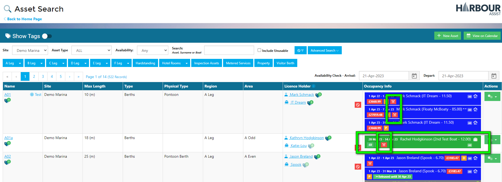

# Overstays

## Overview

Overstays are where an Occupancy has ended, but has not been departed.

These Occupancies have potentially remained on the asset beyond their intended departure date, so the system creates an alert in the form of a red alarm clock icon .

Overstays need to be investigated and departed if they have left, or charged for the additional time if they are staying longer than their original order stated.

## Dealing with Overstays

In the Occupancy Calendar, you can Depart or Amend the Occupancy by clicking on the Occupancy line and selecting *Depart/Amend* from the list of actions.

The system knows this is a potential Overstay and will offer you some options. The options displayed will depend on whether the Occupancy has a Draft or Confirmed order and if a Confirmed Order, whether it is paid or unpaid. The below example shows you the options for the Confirmed, paid order.

Overstays can occur for any type of Occupancy, but and are most common with Visitor or Transient boats, as they have a tendency to change their minds and extend their stay. Visitor Depart is a great housekeeping tool to help manage Overstays.

?> More information on Visitor Depart can be found [here](visitors/VisitorDepart.md).

As well as the Occupancy Calendar, the red alarm clock icon alerting you to a potential overstay will appear in a number of other places throughout Harbour Assist. 

Here are some examples:

### Visitor Depart Screen

### Mapping View

### Asset List

### Boat Details (Tariffs & Occupancy tab)

You can also view Overstays on the report in the Reporting section of the system. 

?> More information on Reporting can be found [here](Reporting/ReportsOverview.md).