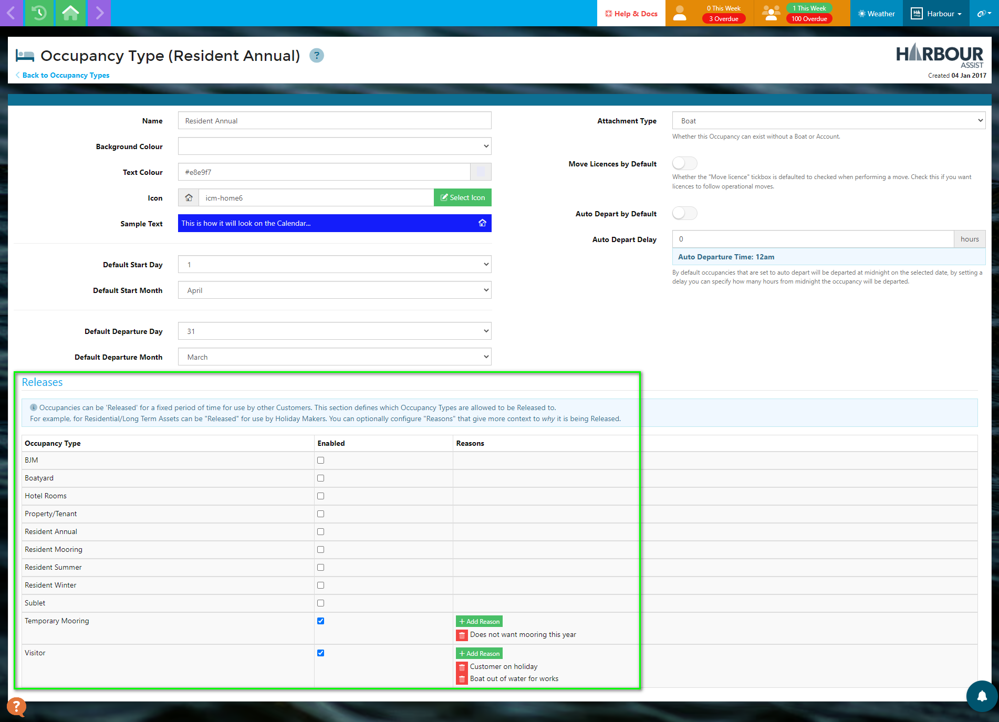
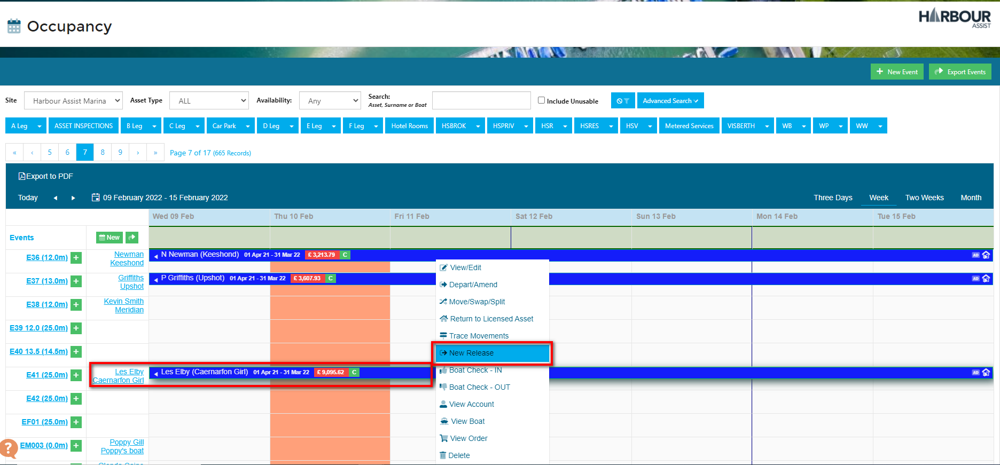
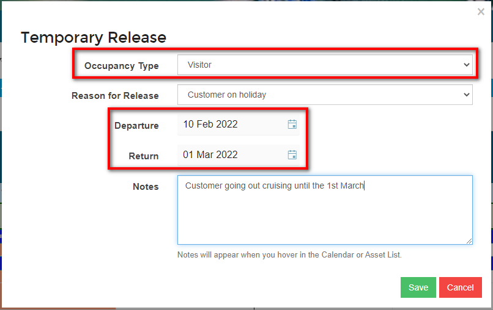
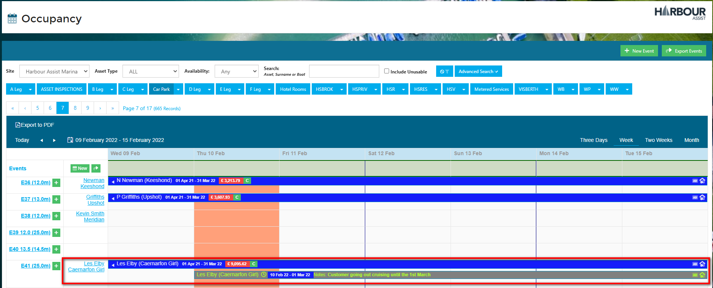
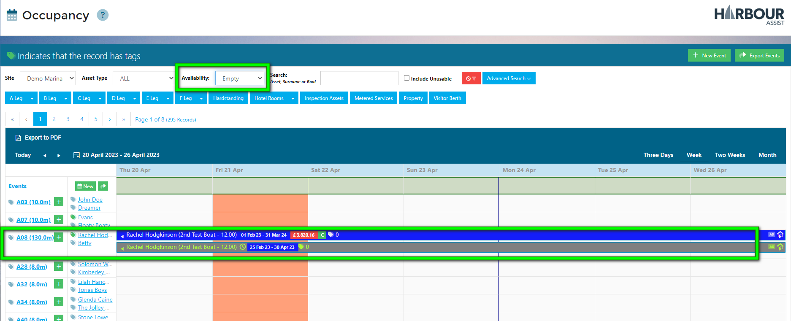
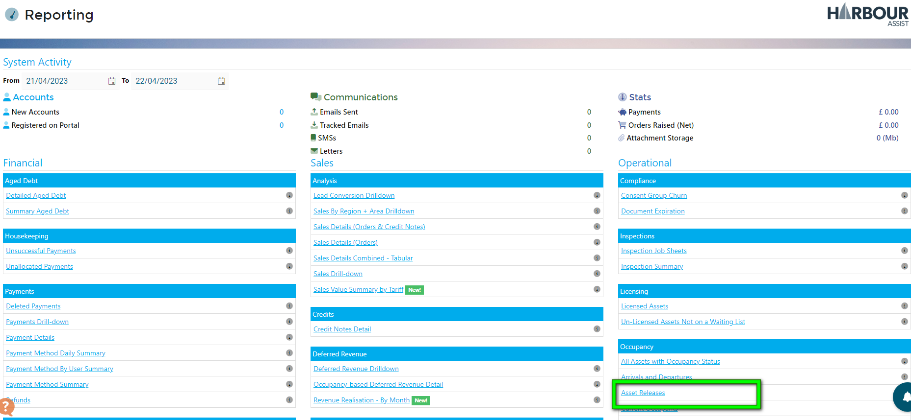
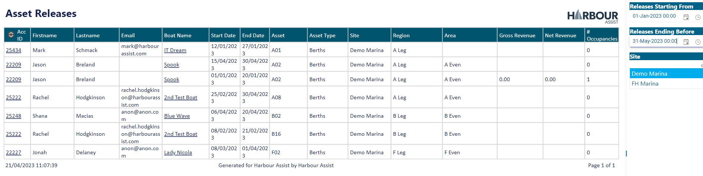

# Releasing an Occupancy #

There may be occasions when a contracted customer vacates their mooring for a period of time and it can be resold for short staying craft.

To identify this to all users a *Release* needs to show on the occupancy screen.

To be able to release an Occupancy, the Occupancy Type must be set up to allow Releases and reasons added.

## To release an occupancy 

From the *Occupancy Screen*, click on the occupancy line of the craft that is vacating the mooring and select *New Release*.

Complete the *Temporary Release* screen using the drop down boxes and inserting the dates of the release.  If relevant, add a note to the *Notes* section to give more information.  Then click *Save*.

?> NB: the Occupancy Type cell should be completed with the occupancy type that you want to allow to occupy the asset during the release.  For instance, you would more than likely release the asset to Visitor/short term occupancy types, but would rarely release it to a permanent contracted/long term occupancy.

The period of the *Release* will show as an additional occupancy, giving the dates of the release in the line detail.

Creating a Release allows you to offer the Asset to other customers for the period of the release.

Filtering your calendar to look for empty berths available for occupancies, the release will show along with other available assets.

## Reporting on Releases

You can report on Asset Releases in the Reporting section.

As well as showing you what Assets have been released during the selected period, this report also shows you the revenue received on the Asset during the release period and the number of occupancies that have used the Asset during the release period.

?> More information on Reporting can be found [here](Reporting/ReportsOverview.md).