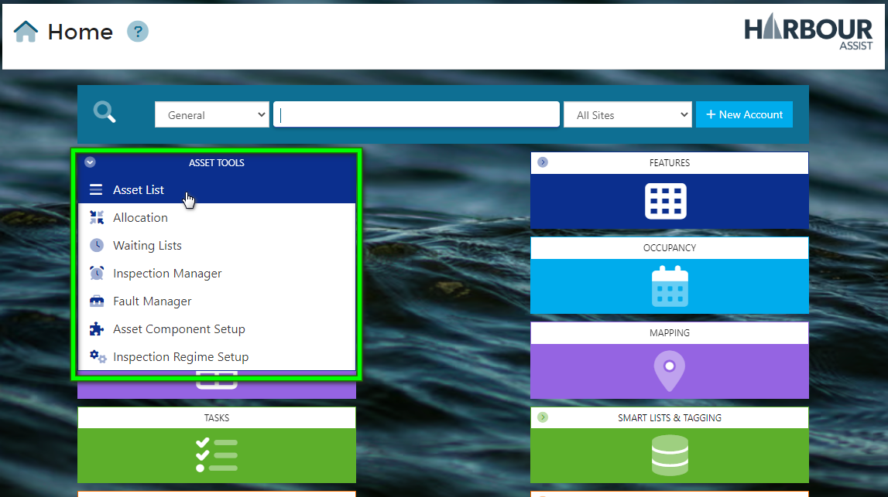
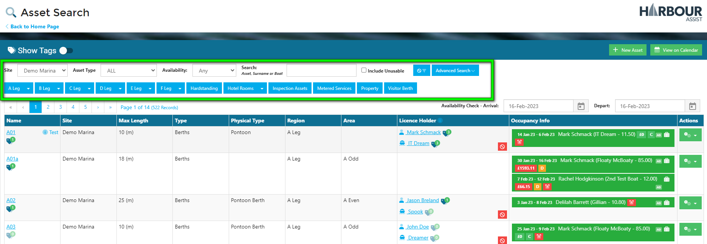
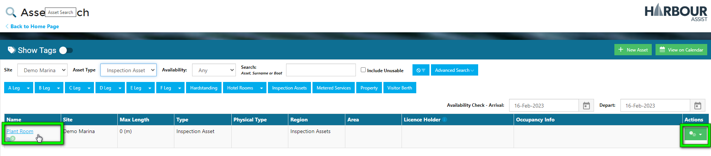
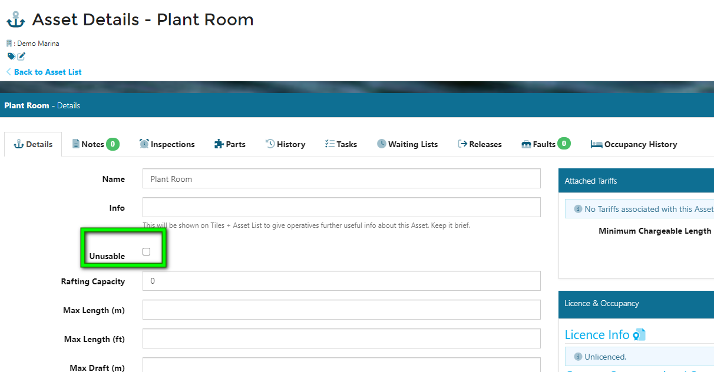
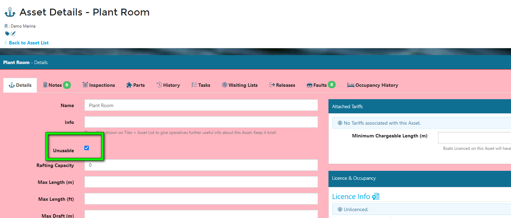
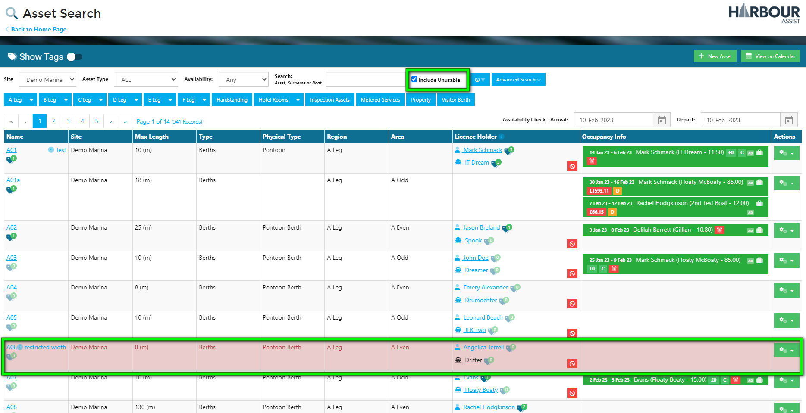
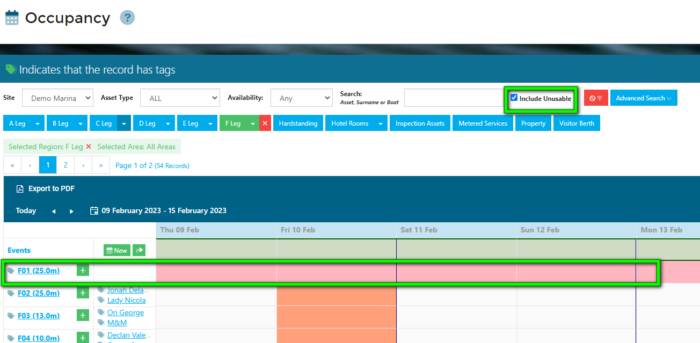
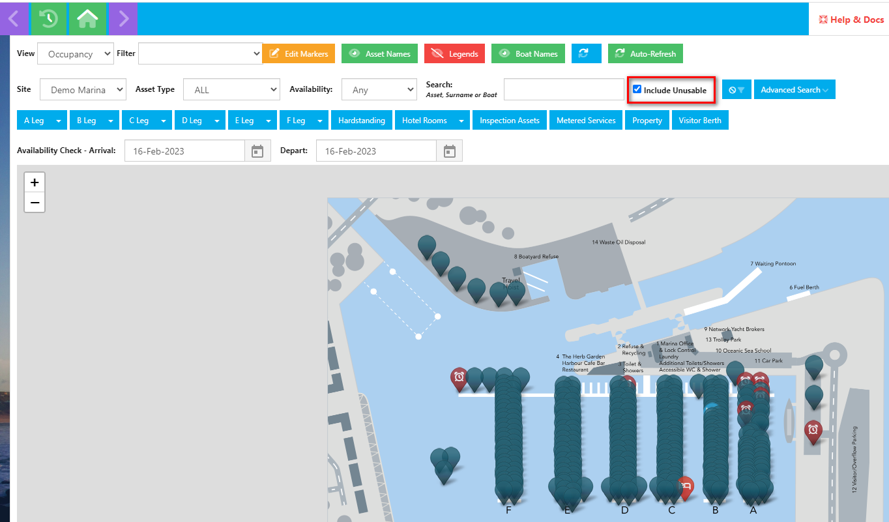

# Unusable Assets #

Some Assets might be classed as *Unusable*, for example plant and equipment which are just in the system for inspection purposes, or an Asset might unusable while it is undergoing maintenance and repair. Unusable Assets are unsellable Assets, either permanently or temporarily.

To make an Asset Unusable, from the Home Page, go to *Asset Tools*.

Select *Asset* List from the drop-down options.

Using the filters (if required) find your Asset in the Asset list.

Next, click on the Asset Name or use the green Actions button to view the Asset Details.

To make the Asset Unusable, tick the *Unusable* box.

The Asset page will now turn red, highlighting that this Asset is unusable.

Return to your Asset List. 

By Default, Unusable Assets do not show in the Asset List. To make Unusable Assets visible, tick the box **Include Unusable**.

The Asset List will now display both Usable and Unusable Assets together.

Where an Asset may have been undergoing maintenance and repair, and is now ready to use, you can revert the Asset back to usable simply by un-checking the Unusable box in the Asset Details, and the screen will turn white indicating this Asset is now usable.

To prevent Users from creating an Occupancy on an Unusable Asset, they are by design not visible in the Occupancy views unless the User specifically searches for them.

The also appear as red in the Occupancy view to highlight they are Unusable.

You can also click to include Unusable Assets on the Map view.

