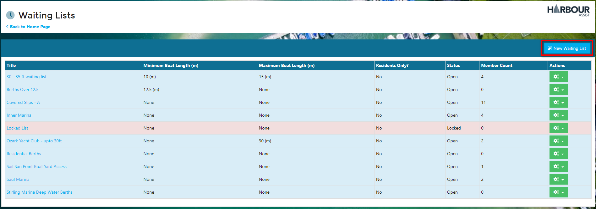
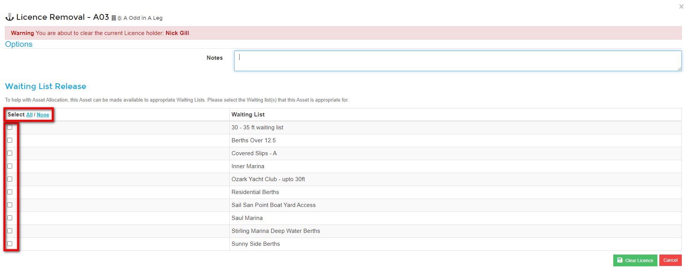

# Waiting Lists

Waiting Lists can be used in different ways:-

- Simply as a log of Accounts/Boats interested in a particular product or event, or
- A full allocation tool matching Accounts/Boats to relevant Assets.

## Creating a New Waiting List

To create a new Waiting List, from the Home Page go to *Asset Tools*.

From the drop down list select *Waiting Lists*.

All your current Waiting Lists will be displayed.  To create a new list click on *New Waiting List*.

Give the List a title and set any minimum or maximum boat lengths.

?> NB: When adding a Boat to a Waiting List, only Lists where the Boat fits within any Min/Max lengths will appear for selection.  If there are no restrictions just leave these blank.

Use the *Back to Waiting Lists* button to return to the main Waiting Lists screen.

Your new List will now show.

## Adding an Account to a Waiting List

You may want to add an Account (rather than a boat) to a Waiting List - maybe the account holder hasn't purchased a boat yet.

You can add an Account to a Waiting List by using the *Add to Waiting List* button which shows in the main toolbar on the Account.  

As you are adding from the Account, not the Boat, all lists will appear for selection irrelevant of any length restrictions you have put on the Waiting Lists.  If a List is Locked it will show with a Padlock symbol next to it.

Click on the List you wish to add the Account to.

In the pop up window, leave the Boat cell as 'No Boat' and add any Notes.

?> NB: The Joining Date will default to the current date, so only complete this if you wish the date to be anything other than the current date.

Click *Save*.

If you view the *Waiting Lists* tab on the Account, you can see the Account has now been added to the List.

The summary details will show on the Account Dashboard page.

It will also show when you view the Waiting List.

## Adding a Boat to a Waiting List

From the Boat Details page select *Waiting Lists*.

Then *Add to Waiting List*.

All Waiting Lists where the boat length fits within the minimum and maximum length restrictions will appear.  If a List is Locked it will show with a Padlock symbol next to it.

Click on the List you wish to add the Boat to.

The Boat has now been added to the Waiting List.

If you view the *Waiting Lists* tab on the Account, you can see here that the Boat is on a Waiting List.

The summary details will show on the Account Dashboard page.

It will also show when you view the Waiting List.

## Viewing, Editing or Printing a Waiting List

To View or Edit a Waiting List, click on the green Actions button and View/Edit.

This will take you into the List where you can edit the Title and amend/set the Minimum and Maximum boat lengths.

You can view the members of the Waiting List, seeing their position on the List and Joining Date etc.

Using the Actions button you can carry out various actions for each member of the List.

Waiting Lists can be printed either by clicking *Print* from within the List or by selecting *Print Preview* from the Actions button.

Both ways create the same PDF for printing.

## Locking a Waiting List

Waiting lists can be Locked and Unlocked as required.  Once Locked you will not be able to add any further Accounts/Boats to the list.  This feature is useful if you are using a List for an event which has a maximum number of places available.

You can Lock a List from either the Actions button or from within the List itself.

Once a List is Locked it will appear in Red on the Waiting Lists screen and the Status will show *Locked*.

To Unlock a List, just click on Unlock either within the List or by using the Actions button.

## Releasing an Asset to a Waiting List

To use Waiting Lists as a full allocation tool, you need to release your Assets to any relevant Waiting Lists.

### Releasing an Unlicensed Asset

From the Home page, go to *Asset Tools*.

From the drop down list, select *Asset List*.

Select the Asset that you wish to release to a Waiting List by clicking on the *Asset Name*.

Click on the *Waiting Lists* tab.

Use the blue *Release to Waiting List* button to select the list that the Asset needs releasing to, or use the *Release to All* button to release to all the Waiting lists.

The *Waiting Lists* tab in the Asset now shows which list(s) the Asset is released to.

### Releasing an Asset when Clearing a License

When clearing a License from a boat you may want to release the Asset to a Waiting List so that you can offer the Asset to someone on the List.

?> More documentation [here](Renewals/Licensing.md).

In the Boat Details and the Licensing section of the *Tariffs & Occupancy* screen, select *Clear* on the Asset you want to clear the License from.

You will be given a warning that you are about to clear a license.  

If appropriate you can add a note, but this is not a mandatory action.

Select the *Waiting List(s)* that you wish to release the Asset to by using the check boxes or the *Select All* button. 

Click on *Clear License* at the bottom of the screen.

You will be asked to confirm your action - click OK to continue.

## Allocation

The Allocation function is used to match accounts/boats on a Waiting List to an Asset.

From the Home page go to *Asset Tools*.

From the drop down list, select *Allocation*.

Select the Waiting List from the dropdown list.

All the members of the Waiting List will show in order of the earliest joining date ie. the one who has been on the list longest will show at the top in position 1.

Select the Account/Boat that you wish to offer the mooring to by using the *Select* button.

Then select the Asset you wish to offer them by using the Select button.

Click on the Offer button to log that you have offered the mooring to the customer.  

Add a note regarding the offer and click OK.

The offer and date it was made is now logged against the Customer and the Asset.  

You should now email the customer the offer of the mooring (this could be set up as a template email for ease).  Clicking on the Account name in the Allocation page will open the customers account in a separate window so that you can easily send the email communication.

?> For more documentation about email templates click [here](communications/EmailTemplates.md).

When the customer responds either accepting or rejecting the offer, go back into the Waiting List and select the customer and the asset, then click on either License to license them to the Asset or Offer Rejected as appropriate.

As the customer/boat may be on more than one Waiting List, when Licensing the Account/Boat to the Asset you have the option to update all the Waiting Lists they are on.

?> NB: Rejecting the offer will add the Customer and the Asset back onto the Waiting List.