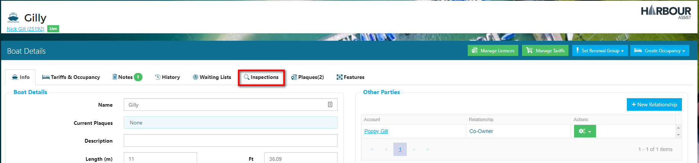
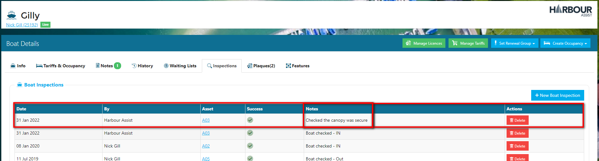
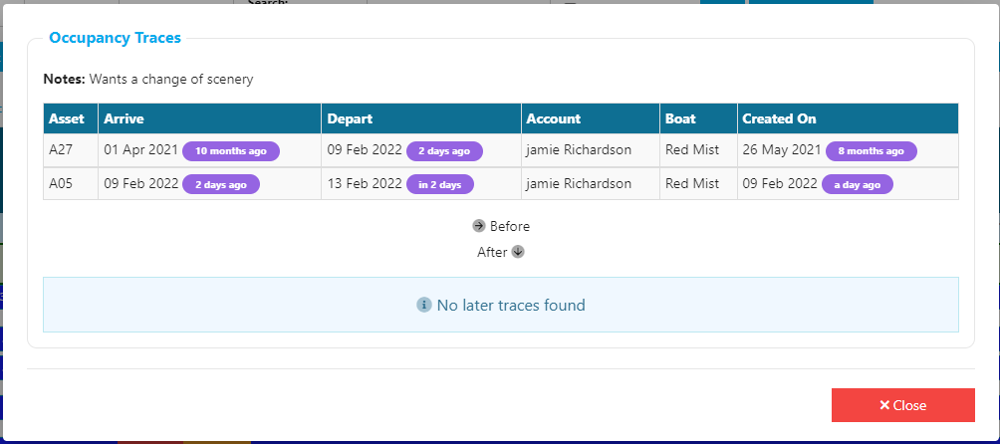
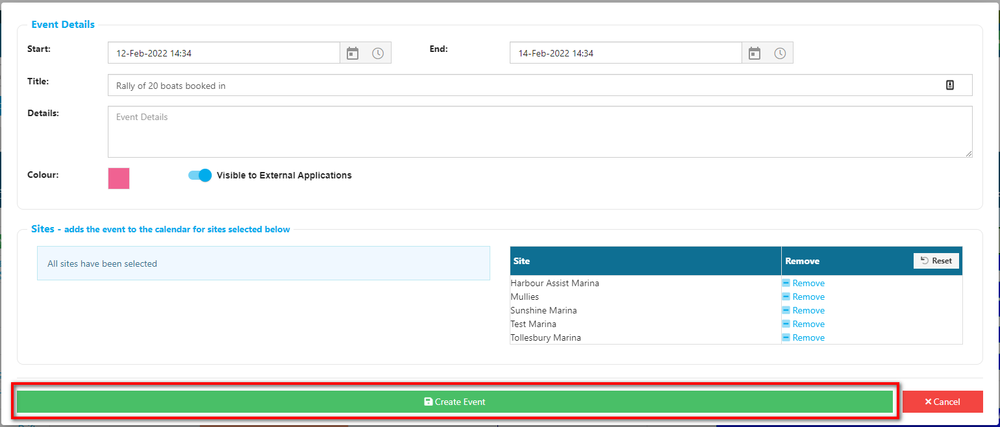

# Occupancy Calendar #

The Occupancy Calendar assists users to carry out checks to ensure that all craft within the marina are either on a long term mooring contract or paying for visitor moorings.

Craft can be moved location by using this function, thus ensuring the system is always up to date with factual occupancy information and shows which berths/moorings are occupied or vacant.

From the *Home* page select **Occupancy**.

## Finding your way around the Occupancy view  ##

The Occupancy view can be filtered in many ways to aid you in finding the information you require.

Multi-site operators should firstly select the site you wish to view by using the drop down arrow next to the *Site* title.  

You can view the Occupancy by 3 days, 1 week, 2 weeks or a month by selecting the view on the right hand side of the screen.

To move to the next 3 days, 1 week, 2 weeks or a month, use the arrow keys on the right hand side of the screen, or to move to a specific date use the Calendar icon to select the date.  You can return to todays' date by clicking on *Today*

You can then select a specific area of the site by clicking on the blue buttons  which outline the different Regions of the site.

The view below is filtered to show just the Car Park.

If you wish to remove the filter and return to seeing the whole of the site, just click on the Red filter icon.

Some of your Assets may have been classified as *Unusable* - ie. it is not available for Occupancy, if you wish these to show on the Occupancy screen you need to check the *Include Unusable* box.  These Assets will then appear in a shaded red colour.

The Assets that are occupied will show an occupancy line - the colour of these lines will vary depending on the type of occupancy i.e. Residential, Leisure, Visitor etc., so at a glance you can see the type of occupancy on that mooring/berth. 

Within the occupancy line the text gives the name of the Account holder, the Boat that the occupancy relates to and the duration of the occupancy.

?> NB: For short occupancy periods not all the above information will show in the occupancy line due to space limitations - it will however show if you hover over the line with your cursor.

The column in between the Asset names and the calendar shows who the mooring/berth is licenced to. 

?> More documentation [here](Renewals/Licensing.md).

When an occupancy is associated with an Order you will also see within the occupancy line the status of the Order - C for confirmed, D for draft - and whether there is an outstanding balance on that order.  If the Order has been paid you will see a £0 balance in green, for outstanding balances the amount will show in red.

## Recording Occupancy Inspections

To record whether a craft is on its berth/mooring at a specific moment in time, click on the occupancy line of the craft and check the boat either IN or OUT as appropriate.

You will be asked to confirm your entry.

An 'eye' icon will appear on the occupancy line to indicate that boat has been checked In or Out - useful if you are walking up and down pontoons with an ipad!

This action of checking a boat IN or OUT is recorded within the *Boat Details* screen under the *Inspections* tab.  

To view details of the Inspections, click on the tab - you will be able to see the date/times of Inspections, who carried out the check, which Asset (mooring/berth) the craft was on and whether it was IN or OUT.

## Adding an Inspection Note ##

During an Inspection you may wish to add an inspection note to a boat.  You can access the Boat Details directly from the Occupancy screen by clicking on the Occupancy line and selecting *View Boat*.

Select the *Inspections* tab, then click on *New Boat Inspection* 

Add your note in the *New Boat Inspection* box and click *Save*.

The Inspection Note will then show in the Inspection details.

Once you have added your note you can go directly back to the *Occupancy Screen* by clicking on the *Back* button.

## Moving Boats ##

### Performing a One Way move ###

To move a boat to a vacant Asset from within the Occupancy screen, firstly click on the occupancy line you wish to move and select *Move/Split/Swap*.

You now have the option to move the Entire Occupancy or to Split the occupancy ie. show part of it on one asset and then the final part on a different asset.

The screen will default to Split the occupancy and will show and the effective date at todays date, you only need to change this date if the move date if a different date.

You also have the option to add some notes stating why the occupancy has been moved if you wish.

Then click on *Next*.

The boat you are moving will be highlighted in light green.

You now need to find the Asset that the craft is moving to - you can filter down your options by using the Blue Tiles at the top of the screen if you wish, but in the example below I have selected to move it to C10.  You select the Asset that the craft is moving to by clicking on the *Use* button.

As this Asset is currently empty, the screen will automatically default to a *One Way* move.

You can select whether or not to move the License of the craft to the new location.

?> For more documentation about Licensing click [here](Renewals/Licensing.md). 

Click on *Perform Move*.

You will be prompted to confirm the more - click on OK.

Back in the Occupancy screen, you will see the craft has moved.  The occupancy on the old Asset is showing as departed and faded.

?> NB. The License move will not immediately show in the Occupancy Screen unless you ctrl+F5 to refresh.

?> NB. You can move a craft onto an occupied asset in exactly the same way - however only one craft can be licenced to the Asset - if you select to licence the moving craft onto the Asset a warning will appear and the existing craft will be unlicensed from the Asset.

### Swapping Boats ###

To Swap two boats, firstly click on the occupancy line of one of the boats you wish to move and select *Move/Split/Swap*.

Select the *Split/Swap* option and the *Effective Date*.  

?> NB. The effective date will default to todays date, so you only need to change this if the move date if a different date.

Then click on *Next*.

The boat you are moving will be highlighted in light green.

You now need to find the Asset that the craft is moving to - you can filter down your options by using the Blue Tiles at the top of the screen.

Select the craft that the swap is with by clicking on the *Use* button.

Select the Move Type of *Swap*.  This will highlight the craft the boat is being swapped with in dark green and the *Swap* arrows will show.

If you wish to also swap the licenses ensure the box is ticked.

Click on *Perform Move*.

You will be prompted to confirm the more - click on OK.

Back in the Occupancy screen, you will see the two craft have swapped.

?> NB. The License moves will not immediately show in the Occupancy Screen unless you ctrl+F5 to refresh.

## Tracing Movements ##

You can trace the movement of a craft from the Occupancy screen, finding out where the craft was before and after the occupancy that you select.

From the Occupancy screen click on the occupancy line and select *Trace Movements*.

The movements of *Before* and *After* are shown - in this case there are two *Before* movements, but no *After* movements.

 Just click on Close when you have finished viewing this information.

## Calendar Events

You can add arbitrary important events into the Occupancy Calendar so they appear at the top letting the entire team know of important things to consider when booking people in.

Select *Occupancy* from the Home screen.

Events will appear in the top green-shaded line.

You can add a new Event in 2 ways:-

- By clicking on the *New* button, 

or

- Clicking on the Events line to select a start date and an end date.

Either way will take you to the Event Details pop-up screen.

If you have used the *New* button to create the event, the Start and End dates will default to the current date.  You can adjust these using the calendar pickers.

Give the Event a Title and add any further details.

If you wish you can colour code your Events - select a colour by clicking on the blue square.

**Multi-site users only** - you can select which sites the calendar event will appear on - use the Add and Remove buttons to do this.

Once you have entered all the details click *Create Event*.

The event will now show on the Occupancy Calendar.

