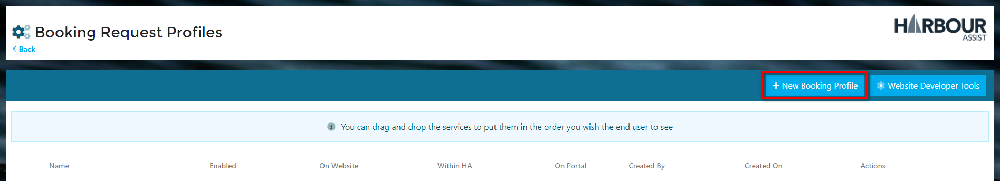

# Creating a Booking Request Profile

?> NB: The Permission of Feature Permissions>Booking Requests>Administration is required to be able to create a Booking Request Profile.

From the *Home* page select *Administration*.

Then select *Booking Request - Profiles*.

Click on *New Booking Profile* to start building your profile.

Now you can navigate through each part of the build process to create your new profile.

### Configuration

Complete the following information to configure your Booking Request profile:-

1. **Internal Name** - give the profile a name.
2. **External Name** - this is an optional cell.  If you want the customer to see a different name to the Internal Name enter it in this cell.
3. **Restrict to Account Types** - this is an optional cell.  Should this profile only be available for certain account types?  If so select them here.
4. **Default Account Type** - if this is a new customer which Account Type should be used ie. if this is a profile for a Visitor Booking Request and the customer hasn't visited before you would probably want the new account to be a Visitor Account Type.
5. **Enabled** - you can enable or disable Profiles whenever you wish, so if a service is only available for a period of time each year you can just disable it when not required.  You can also set up Profiles in advance and then enable them at the appropriate time.
6. **Availability** - where do you want the Profile to show?  Check box to show the Profile on your Website, within Harbour Assist or on the Customer Portal.  You can have the Profile showing in multiple places.
7. **Image** - upload a relevant image for the Profile.

To move on to the next section, click on the *Next* button at the top of the page.

### Capture Fields

Now you can add your Capture Fields.  This is all the information that the customer needs to complete to make their request.

?> NB: The Email and Last Name fields are mandatory, so are added to the Capture Fields by default.

Use the **+** button to add the Capture Fields.

Each time you add a Capture Field a pop-up will appear for completion - complete the information as necessary:-

1. **Required** - this is an optional cell.  Is this a mandatory field?  If it is click to check the *Required* box.
2. **Label** - this is an optional cell.  If you want to display something different to the customer than the Field Name enter it here.  In the example below you may want *Mobile* to say *Mobile Phone Number*.
3. **Guidelines** - this is an optional cell.  Enter any guidelines here that will assist the customer in completing this cell on their request.  This will add an *i* button which gives additional information when they hover over it, just the same as you are seeing next to these cells.
4. **Placeholder** - this is an optional cell.  This is the text that appears in the cell before a user clicks on it giving them instruction on what information to complete.  An example could be *Please enter your mobile number without spaces*.
5. **Css Class Name** - this is an option cell that will make sense to your Web Developers.  This enables you to add specific styling to each cell ie. background colour, boarder etc.

When you have complete all the details, click on *Save*, this will take you back to the *Capture Fields* page.

You can arrange the fields to put them in the order which you wish the user to see when filling out the form by dragging and dropping them.

You can also request the customer to complete additional details on their form.  Check the box if this information is mandatory and then put a relevant message in the text box.  For instance - for a refuelling profile you will probably want the customer to complete the quantity required, so put *'please state here how many litres are required'*

To move on to the next section, click on the *Next* button at the top of the page.

### Scheduling & Sites

This section is where you can set the availability for each service that you offer, if applicable.

The first thing to complete is whether this is a scheduled service or not, ie. does the customer need to select a date?  

#### For non-scheduled services

Profiles such as *New Customer Registration* would not require a date, so you can leave the *Scheduled Service* box unchecked.  

In the *Manage Sites* section check the box for the site(s) where you want the service to be available.  This is particularly relevant if you are a multi-site operator as some services may be available at some sites and not others

?> NB: Single site operators will still need to check this box for their site.

Now you can move onto the next step by clicking on the green *Next* button. 

#### For scheduled services

For Profiles that are scheduled ie. they require a date, please check the **Scheduled Service** check box.  The page will then expand so that you can configure the following details:-

1. **Days in advance** - how far ahead do you want your customers to be able to book?  Enter the number of days in this box.
2. **End Date Required** - tick this box if the request requires more than 1 date.  For example, a Lift-out would not require an end date, but a Visitor booking will require an end date.
3. **Max duration** - NB: this box will only appear if you have checked the *End Date Required* box.  You may only allow visitor stays for a maximum of 7 nights, if so enter 7 into this box etc.
4. **Manage Sites & Slots** - NB: this is only relevant to multi-site operators.  Checking multiple sites will enable you to configure slots in bulk rather than on a site by site basis.
5. **Enabled** - If you are a multi-site operator, some services may be available at some sites and not others.  Check this box for all sites where the service is available.  NB: if you are a single site operator, you still need to check this box for your site.
6. **Manage Slots** - click on this to set the number of slots available for each service each day and how much notice you require for a request.
7. **Override Slots** - when you set the number of slots in the Manage Slots section, this will set them on a recurring basis indefinitely.  You can override this on a day by day basis by using the Override Slots calendar.  So, if Joe is on holiday for a week in August and you can't offer any lift outs, just override the number of slots available for that period to 0.

To move on to the next section, click on the *Next* button at the top of the page.

### Notifications

Now you can configure what is sent to the customer, how it is sent and when it is sent.

The communications sent from here are automated so will not require any user intervention.

So, if you want your customer to receive an automated email acknowledgement that their Booking Request has been received, check the Email box on the *Request Received - Awaiting Confirmation* line.

You can also send communications by SMS/Text, but remember you will need to have some SMS credits to be able to do this.

We have added template responses for each of the communications, but you may want to alter these or even create your own.  You can do this by clicking on the *pencil* icon next to each communication.

You can also send automated communication to internal recipients, for instance you may want Joe in the yard to receive an email every time a Lift Out Request is received.  Just check the Email box and add Joes email address.  For multiple recipients, just comma separate the email addresses.

To move on to the next section, click on the *Next* button at the top of the page.

### Orders

You can also add a Quick Order Template to your profile, this enables the customer to both book and pay for the booking online. 

?> More information on Quick Order Templates can be found [here](QuickOrders/CreatingQuickOrders.md)

To add a Quick Order Template to a Booking Request Profile, click on *Select*

A window will appear showing with the Quick Order Templates available. If you can’t see the Quick Order Template you need, you will need to check the Quick Order Template settings.

Once selected, you will return to the Booking Requests Profile, and your Quick Order Template will now be listed. 

Multi-site customers will be shown a list of sites, and the Quick Order Templates available for each site. You will need to select a Quick Order for each site.

If any sites do not have a Quick Order Template set up, the system will not allow you to assign other templates, a Quick Order Template will need to be created specifically for that site.

To change the Quick Order Template to a different one click on the *Edit* button and select a new Template.

To remove the Quick Order Template use the *Clear* button.

?> NB: This will remove the ability for the customer to pay for the Booking Request at the point of submitting the request.

### Tasks

Booking Requests can be linked to Tasks so that when a request is received a Task is automatically created.  

If you don't want a Task to be created automatically, just move onto the next screen.

When you toggle for a Task to be created a number of fields to fill out will appear.

1. **Task Date** - what date do you want the Task to be created for?  The submitted date of the request or the start date of the service?
   NB: if the Profile is for a non-scheduled service, the task will default to the date the request was submitted.
2. **Task Type** - what Task Type should be created; select from the dropdown list or add a new Task Type if you don't already have a relevant one set up.
3. **Assign to Team** - what Team should the task be assigned to initially?  Remember, you could have it assigned to one Team when it's received and then they can reassign the Task to another Team when the request is confirmed.
4. **Title** - what should the Task Title be?

To move on to the next section, click on the *Next* button at the top of the page.

?> NB: The final screen **Web Developer Tools** will only appear if you have selected that you want the Booking Profile to appear on your website.  If you haven't selected this, just click on **Save** to complete the set up of your Booking Profile.

### Web Developer Tools

?> NB: This screen will only appear if you have selected that you want the Booking Profile to appear on your website.

Use this screen to customise how you want the Booking Request Profile to appear on your website.  

?> NB: This screen should only be completed by someone who has knowledge of web development.  For those with this knowledge it is quick and easy to complete.

Once completed click on the *Save* button to complete the set up of your Booking Request Profile.
