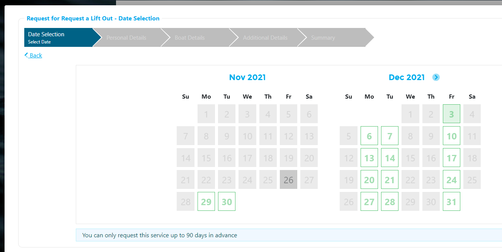

# Create a Booking Request via Harbour Assist

One of the ways to create a Booking Request is via the system, where users can create a Request on behalf of a customer.  Whether this is available or not is configured against each Booking Request Profile when they are created.

?> For more documentation about creating a Booking Request Profile click [here](BookingRequests/CreatingProfile.md).

To create a Booking Request on behalf of a customer, from *Features* on the *Home* page select *Make a Booking*.

Click on the service that the customer wants to book.  For this example we are going to book a lift out.

Select the date that the customer wants to book the lift for, available dates will show in green.

Now search for the customer by entering their email address.  If this a new customer select the +New Account to create an account for the customer.

When you have entered 3 characters the system will bring back possible results; obviously the more characters you enter the more refined the results will be.

Select the correct account by clicking on the *Select* button.

If the required information is already held on the account this will be populated automatically in the relevant cells.  Enter any additional details required then click on the *Next* button.

?> NB: Mandatory cells will appear in red and you will not be able to navigate to the next screen until they are completed.

All the boats on the account will be displayed; select the boat by clicking on the *Select* button.

If you need to add a new boat to the account click on *add a new boat*.

If the information is already held on the boat this will be populated automatically in the relevant cells.  Enter any additional details required then click on the *Next* button.

?> NB: Mandatory cells will appear in red and you will not be able to navigate to the next screen until they are completed.

Enter any additional details, then click *Next*.

Review the Summary with the customer, then click on *Submit & Pay* for Booking Requests with a Quick Order, or *Submit* for Booking Requests without a Quick Order attached.

For Bookings without an Order, a confirmation screen will show with a Booking Request Id number.

For Booking Requests with a Quick Order, the User will be taken to the New Payment page to process the transaction with the customer.

The customer will receive the automated confirmation email (if the Profile has been set up to send one) and the request can now be dealt with in the same way as requests received via the Customer Portal or your Website.

