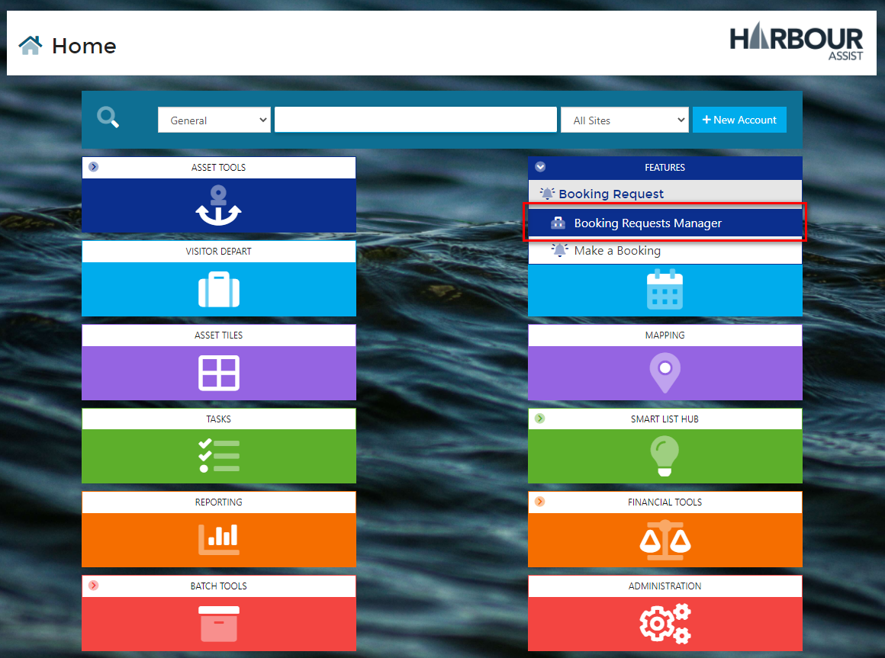
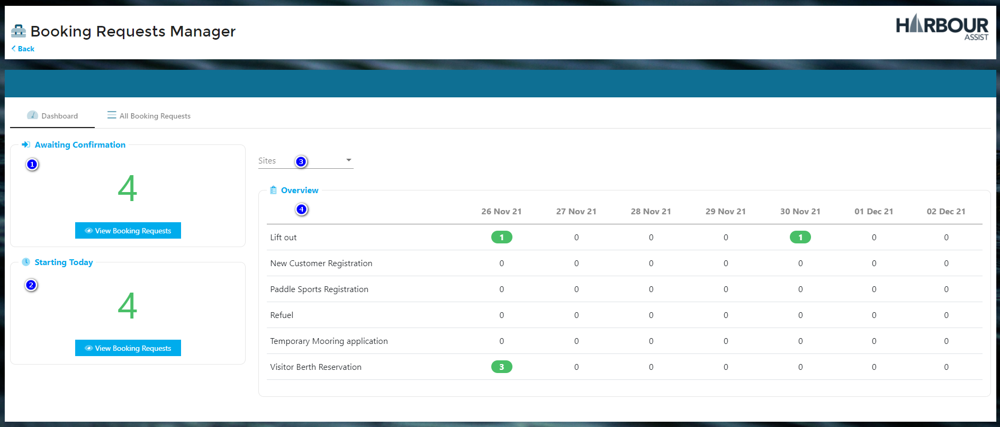
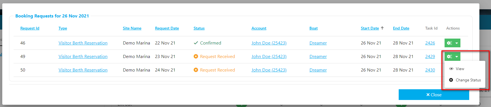
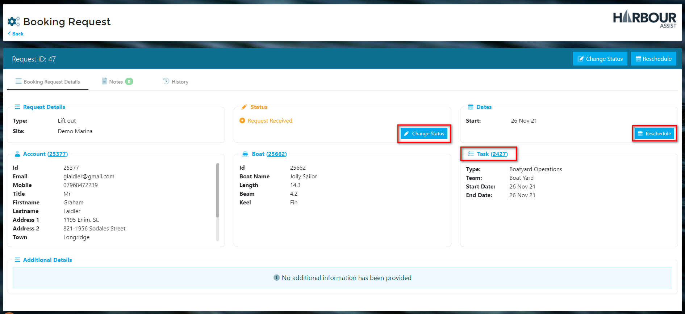
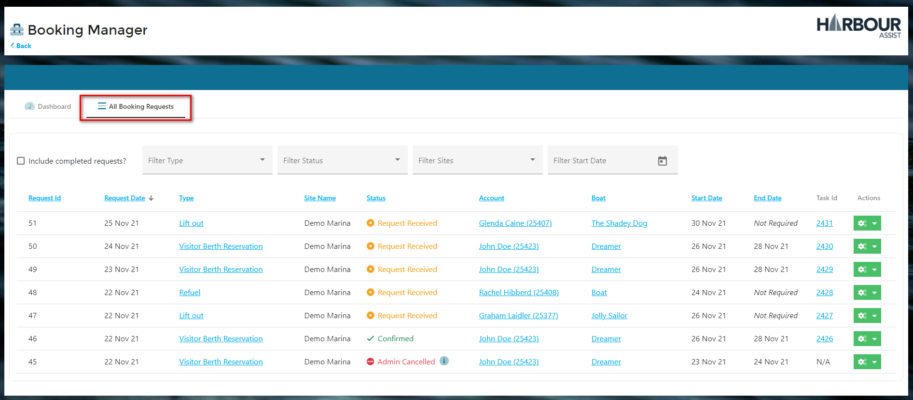
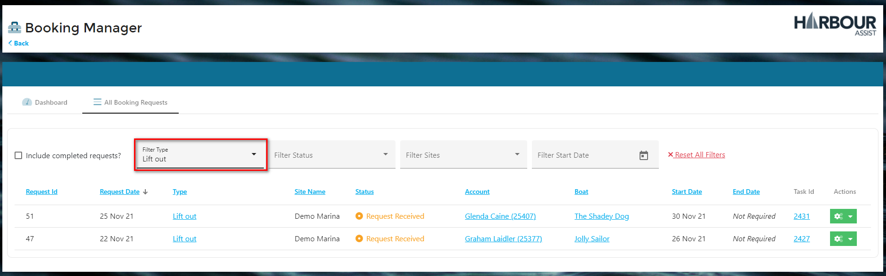

# Managing and Viewing your Booking Requests

Booking Requests can be viewed and managed by using the *Booking Requests Manager*.

From *Features* on the *Home* page select *Booking Requests Manager*.

This page gives you the following details of all requests:-

1. **Awaiting Confirmation** - the number of requests received that are still awaiting confirmation.  Click on *View Booking Requests* to see all the details.
2. **Starting Today** - the number of requests starting today.  Click on *View Booking Requests* to see all the details.
3. **Sites** - for use by multi-site customers.  Filter the screen to show requests for just the site you are interested in.
4. **Overview** - a seven day overview of upcoming requests.  Click on any of the green numbers to see all the details.

Clicking to view the Booking Request details will open a pop-up screen. Click on the green *Actions* button to view the full Request details or change the status of the Request.

When viewing the Booking Request you will see all the information completed by the customer.  From this screen you can click through to the Task to schedule a time for requests such as Lift Outs.

?> NB: Tasks that are created by a Booking Request will always default to the time of 00:00.  Click through to the task to schedule a time for the Request.

Once you have checked to see if you can accommodate the Request you can use the *Change Status* function to either confirm or cancel the Request.

You can also *Reschedule* the request to a different date. 

If you have a large number of Requests, use the *All Booking Requests* tab to show you all requests, including cancelled requests.

Here you can filter by Request Type, Request Status, Site and Request Start Date.  

Joe in the yard is only interested in Lift Out requests, so he could filter to just show those.

Clicking on the green *Actions* button gives you the same options as above so that you can manage your Requests.