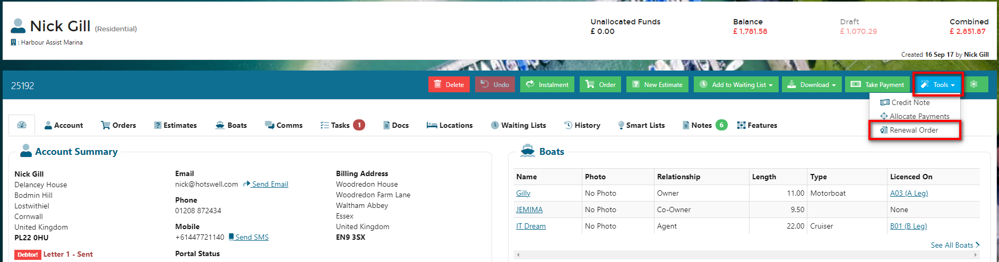
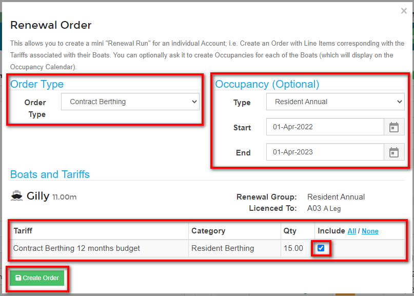
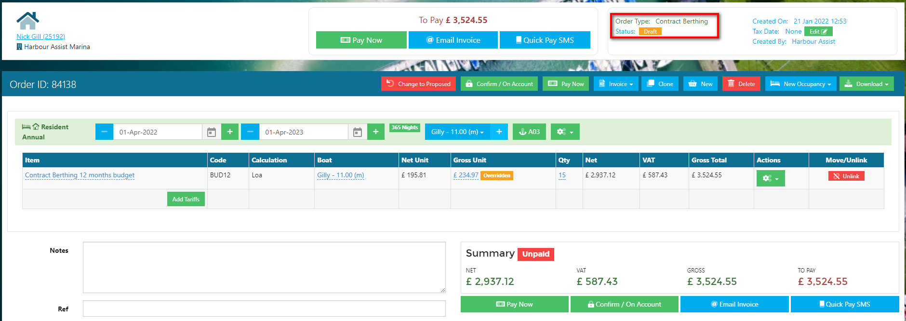
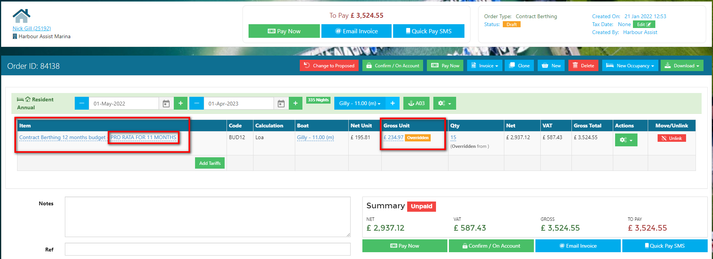
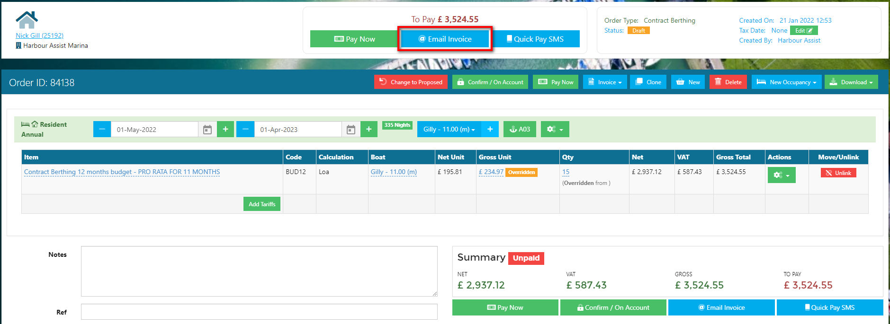

# Raising a Contracted Customers Initial Order

On most occasions a new contracted customer will need to have their initial order raised outside of a Renewal Batch, especially if they are arriving part way through the year.

Once you have set the customer up with the License, Tariff and Renewal Group, their first order can be raised based on this data.

?> For more documentation about Renewals click [here](Renewals/Overview.md) or go to Renewals in the Help Index.

## **Individual Renewal & Pro Rata Video**

From the customer Account click on the blue *Tools* button and select *Renewal Order* from the dropdown list.

Complete the following details on the pop up screen:-

- Order Type - select from the dropdown list
- Occupancy Type - this will automatically select the default Occupancy Type for the Order Type selected; you can change this by using the dropdown options if necessary.
- Start and End dates - using the calendar pickers.
- Tariff(s) - click to include a tariff.

Once complete, click on *Create Order*.

 The order has been created in Draft so you can now make any necessary adjustments.

Often the initial Order needs to be a pro rata order, so you will need to adjust the Gross Unit cost to the pro rata rate (the full charge will have been added by default) and you can also indicate it is a pro rata order by amending the tariff name.

Once the amendments have been made you can send the Order to the customer in the normal way.

As you have already set up the customer with the License, Tariff and Renewal Group, they will automatically be included in your next Batch Renewal Run.