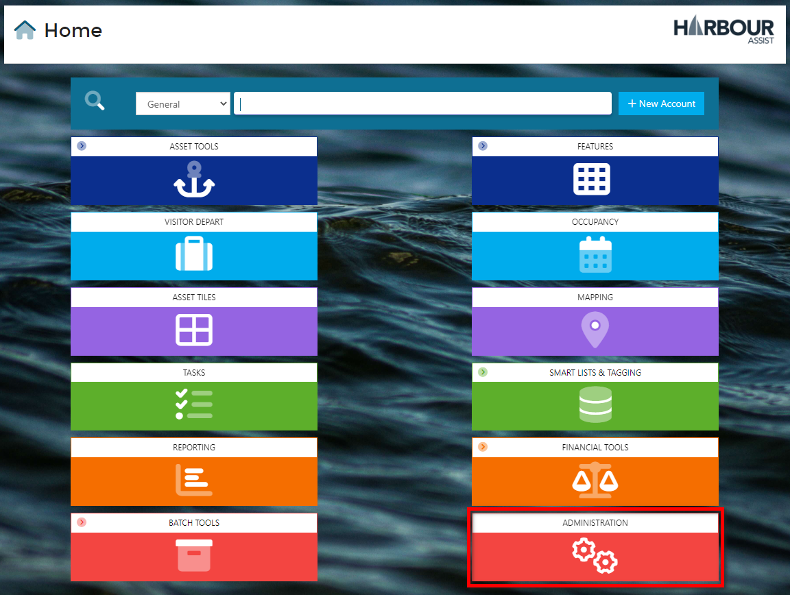
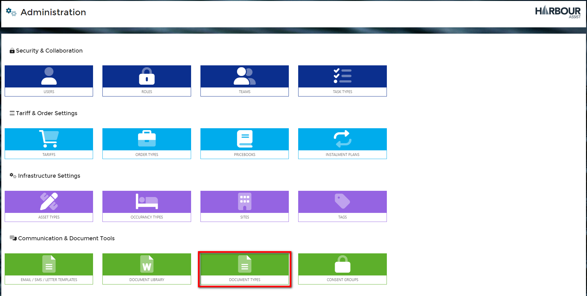
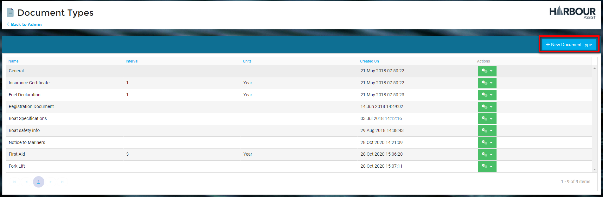
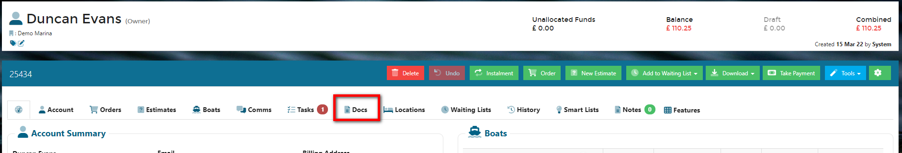
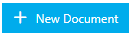
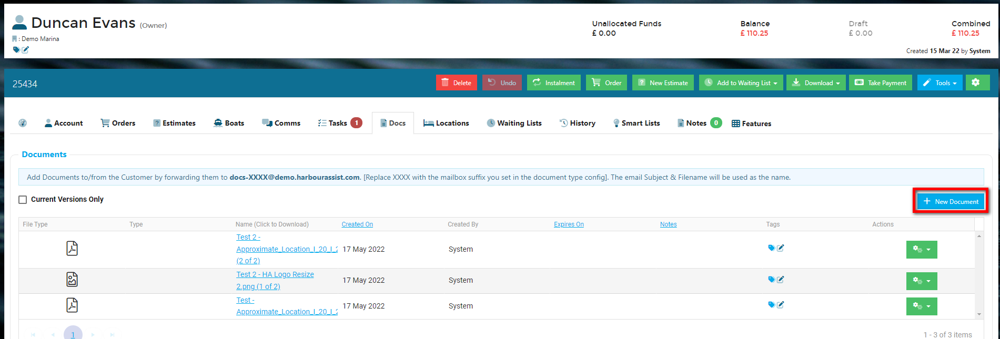
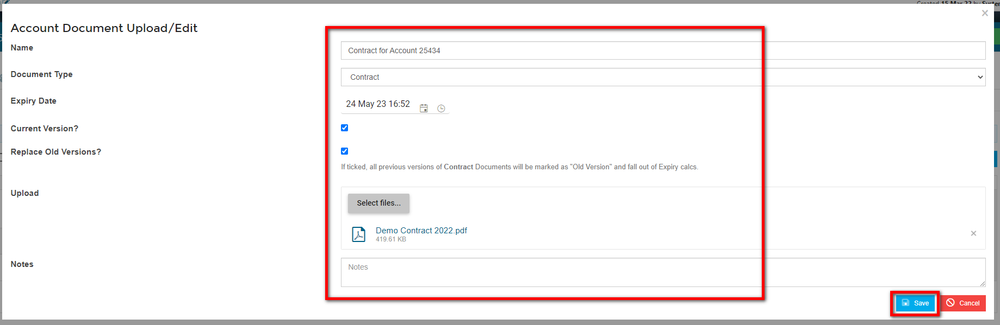
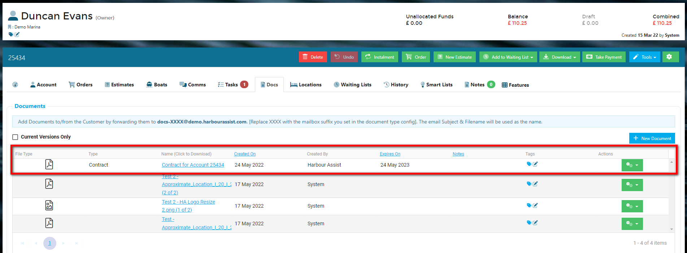
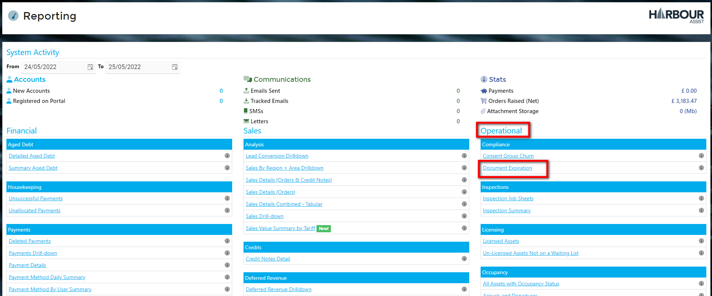
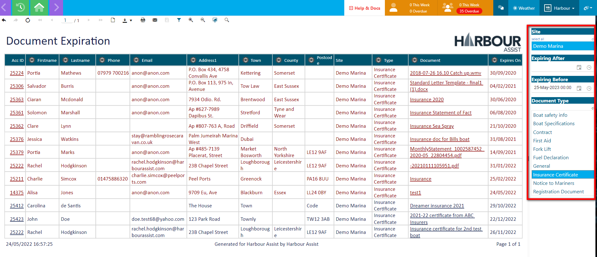

# Documents

## Overview

To allow HA to categorise documents that are uploaded against an Account, there are now the concept of Document Types.  An example of a Document Type could be *Insurance Certificate*.  Account Document Types are configurable via the Administration area.  Each Document Type can have an expiry duration configured against it consisting of a number of days, weeks, months or years.  

When a document is uploaded, its Expiry Date is calculated & this is then flagged as and when it becomes expired.  

When a user uploads a new Document, you can opt to replace the previous version, allowing you to quickly see the current version of a given Document Type as well as historical versions.

We've also integrated this into the ability to send docs to a docs tracking mailbox.  By specifying a "Mailbox suffix" to the Document Type, you can set up different mailboxes for each Document Type.  For instance setting up a Document Type of "Insurance Certificate" with a mailbox suffix of *insurance* would mean that any attachments sent to **docs-insurance@xxxxxxxx.harbourassist.com** will be attached to the account with a Document Type of *Insurance*.

## Creating a Document Type

From the *Home* page select *Administration*.

Then select *Document Types*.

Click to create a *New* Document Type.

Give the Document Type a name and complete the *Expiry Units* (using the dropdown options) and *Interval* if these are required.  

You can also add the *Mailbox Suffix* if you wish (see Overview above for details). When finished, click *save*

## Uploading a Document to an Account

To upload a *Document* to an Account, select the *Docs* tab.

Then click 

Complete the following details on the pop-up screen:-

- Document Name (leave blank if you wish it to default to the file name of the document you are uploading),
- Document Type - select from the dropdown options,
- Expiry Date - if relevant for this Document Type
- Current Version - should this show on the Docs page as the current document of this Document Type?
- Replace Old Version - if ticked all previous versions of this Document Type will be marked as *Replaced* and fall out of Expiry Reporting.
- Upload - select the file to be uploaded.
- Notes - (optional) add any relevant notes.

Then click on *Save*.

The new Document will now show at the top of the list (they display in *Created On* order with the most recent at the top) and the if you have selected to *Replace Old Versions* they will be marked up accordingly.

## Document Expiry Reporting

A list of expired or expiring documents can be viewed in the *Document Expiration Report*.  From the *Home* page click on *Reporting*.

Then select *Document Expiration.

Add filters to your report to drill down to the information you require.

?> NB. Details for any Documents that have already expired will show in Red.

