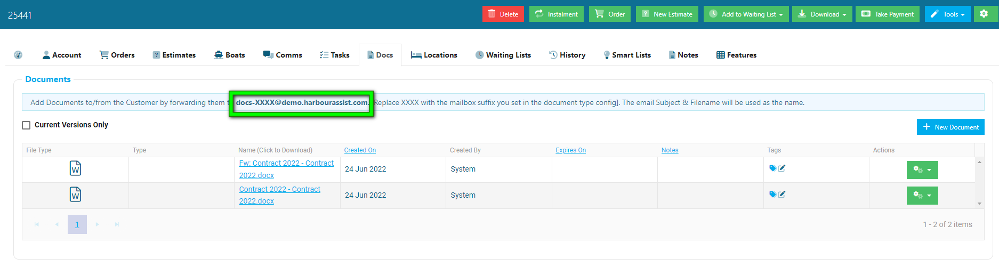
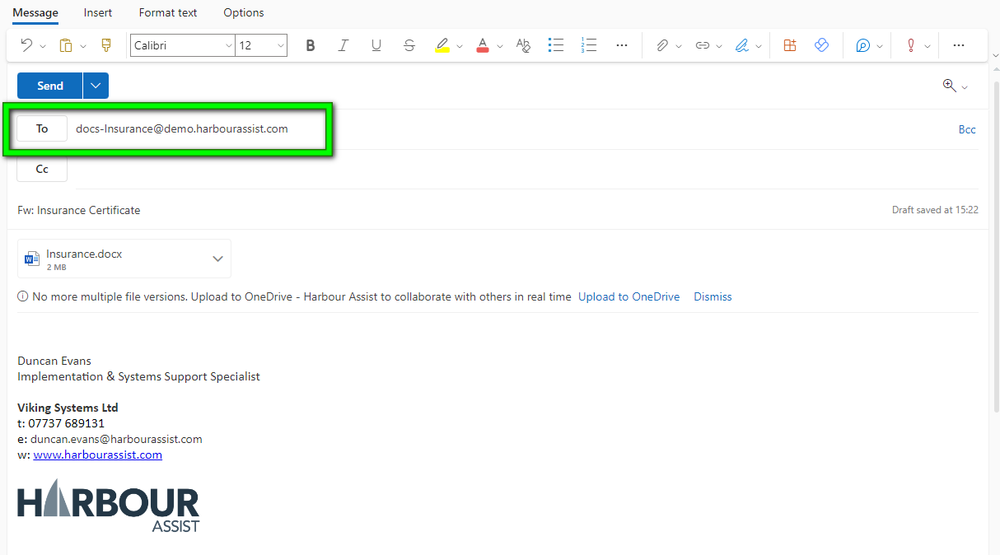
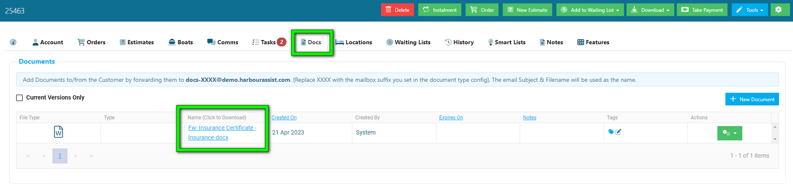
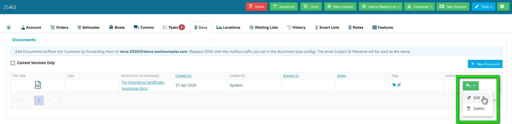
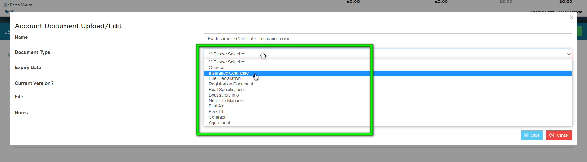
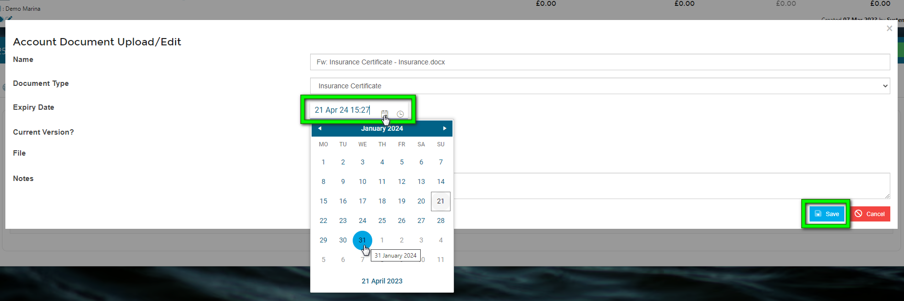
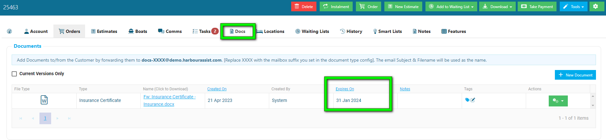

# Tracking a Document to an Account

If a customer sends you a document as an attachment in an email, you can track documents directly into an account by forwarding the email to a mailbox suffix, saving you time of having to save the document to your device before uploading it.

In the Document tab of an account, there is a mailbox address.

When a customer sends an email with their document attached, you can forward the email to the mailbox address, simply replacing the **XXXX** with the name of the document. The name just needs to match the name of the Document Type you have created.

For example, if it was an Insurance Document you would forward the email to **docs-*Insurance*@demo.harbourassist.com**

The document will added automatically to the customer account, found in the Docs tab.

When forwarding a document, if the document type has an expiry, such as Insurance or a Contract, you will need to check and confirm the expiry date.

To edit the expiry date, click on the green actions button and select *Edit*

Then confirm the Document Type from the drop-down list.

Next, confirm the Expiry Date using the calendar picker, and click *Save*.

Your document details will update on the account. 

