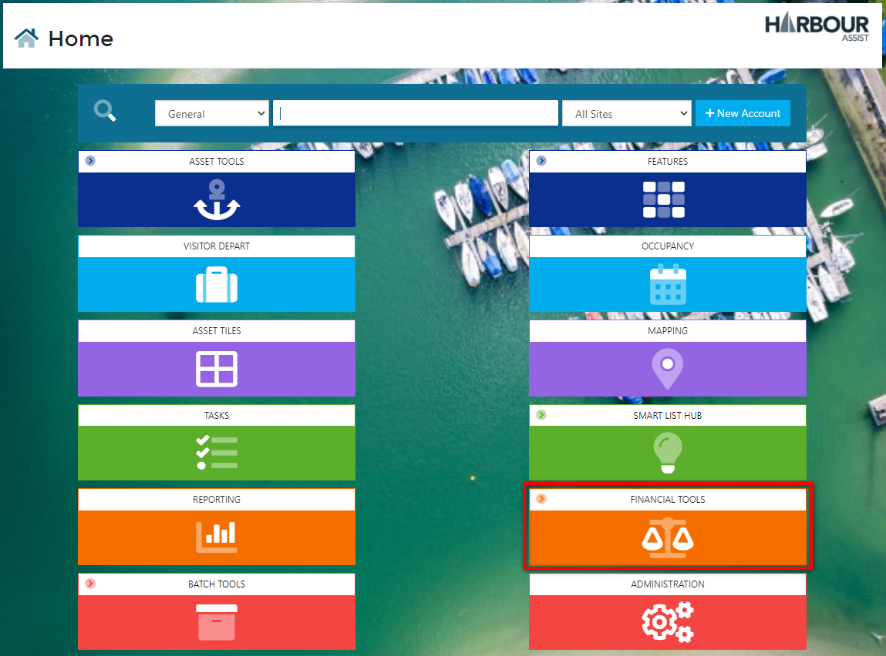
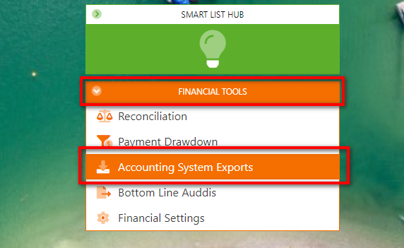
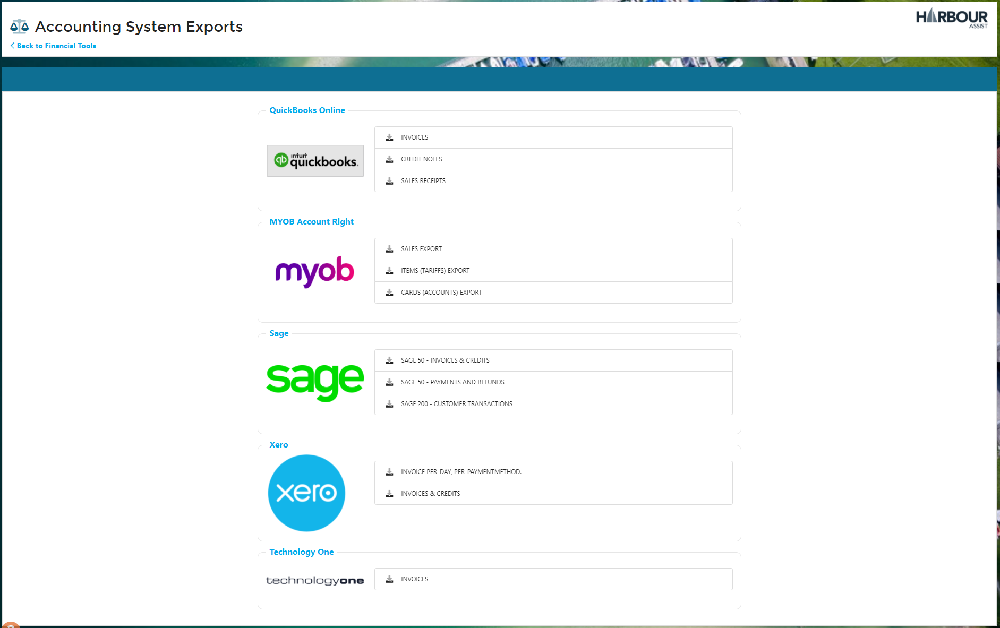
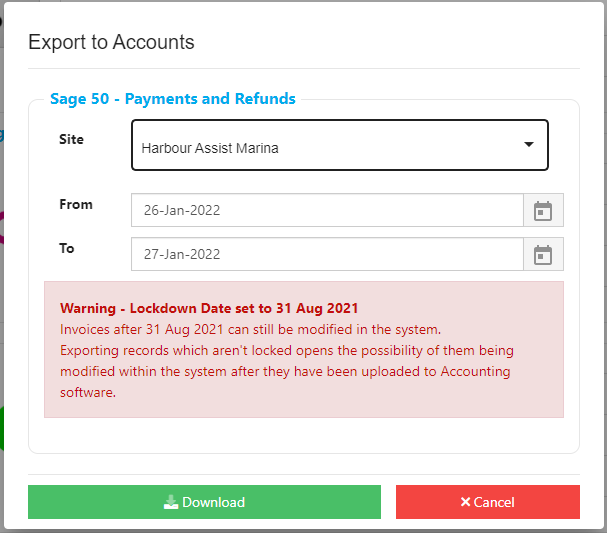

# Exporting Data to Accounts systems

Whilst we don't (yet) support direct integration with Accounts software, you can export records in file formats compatible with popular Accounting packages.

Currently supported:-

**Sage 50** - Invoices and Credit notes.  Payments and Refunds.

**Sage 200** - Customer Transactions

**Sage Intacct** - Receivables, Invoices. 

**Xero** -  Invoices and Credit notes. 

**Technology One** -  Invoices.

**MYOB Account Right** -  Sales, Items (Tariffs) and Card (Accounts) Exports.

**Quickbooks Online** -  Invoices, Credit notes and Sales Receipts.

**Access Dimensions** - HAInvoices, HACredits, HAReceipts.

To export data, from the *Home* screen go to *Financial Tools*.

From the drop down list, select *Accounting System Exports*.

Now select the appropriate account package.

Select the Site and From/To dates.

A warning will show if you are selecting dates after the last Lockdown Date or if a Lockdown Date hasn't been set.

?> More documentation on Lockdown Dates can be found [here](AccountsOrdersPayments/AccountingExports/LockdownDate)

Click *Download*

This will create and download an Excel document that you can open at the bottom of your screen.