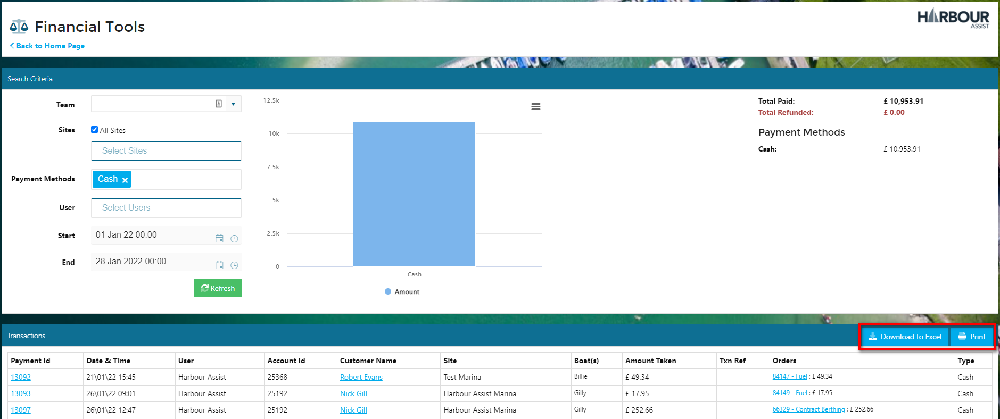

# Reconciliation - End of Day

The Reconciliation page gives you a full overview of all financial transactions for a selected period of time.

From the *Home* page go to *Financial Tools*.

From the drop down list, select *Reconciliation*.

In the overview that you see will default to the current day and show all transactions in a bar chart, with a summary on the right hand side and details of each individual transaction at the bottom of the page. 

Filters can be applied to get more specific information or information for more than the current day. We want to show Cash payments only for the period 1 - 28 January.   

Once you have applied all the filters, click *Refresh* to view the results.

The tranactions can be printed directly from Harbour Assist or downloaded to Excel so that they can be reconciled with the takings or banking for that day or chosen period of time.

To remove any filters or change the selection, click on the drop down arrow of the filter, remember to *refresh* each time you make a change

