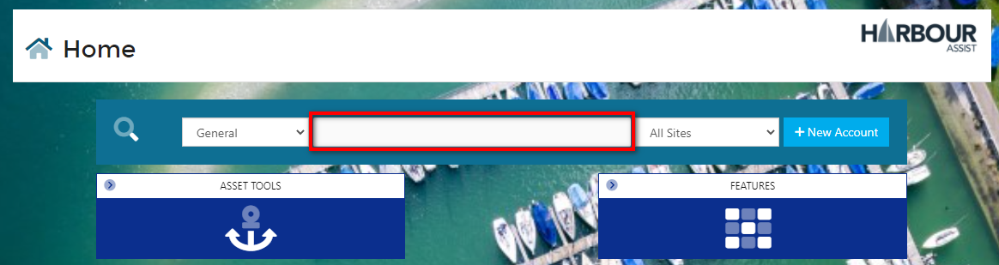
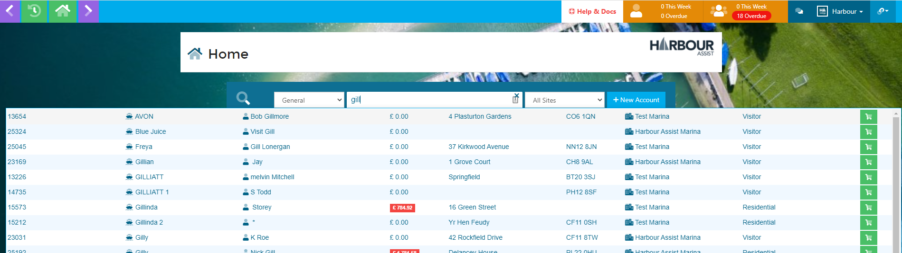
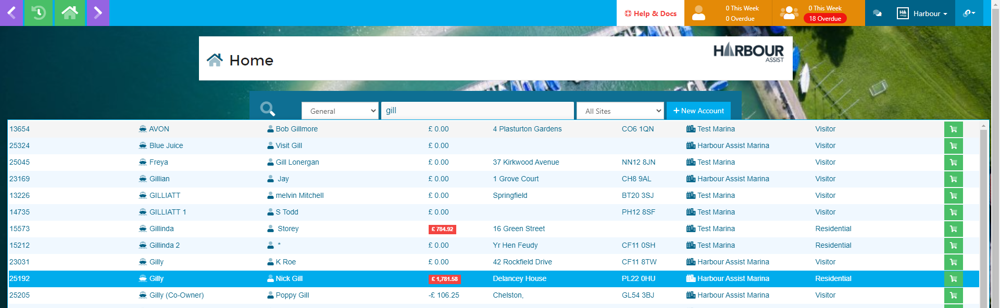
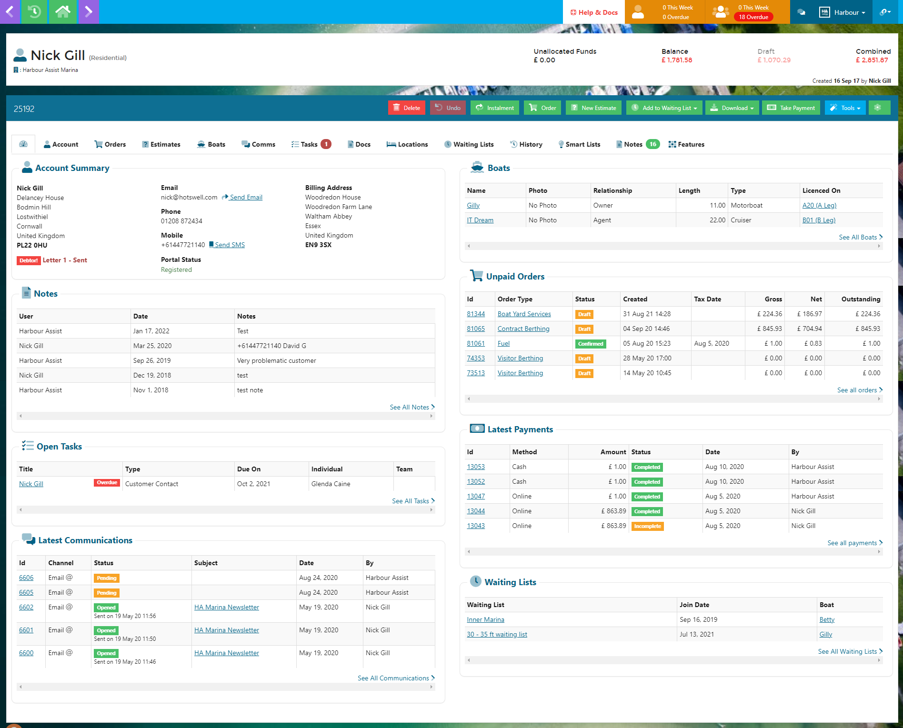
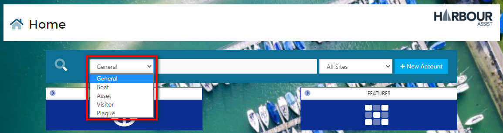

# Finding a Customer #

## Finding a Customer video

## Finding a Customer Documentation

To find an existing customer or to check if someone already has an account (live or archived) - from the *Home* page, enter a significant word in the *Enter search term* box - this would normally be a surname, but could also be a first name, boat name, email address or postcode.  You can also search by Account ID or Order ID.

All the customers that match your search will be shown, giving details of their name, boat, account number, address - this will enable you to confidently select the correct customer.  Archived accounts will show in RED and archived boats that are on live accounts will show the boat name in RED.  

Move your cursor to the customer you wish to select - it will highlight the customer in blue - and click.  This will take you to the customer dashboard.

?> NB: The search is set to default to a General search, but to narrow the results you can use the drop down key to change this to a more specific search.  Different search types will show different details in the results - for instance the search type of Boat will show the boat dimensions and a picture of the boat (if one has been uploaded) in the results.

?> More guidance on the Default Search setting can be found [here](GeneralNavigation/SettingYourDefaultSearch.md)

