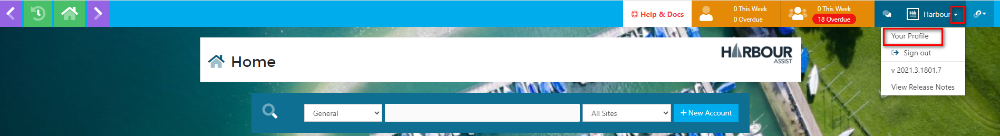
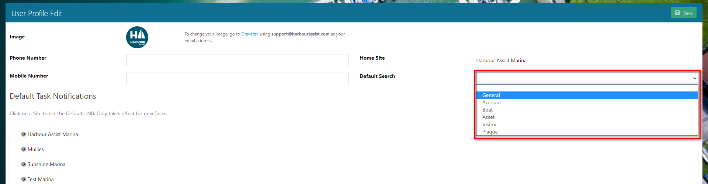

# Setting your Default Search #

If you wish to customise your default search this can be done by going to Your Profile.

Set the default search using the drop down options and then click Save.

Once this is set, the Home page will always default to this search type, however you can still change this by selecting the search type from the drop down list.

