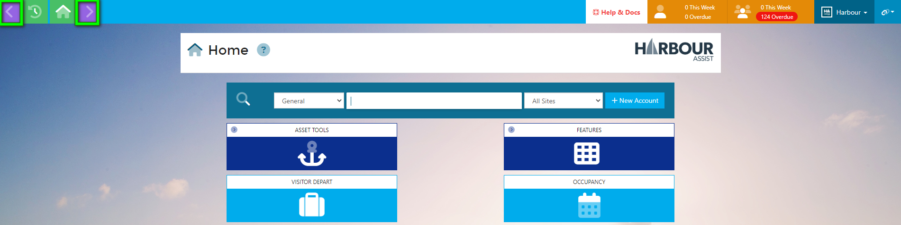
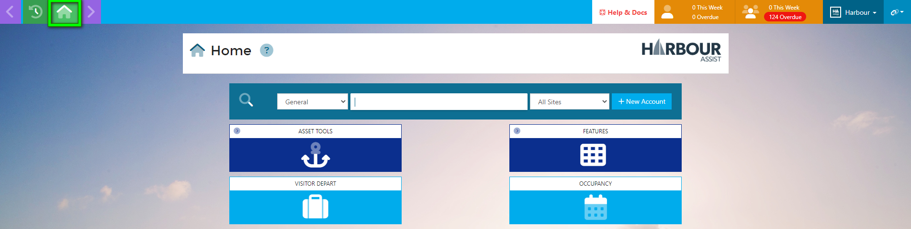
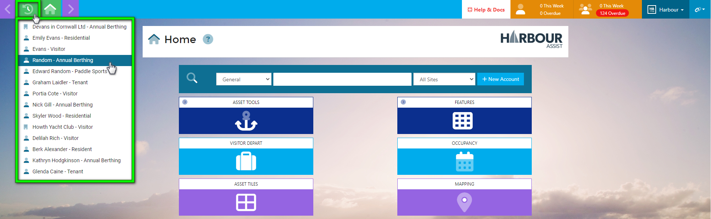
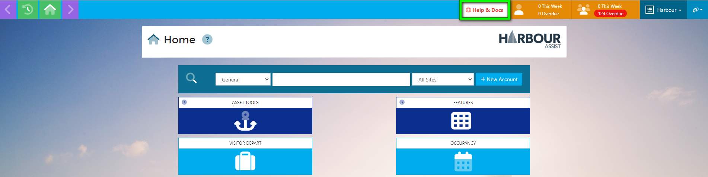
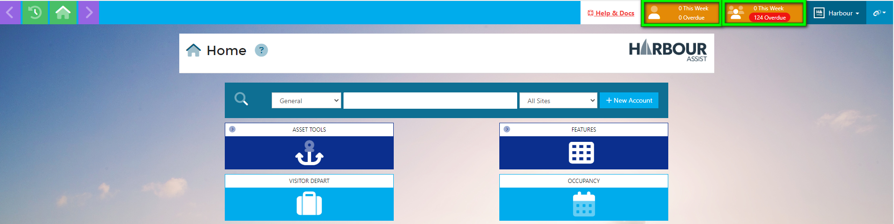
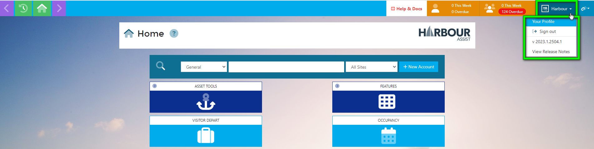
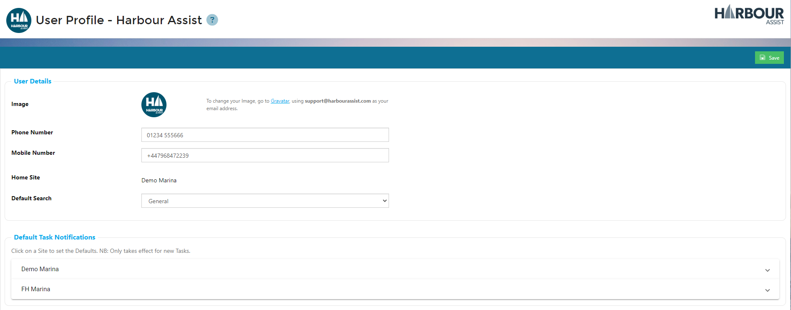
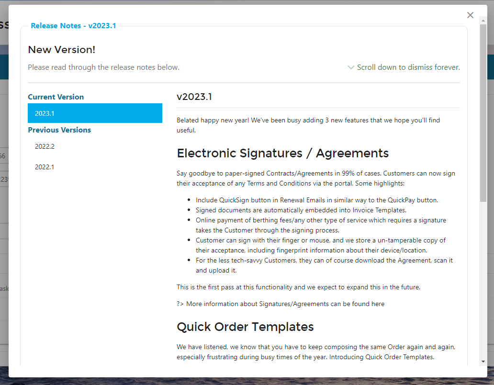
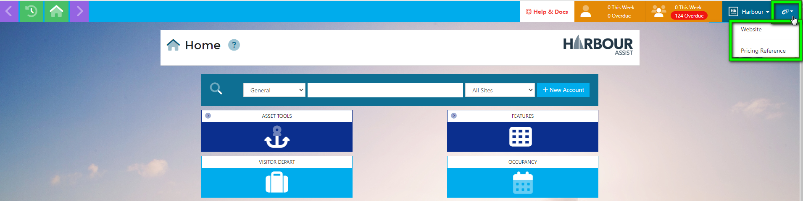
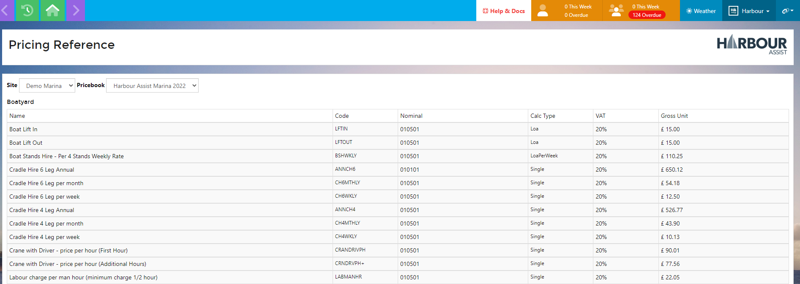

# Top Toolbar

The Top Toolbar contains convenient navigation buttons and quick links, the toolbar appears in every screen of Harbour Assist. 

From wherever you are in the system, the purple arrow keys will take you back a page or forward a page respectively, saving you the need to keep clicking in and out of screens.

The Home button will return you to the Home Page from wherever you are in the system.

The Account Tracker acts as a User history, clicking this button will display up to the last 20 Accounts you have viewed so you can go back to an account quickly without re-searching.  Just click on the Account Tracker button and select the correct Account.

The Help & Docs button opens this step by step guide on how to complete processes within Harbour Assist, featuring both documented instructions and video guidance.

The orange Task notification buttons alert the User to any Tasks they may have due or overdue for completion.

The Icon representing a single person, shows any relevant Tasks for the User signed in, while the Group Icon represents any Tasks due for the Team(s) the User is a member of.

?> More guidance on Tasks can be found [here](Tasks/Overview.md)

The Your Profile button displays a drop-down list, these include Your Profile details, the Sign out option, confirmation of the current version of HA you are on, and any Release Notes.

In *Your Profile* you can upload an image, add your contact numbers, view your Home Site setting (Multi-Site customers only), change your Default Search setting and edit your Default Task Notifications.

?> More guidance on the Default Search setting can be found [here](GeneralNavigation/SettingYourDefaultSearch.md)

?> More guidance on Default Task Notifications can be found [here](Tasks/TaskUserNotifications.md)

The Release Notes will display any recent updates to Harbour Assist and you can view historical releases by clicking on the Previous Versions.

The links button on the far right hand side provides a link to your company website, and a list of your current Prices.

