# Archiving Accounts

## Overview

So that everything is kept neat and tidy and your system doesn't get littered up with old accounts, it is good practice to archive accounts when customers leave.  You don't want to be sending bulk communications with details of things like access code changes etc to those who are no longer your customers.

There's a few things to note:-

- Archiving an account doesn't mean you will lose any information - it will all still be there on the archived account.
- When searching, archived accounts will still show in the results, but they will appear in red and below any live accounts.
  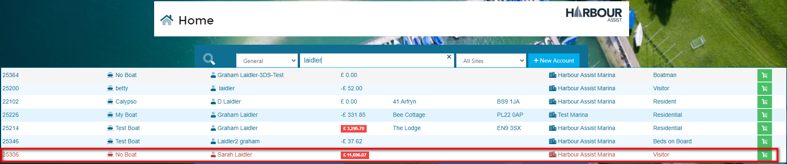

- You **can** archive an account that has a debt or credit balance - they will still appear in the debt reports.
- You **cannot** archive an account that has open Tasks - these will need to be completed or deleted.  A pop-up message will appear informing you if there are open tasks on an account.
- You **cannot** archive an account if the account or any of its boats are licensed to an Asset - the license will need to be removed.  A pop-up message will appear informing you of the license details.
- Archiving an account will:-
  - Archive all the owned boats on the account,
  - Prevent the creation of any further orders,
  - Remove the account and its boats from all waiting lists.
- Archived accounts **can** be reinstated.

## How to Archive an Account

From within the Account, click on the *Account* tab.

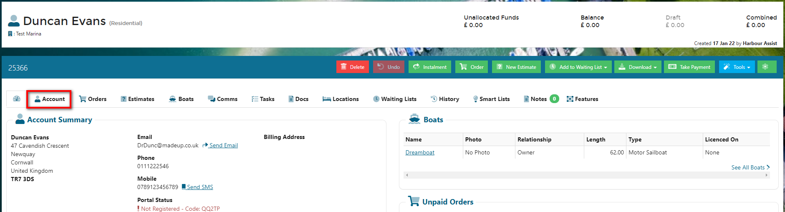

Click on the *Archive* button - this can be found towards the bottom of the page on the right hand side.

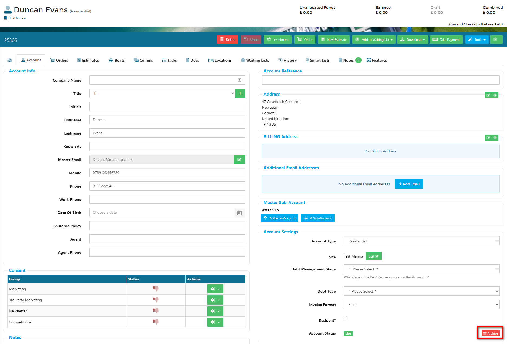

Complete the details in the pop-up box:-

- Select the *Reason* from the dropdown list,
- Add a note,
- Click *Save*

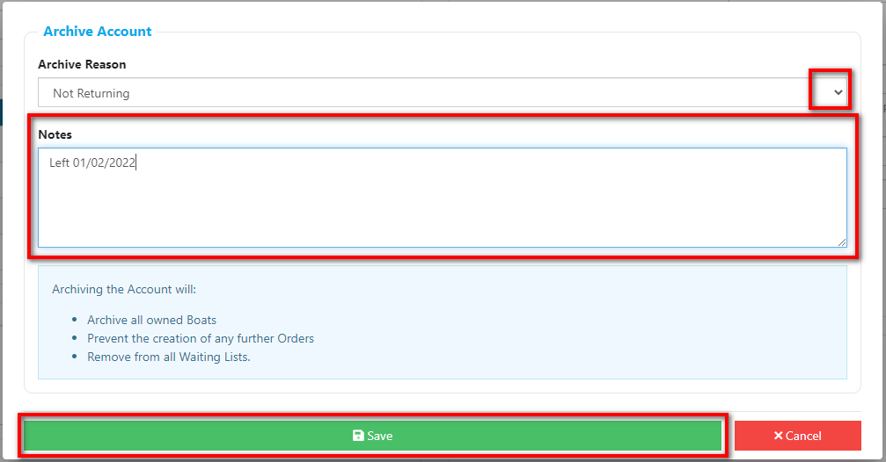

The Account background will turn red indicating this is now an Archived Account.

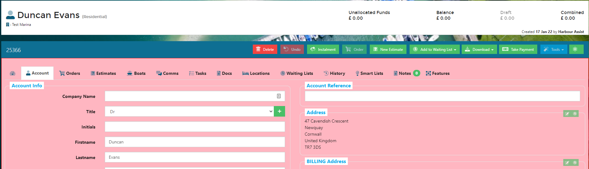

?> Additional Account Archive Reasons can be added in Lookups.  For more documentation about Lookups click [here](Administration/Lookups.md). 

## How to Reinstate an Account

From within the Account, click on the *Account* tab.

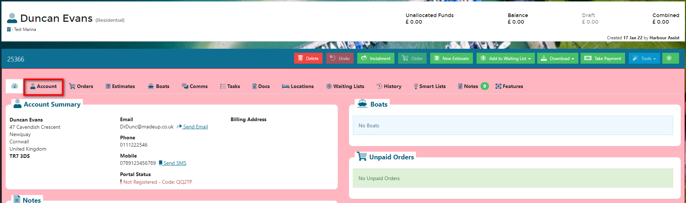

Click on the *Reinstated* button - this can be found towards the bottom of the page on the right hand side.

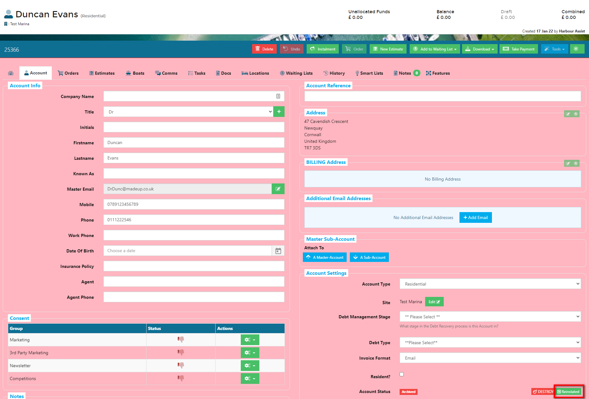

Click on Yes.

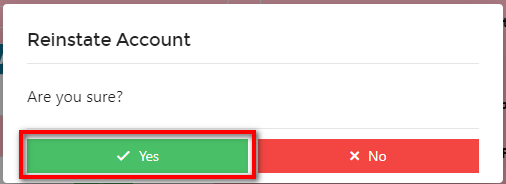

The Account background will turn white indicating this is now a Live Account.

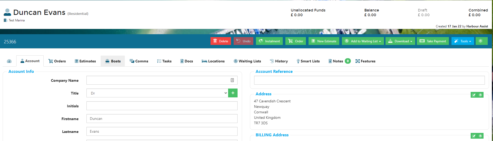

?> Reinstating an Account will not reinstate any Boats on the Account - they will remain as Archived unless their status is changed to Live.

## Changing the Status of a Boat

Click on the *Boats* tab to see any Archived Boats.

?> The Dashboard view will only show Live Boats.

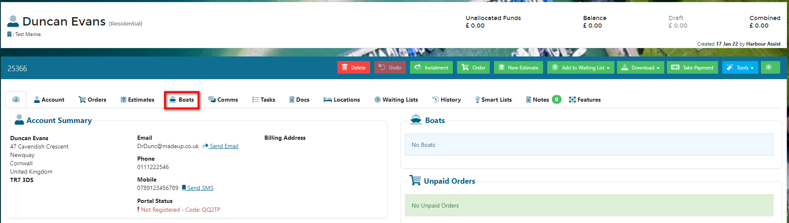

This will show all Boats on the Account and their status.

Click on the name of the boat to access the details.

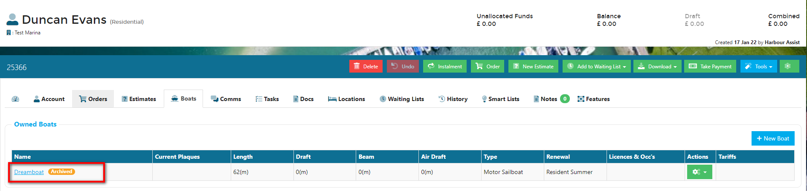

The Boat background will appear in red, indicating it is an Archived Boat.

Click on the dropdown arrow in the *Status* cell and *Live*.

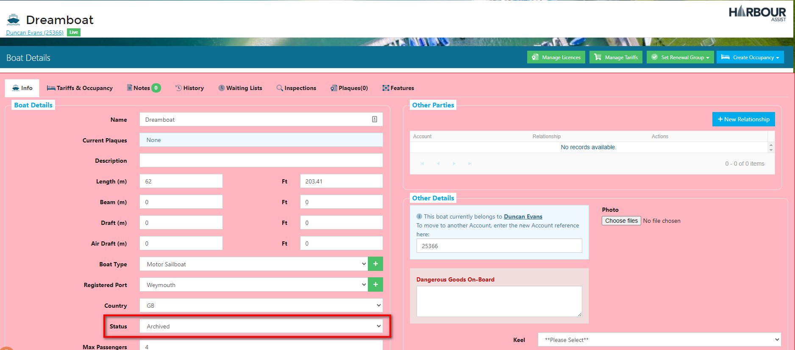

The Boat background will turn white indicating this is now a Live Boat.

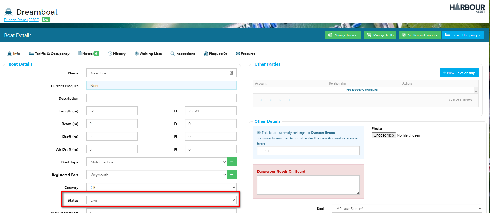