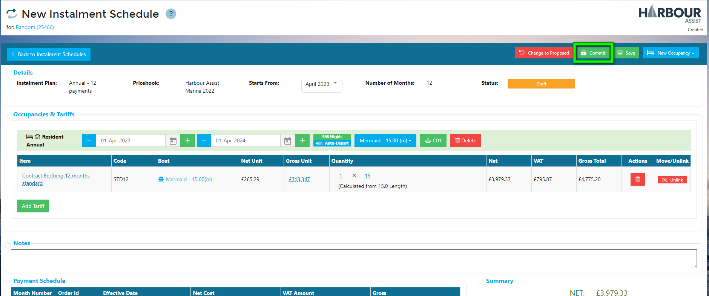

# Creating an Instalment Schedule #

Navigate to the Account you'd like to create the Instalment Schedule for.

Click on the *Instalment* button.

You will be prompted with the following:

- Whether to create a Custom Schedule.

- Which Instalment Plan to use when generating the Schedule.  This will determine the number of months over which the value is split.

- The Pricebook to use.  This will determine the value of Schedule.

- Which month to start the Schedule from. 

When you have completed this, click on *Next*.  

You will be taken to the page where you can select which Asset is required, add Tariffs and see how the value is calculated.

- Select the Asset in the same way as you do when creating an Order.
- Click on *Add Tariff*.  A pop-up will appear allowing you to choose the Tariffs.

?> NB: Only Tariffs configured to be available to the chosen Instalment Plan will be available.  Tariffs which aren't available in the selected Pricebook will be shown crossed-out.

-  Add the appropriate Tariffs.
- Click on *Done*.

The Schedule screen will show the total value of the Schedule and how this breaks down based on the number and frequency of payments set up in the Instalment Plan.  At this point, the Schedule isn't saved, it's in a **Proposed** State.  Whilst in this State, Tariffs can be added, Occupancy dates modified etc.  

Once you are happy with the payment schedule, click on *Commit*.

?> NB: Once *Committed* an Instalment Schedule cannot be edited, it would need to be Credited out, so please be sure the schedule is correct.

A reminder will pop up, click *Yes* if no further changes are required. Click *No* if you want to make any further changes.

Once committed, the screen will update to show the confirmed schedule.

The schedule will now appear in the Orders page of the Account.

