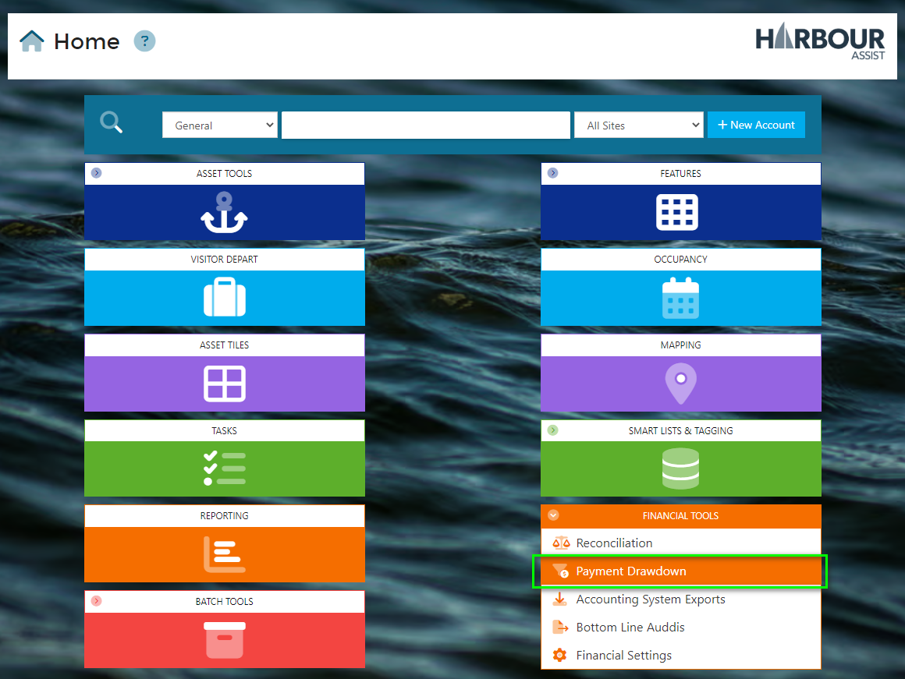
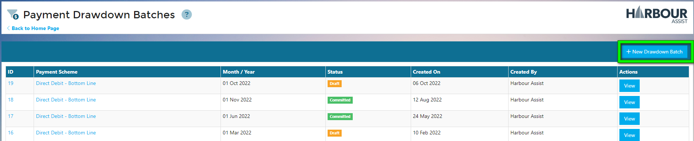
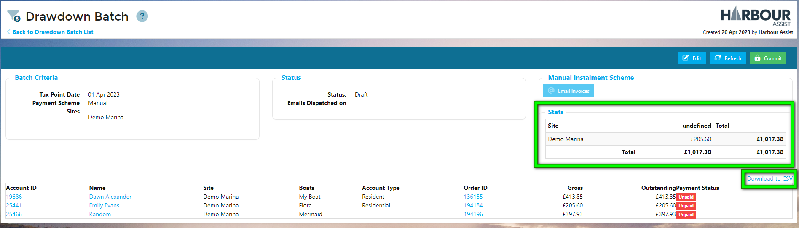

# Drawdown Batches

Each month, you will want to collect the monies due for the Instalments due on that Month.  To do this, you create a *Drawdown Batch* which allows you to perform bulk actions depending on what Payment Scheme you select.

- **Manual** - Bulk email all Accounts with their Invoice, so they either pay online or pay via some other mechanism.
- **Direct Debit** - Generate the DD file for submission.

## Create new Drawdown Batch

?> NB: You require the **InstalmentDrawdownBatchAdministration** Permission in order to do this.

From the Home page click on *Financial Tools* - *Payment Drawdown*.

- You will be shown previous batches if they exist.

- Click on *New Drawdown Batch* 

- You will be shown a popup where you choose:
  - Payment Scheme
  - The Month which you wish to process
  - The Site(s) you wish to process.

- Click on *Save*.

The engine will gather all unprocessed Instalment Orders for the selected Month based on the Accounts' *Payment Scheme* and *Site*.  

These will then be displayed in a grid along with a summary of how much the Batch is worth, grouped by *Account Type* and *Site*.

You can download the Grid to a CSV so you can inspect the data in Excel.

Once happy with the contents of the Batch you can then hit the *Commit* button.  Once the Batch has been Committed, you can then perform the appropriate action based on the selected Payment scheme:

- **Manual** - Bulk email all Accounts with their Invoice, so they either pay online or pay via some other mechanism.
- **Direct Debit** - Generate the DD file for submission and Mark all as Paid.

?> NB: Direct Debit Drawdowns will only pick up confirmed orders. Make sure you confirm your batch runs prior to creating a new Drawdown Batch