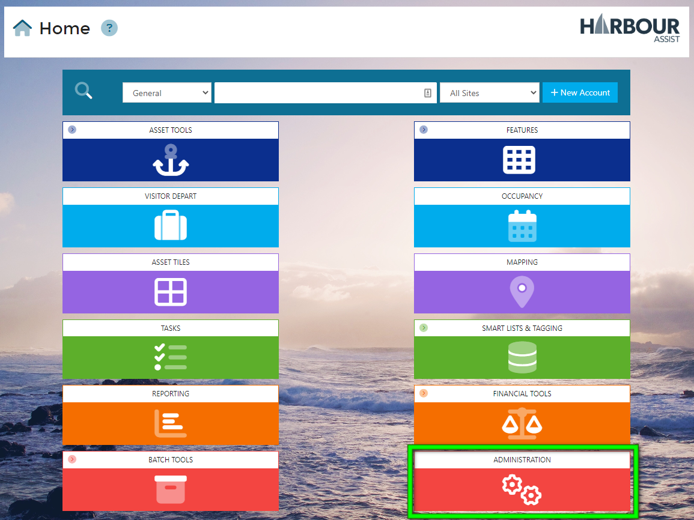
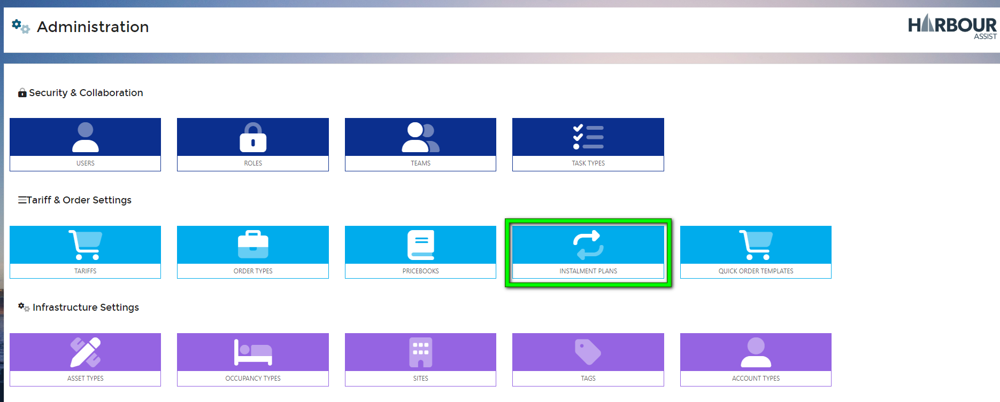
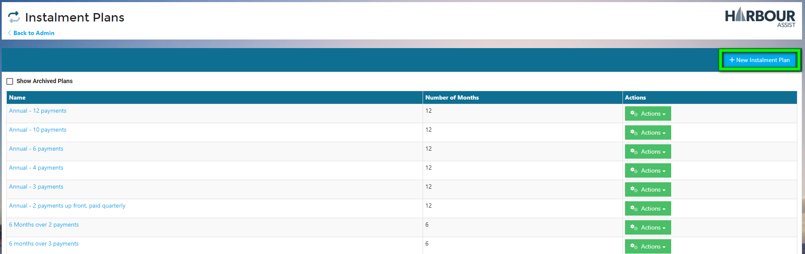
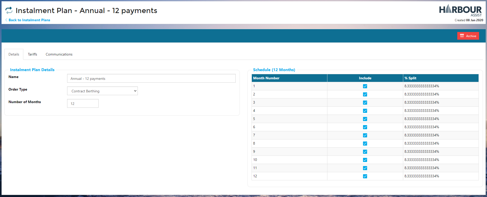
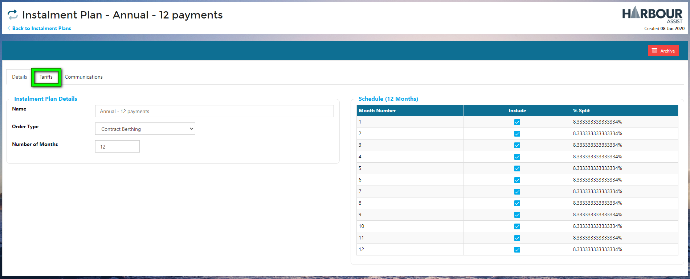
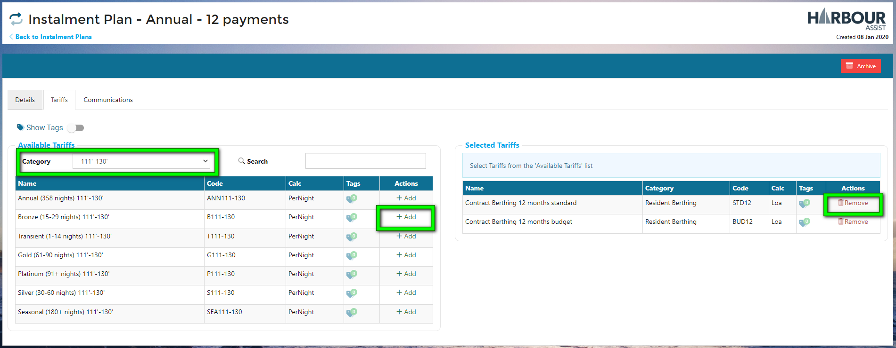
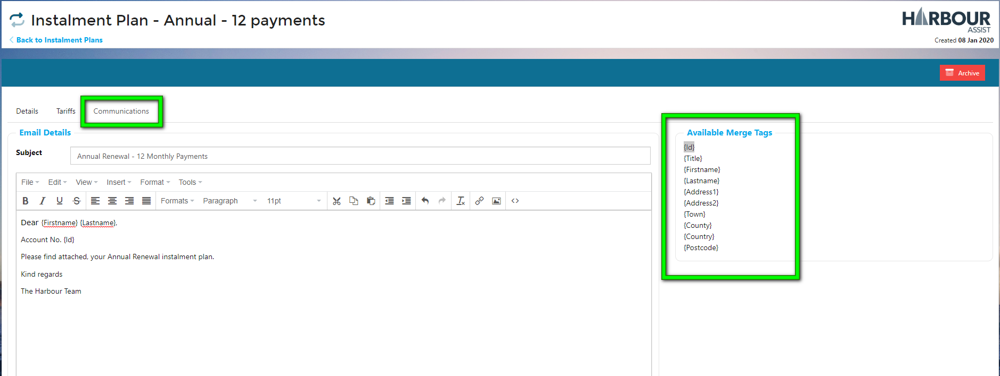

# Instalment Plans

An Instalment Plan is a pre-configured template which can be used to generate individual Payment Schedules as required.  An Instalment Plan consists of:

- The name of the Plan
- A table of Month number / percentage combinations which define how the value will be broken down over time.

- Which Tariffs are allowed to be included when a Schedule is being created.
- Email + File Attachments to standardise how the customer is communicated their contractual obligations.

## Creating an Instalment Plan

From the Home Screen, go to *Administration*

Next, go into *Instalment Plans*.

You will be taken to the list of existing plans, where you can view existing or create a new one.

Creating a new Instalment Plan will prompt you to enter:

**Name:** The friendly name of the Plan - e.g. "12 Month Residential"

**Order Type:** The Order Type which will be used when generating the monthly Orders.

**Number of Months**: Over how many months will the cost be split.

**Schedule**: Here you can define which months should be included in the Plan.  The % split wil be automatically calculated for you.  Here you can add creativity to how the balance is paid.  e.g. 

- Quarterly: Tick Months 1, 4, 7, 10.
- Split over first 10 months of year: Tick Months 1-10.

Now you can add the Tariffs that are available to use for the Instalment Plan (often different charges are applied if a customer is paying over instalments, so you don't want a User to be able to select a Tariff that is for a single payment charge).

Click on the *Tariffs* tab.

Select the Tariffs by filtering to a *Tariff Category* and then clicking the *Add* button.

Any selected Tariffs will transfer from the left, to the right hand side. If you select any in error, simply click on the *Remove* button and the Tariff will return to the left.

In the Communications Tab, you can compile an email template, writing the body of the email and using the formatting tools and available merge fields.

