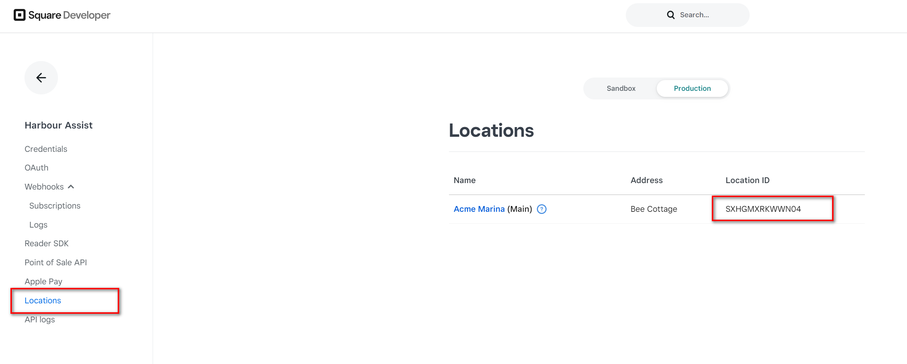

## Square ##

In order to process Square online payments, we need some API credentials from your Square dashboard, as well as you configuring Square to send us a message when a payment has either been Accepted or Declined.

**Before you start, log in on your square account: https://squareup.com/login**

### Step 1 ###

Click the link below
https://developer.squareup.com/apps

### Step 2 ### 

Click the + option to add a new Application. In the “Create an Application” screen, type the name of the app. You can type whatever name you want, but for the sake of simplicity, we suggest you just call it "Harbour Assist" or "Marina Assist". Then click **Save**.

Your new Application will appear as one of the items on the list.  Click on **Open** against it.

### Step 3 - Access Token ### 

On the screen that just opened, be sure the option at the top is **Production** .
Copy the Access Token drop it into an email (Don't send yet, we need Location ID too - see below).

### Step 4 - Location ID ###

Whilst viewing the application, click on the **Locations** item in the menu on the Left.  This should show you your Marina (or list of Marinas if you're multi-site).
Copy the LocationID, pop it in the email you started above and send it to us.

### Step 5 ###

We need Square to tell us when a transaction has been approved so we can take the User to the appropriate page.  Square does this by sending a message to our webhook receiver.

- Navigate to 'Webhook > Subscriptions' in the left hand menu 
- Click on **Add Subscription**.
  - Call it anything you want.
  - Paste the following URL into the prompt.  Note the placeholder for your tenantkey - we'll let you know what this is when you let us know you want to use Square.  
  
  - https://events.hookdeck.com/e/src_3HcYcGBW4dlb?tenantKey={-  We'll supply this --} 
  
  - From the list of Events - ensure that **'payment.updated'** is **ticked**.  

