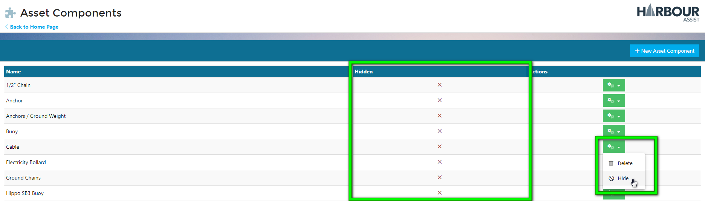
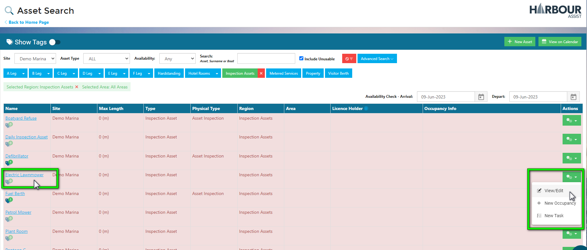

# Components

Some Assets have specialist parts or components that require inspection or maintenance.

You can add components to specific Assets, and they can be incorporated into the Inspection Regimes as part of your Maintenance Schedules.

For example, you might have two lawnmowers, one petrol and one electric. The electric lawnmower will have the added component of a cable that requires checking, whereas the petrol lawnmower does not. You can use the same Inspection Regime to check both lawnmowers, however the cable will only show as a specific component for the electric lawnmower.

## Adding a new Component

To add a new Component, from the Home Page go to *Asset Tools*, and from the drop-down list select *Asset Component Setup*.

You will be presented with a list of any Components currently set up.

To add a new Component, click on *+ New Asset Component*.

Give your new Component a name.

Then click *Save*.

Your new Component will be displayed in the list.

You may want to restrict the use of the component to avoid it being added to the wrong Assets. 

You can do this by clicking on the actions button and selecting *Hide*.

This will remove it from general use when adding components to an Asset.

Your new Component is now ready and can be added to an Inspection Regime as part of your Maintenance Schedule.

## Adding a Component to an Inspection Regime

To add a Component to an Inspection Regime, from the Home Page, go to *Asset Tools* and select *Inspection Regime Setup* from the drop-down list.

Select the Regime by clicking on the Name or using the actions button and selecting *View/Edit*.

Click on the actions button next the Inspection Type and select *View*.

In the Inspection Type page, click on *+ Add*.

Give the Check a Name, select a Capture Type, select your Component and confirm if the Check is Mandatory.

Then click *Save*

You Component has now been added to the checks in your Inspection.

## Adding a Component to an Asset

Once you have created your new Component and added it to your Inspection Regime, you will need to add it to the associated Asset.

From the Home Screen, go to *Asset Tools*, from the drop-down list, select *Asset List*.

Find the Asset you need to add the Component to, you can use the filters if needed, and don't forget if the Asset is Unusable, you will need to tick the *Include Unusable* box.

View the Asset details by clicking on the name, or by using the green actions button, selecting *View/Edit*.

In the Asset page, go to the *Parts* tab.

This will display if the Asset has any Components currently associated to this Asset.

To add a new Component, click on *Click to add Component*.

From the drop-down list of available Components, select the Component you wish to add.

Next, confirm your selection by clicking the tick to submit, or to re-select, click on the cross.

You Component will be included in the list.

If required, you can further details by clicking on *Click to add Details*.

## Adding the Inspection Regime to an Asset

Once your Component has been created, added to your Inspection Regime and added to your Asset, you will need to make sure that Asset is set up on the correct Inspection Regime.

On the Asset page, go into the *Details* tab, scroll down and check the Inspection Regime assigned to the Asset.

To change the Regime, click on the box and select from the drop-down list.

When you complete an Inspection for this Asset, the Component check will appear.

Using the same Inspection Regime for an Asset without the Component, the check will not appear on the Inspection.

