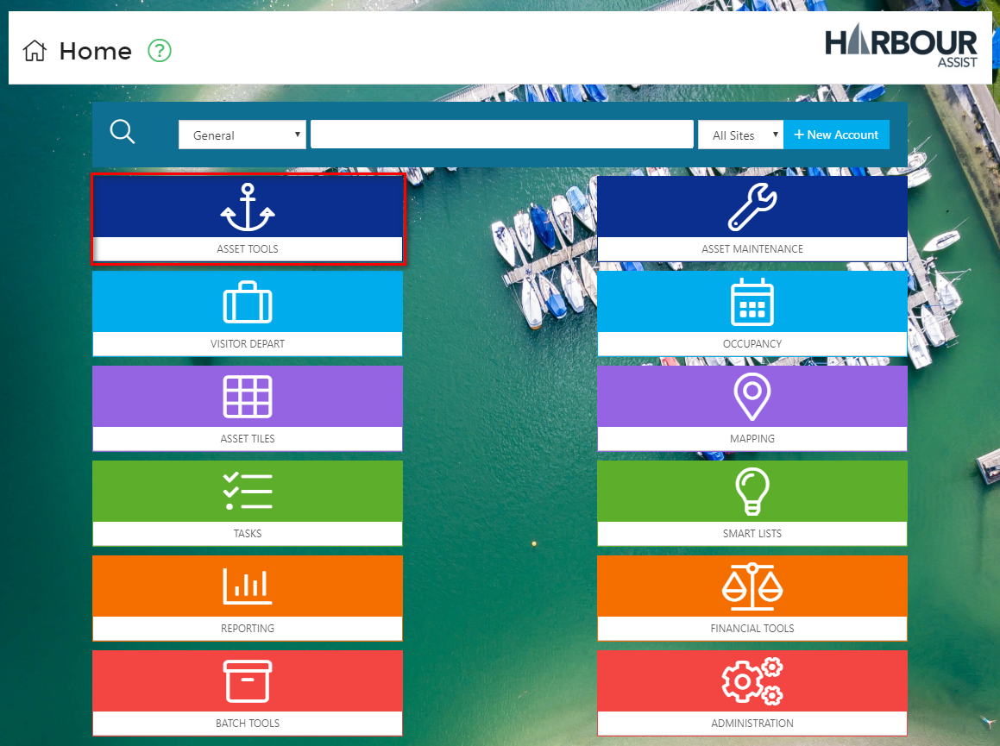
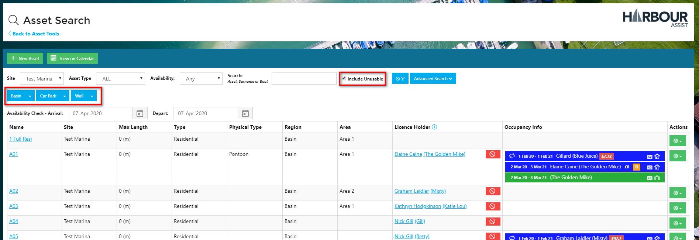
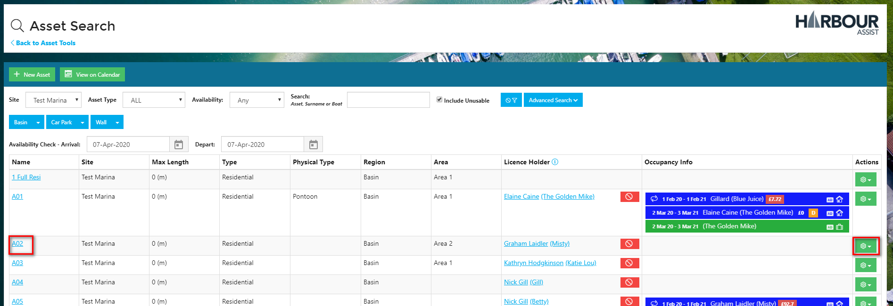
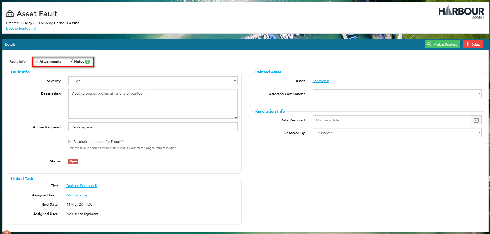
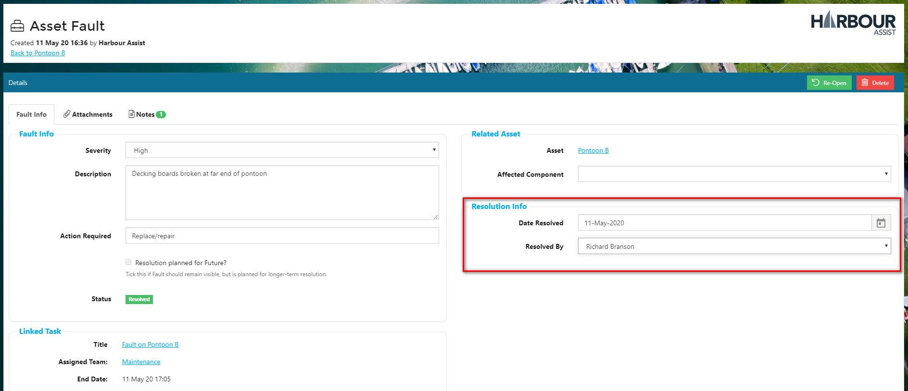
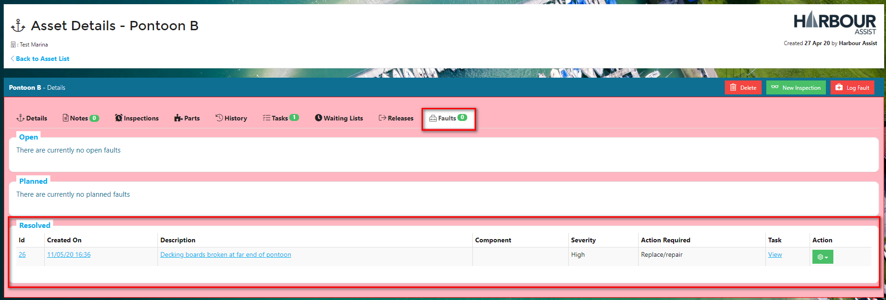

# Faults #

Harbour Assist provides tools to allow you to log Faults against Assets, and tools to manage these through to resolution.  Logging a Fault can be done at any time on an Asset - you don't have to be carrying out an Inspection.

To instruction about logging a Fault as part of an Inspection please click below.

?> More documentation [here](Maintenance/PerformingAnInspection.md).

## Logging a Fault ##

To log a fault on an Asset, from the *Home* page select *Asset Tools*.

Then select *Asset Administration*.

You now need to find that Asset that needs a fault logging against it - remember to check the *Include Unusable* box to show all Assets and then filter the screen using the blue filter tiles.  

Once you have found your Asset, you can open this Asset by either clicking on the Asset name or by selecting *View/Edit* in the green *Actions* box.

To log the fault, select *Log Fault*.

A *Log Fault* window opens up which you need to complete.  

- Select the fault severity (high, medium or low) 
- Tick if you want to create a task - NB: the Task Details part of the screen will only appear if you tick to create a task
- Add a description of the fault
- Add what action is required.  

If you have selected to create a task, check and complete the Task Details part of the screen.

Now click on the *Save* button. 

You will see in the Asset screen that there is an unresolved Fault logged.

## Viewing, Editing or Completing a Fault ##

To view Faults that the Team you are in has been set a Task for click on the Team Tasks in the top toolbar.

Click on the Overdue tasks or current tasks to view the details.

To view the Fault click on the Link to go directly to the Fault details.

All the detail of the Fault can be seen and edited in this screen - you may needs to change the Severity of the Fault etc.

You can upload attachments to the Fault (photographs for instance) and add any relevant Notes.

Continue to update the Fault by adding Notes as necessary.

Once the Fault is fixed complete the *Resolution Info* section - this will mark the Fault at Resolved. 

When you view the *Faults* tab on the Asset screen, the Fault will show in the *Resolved* category.

