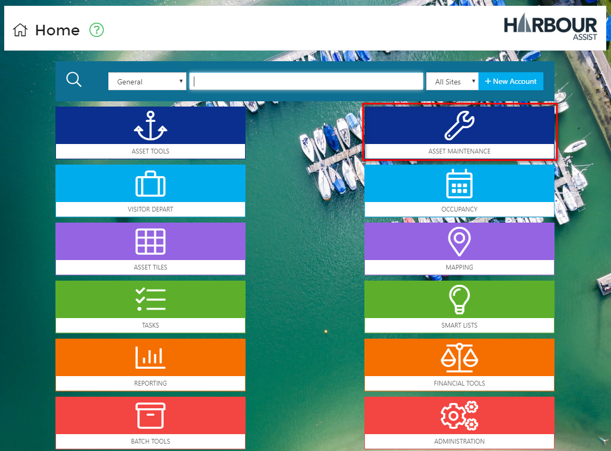
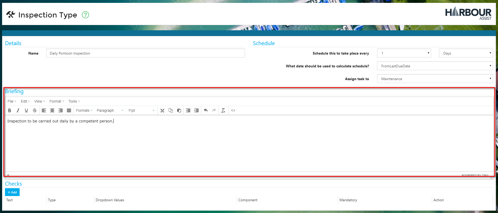
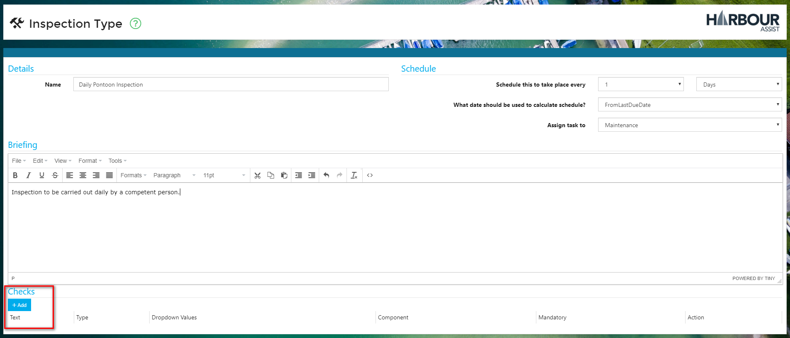
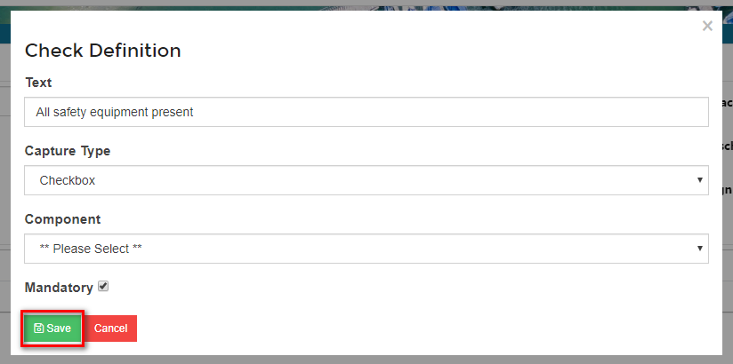
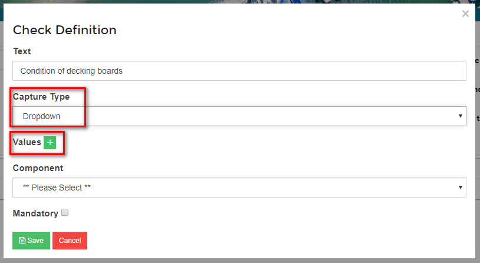
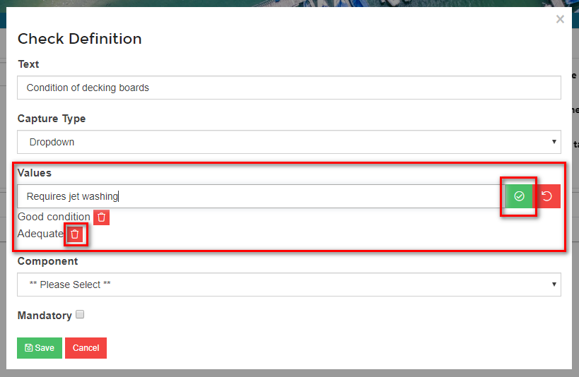
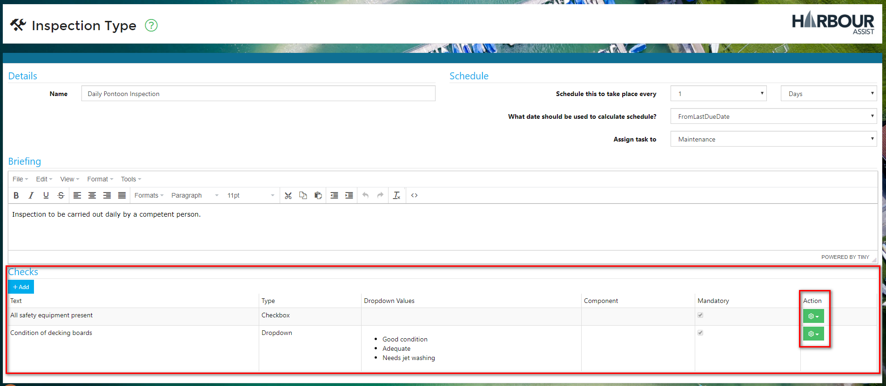

# Creating an Inspection Regime #

Most companies have routine inspections that need to be carried out on a regular basis, whether it be on assets, buildings, equipment or plant.  These inspections can be recorded in Harbour Assist so that there is a full inspection record.

The first stage to setting up Inspections in Harbour Assist is to create an Inspection Regime.  This Regime can then be attached to an asset, building, piece of equipment or plant.

From the *Home* page, select *Asset Maintenance*.

Then select *Inspection Regime Setup*.

Click on *New Inspection Regime*.

Give your regime a name, then click *Create*.

Most Regimes will have more than one type of Inspection - for instance, large items of Plant may require a *Daily Inspection* before each use, however this is likely to be a brief inspection comprising of only a few checks; a more comprehensive *Monthly Inspection* could also be required, this will be more in depth and have different aspects to it; there could then also be an *Annual Inspection* which is a thorough inspection, possibly carried out by a different person/team.  Each of these are known as *Inspection Types*.

 To set up a new Inspection Type, select *New Inspection Type*.

Now you need to set the parameters of the Inspection:-

- Give it a Name
- Set the Recurrence
- Set the Schedule Type
- Finally, assign the inspection to Team - a task will be sent to alert them when an inspection is due.

When complete click on *Create*.

The details entered will show in the Schedule.  You should now write a briefing for the Inspection ie. some basic instructions on how the Inspection should be carried out.

The next stage is to set the specific *Checks* that need to be carried out. A *Check* is data that needs to be captured during an Inspection.  

Click the *Add* button.

Enter some text - a brief description, then select the *Capture Type* - this is the way you want to capture the information.  There are 4 options:-

- Checkbox - a tick box which is a confirmation you have carried out the check.
- Number - when the response must be in a number format.
- Dropdown - a selection list of possible answers - **see below for instruction on how to do this**.
- Text - a text box for the user to write their response to the check.

If you wish to make the check *Mandatory*, check the box - this means the user will not be able to skip the check.

Then click *Save*.

You can now set your next check by clicking on the *Add* button again.

## Creating a Capture Type Dropdown List ##

When you select the Capture Type of *Dropdown*, this will bring up an additional cell so that you can set the *Values*.  To add the *Values* click on the green + button.

Set each Value by typing the description in the cell and then clicking on the Green tick.  You can add as many as you wish and if you change your mind you can remove them  by clicking on the Red trash icon.

When you have finished your dropdown list, click on *Save*.

Each *Check* and the set up of it will show under *Checks*, you can change any of the details by selecting the Green *Action* button and selecting Edit.

Once complete the Inspection you have set up will show in the *Inspection Regime*.

