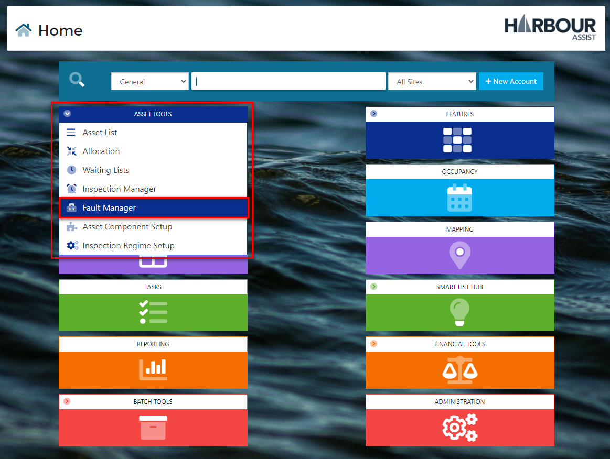
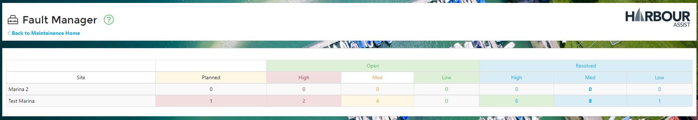
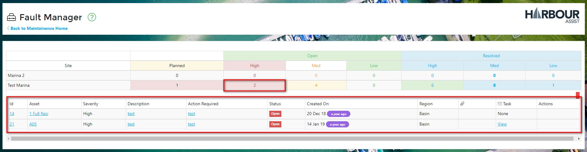
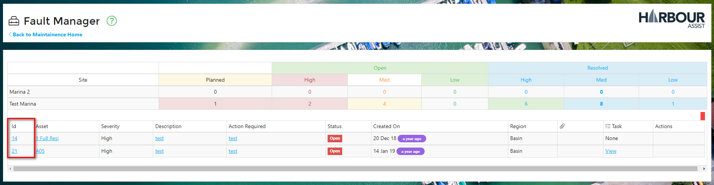

# Managing Faults #

From the *Asset Tools* on the Home page, select *Fault Manager*.

The *Fault Manager* screen shows a summary of all Open and Resolved Faults for each site based on the severity of the Fault.

To view further details of the Faults, click category you wish to view - in the example below we wish to view the Open, High severity faults for the site Test Marina.  This will open a panel showing the Faults that fall into this category.

To view an individual Fault, click on the 'Id' number against the Fault. 

This will take you directly into the Fault details view where you can Edit or Complete the Fault.

?> More documentation [here](Maintenance/Faults.md).

