# Performing an Inspection #

## Carrying out the First Inspection on an Asset

From the *Home* page go to *Asset Tools*.

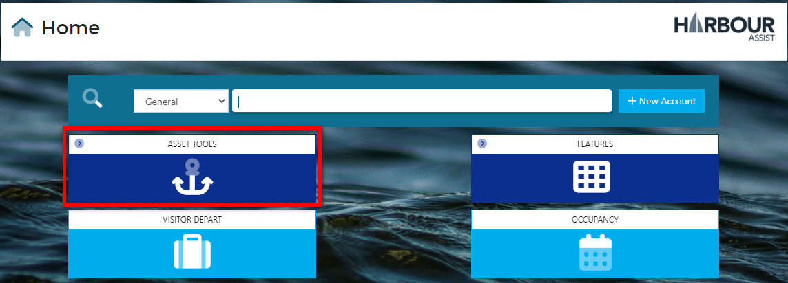

From the drop down menu, select *Asset List*.

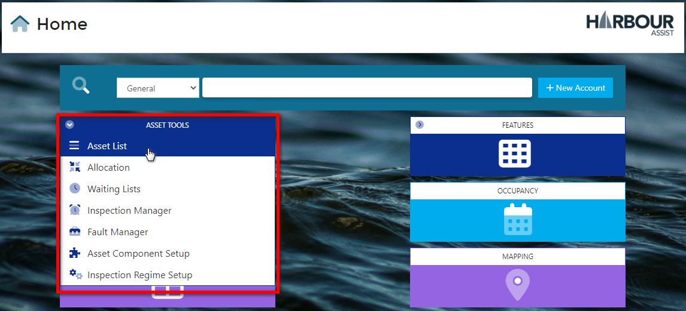

Filter your Assets to the ones that you need to inspect (this could just be the Inspection Assets), remembering to click on the *Include Unusable* box to ensure all the Assets are shown. 

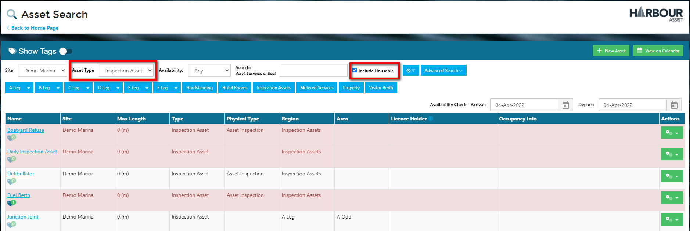

It would be advised to check Tags at this stage, any Tags on an asset might provide essential information about the assets you are due to inspect. You can do this by either clicking the *Hide Tags* button, which will show all Tags on your assets

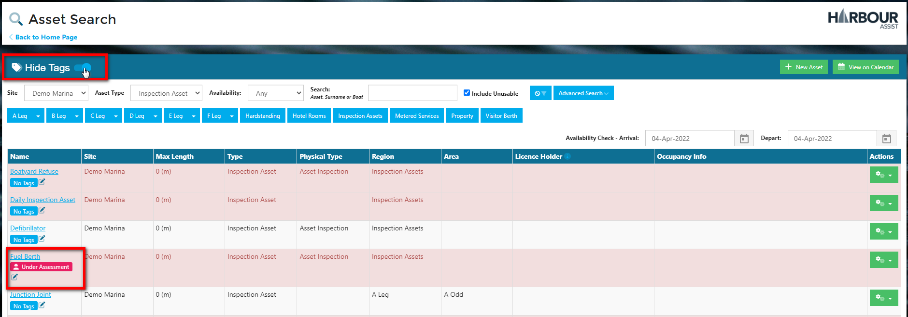

Or you can click on the Tag symbol next to an individual asset to view the Tag just for that asset

Once you have reviewed Tags, select the first Asset you need to inspect by clicking on the Asset name.

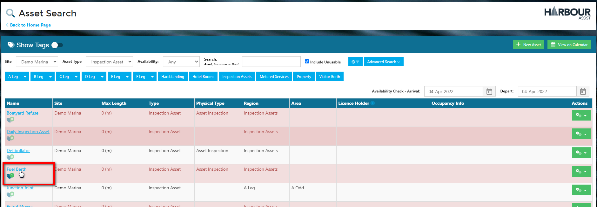

Select *New Inspection*.

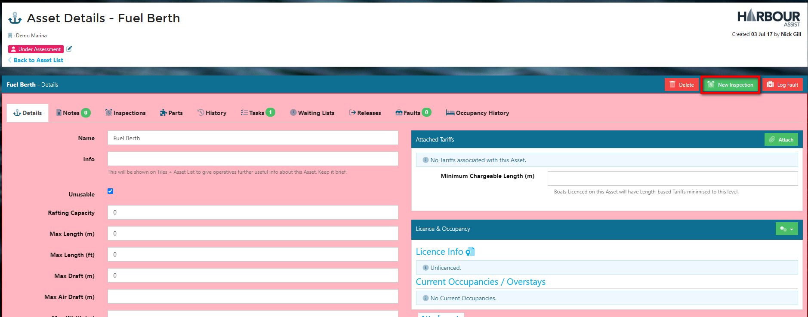

Select the Inspection Type you wish to carry out and then click on *Create*.

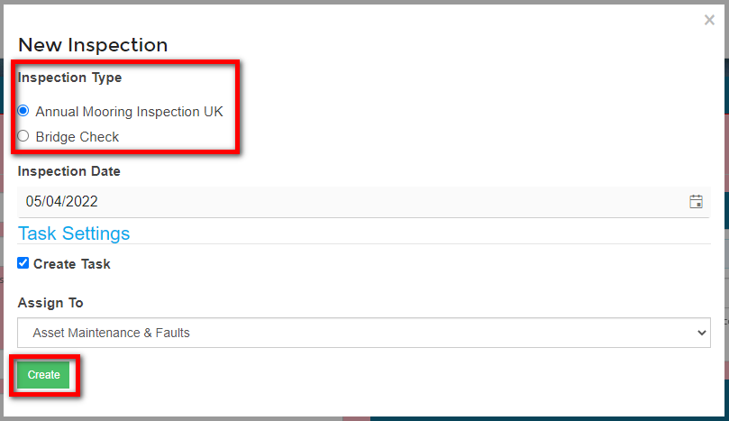

The Inspection Details screen will open up which will show you some details of the Asset and a Briefing.

Work your way through each of the Inspection items, marking the Results and making any notes as you do so.

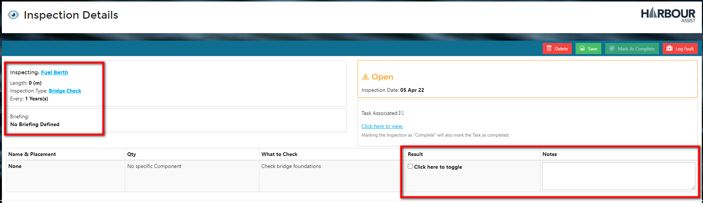

If there are any Faults that need logging, click on *Log Fault* at the top of the screen.

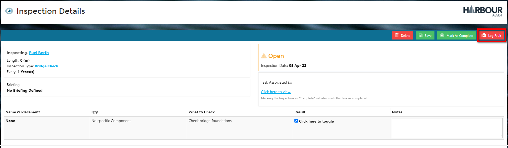

The Fault should be logged and a Task set.

?> More documentation [here](Maintenance/Faults.md).

The Inspection can be saved at any point, so that you can go back and complete it at a later time.

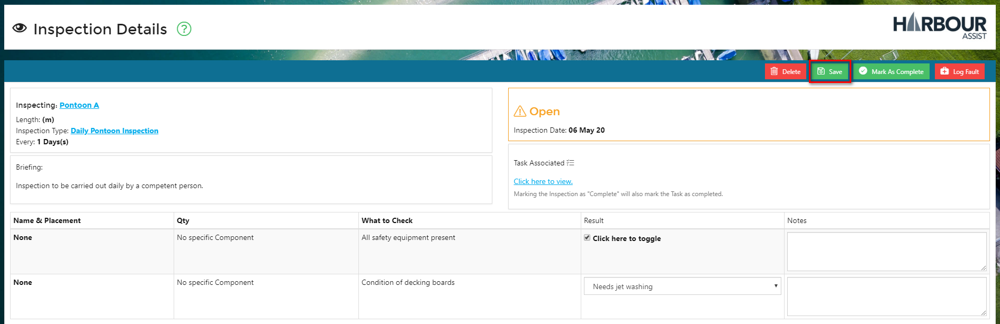

Once all the Inspection items have been checked and the results logged you should click on *Mark as Complete*.  

?> NB: You will not be able to complete an Inspection until all of the mandatory items have been checked.

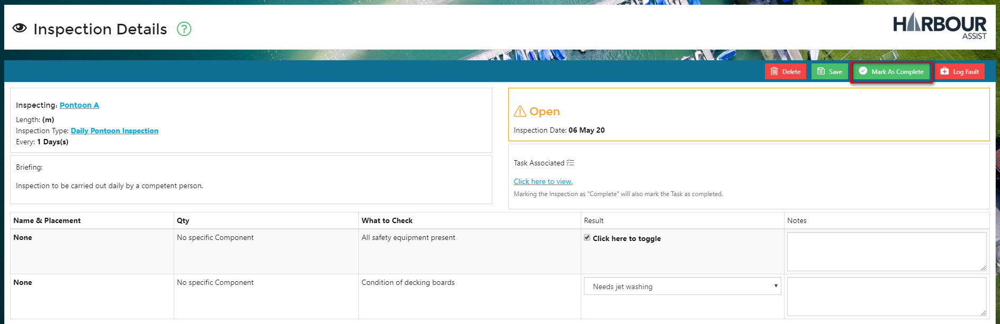

The next Inspection details will be automatically populated in line with the Inspection Type set up, however you can change these in this screen if you need to.

A reminder Task will be set for Team when the next Inspection is due.

Select *Completed*.

A confirmation screen will be shown - select OK.

The Inspection will now show as Completed.

Use the Back button to return to the Asset.

If you wish to view Inspection information for the Asset click on the *Inspections* tab where historic and future scheduled Inspections will show.

To return to your *Asset List* select *Back to Asset List*.

You can now select the next Asset to inspect.

## Carrying out Recurring Inspections

Once you have carried out the first inspection of a particular Inspection Type on an asset, the next Inspection date is set automatically and a Task is created for the Team responsible for carrying out the next Inspection.

As each Inspections becomes due, the Team will be shown a Task Notification in the Task bar at the top of the screen.

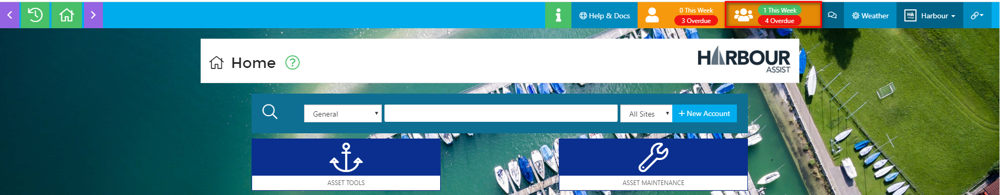

Click on the Task Notification view the Tasks and open up the Task details by clicking on the number.

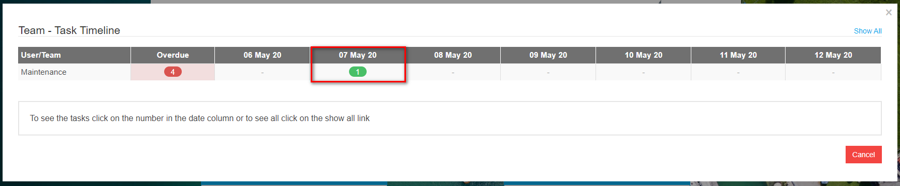

You can now select each Inspection by clicking on the Link and this will take you straight to the Inspection where you can complete it as above.

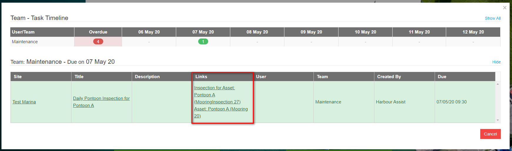

?> NB: Once you are in the cycle of recurring inspections you won't need to use the *New Inspection* feature in the Asset details.