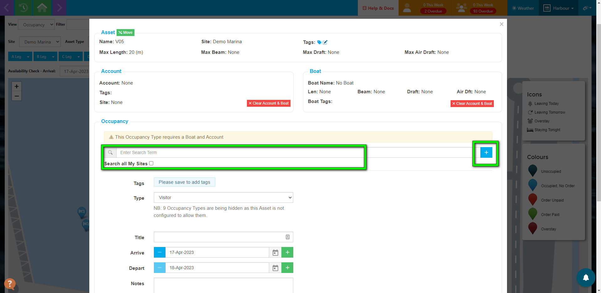

# Creating an Occupancy in Maps

To create an Occupancy in Maps, first, select the Asset.

Then click on *+ Add Occupancy.*

Next, select the Occupancy Type.

Search for existing customers using the search tool, this works in the same way as the search tool in the Home Screen.

If the Occupancy is for a new customer, you can create a new account using the blue button.

Once you have confirmed the customer, you can select the arrival and departure dates by using either the green + buttons, or selecting from the Calendar Picker.

To create the Occupancy without an order, click *Save*.

To raise an Order with this Occupancy, click *New Order*. 

Select the Order Type.

Complete the Order in the usual way, adding any relevant Tariffs.

The Map will update and the Asset will change to reflect the Occupancy.

