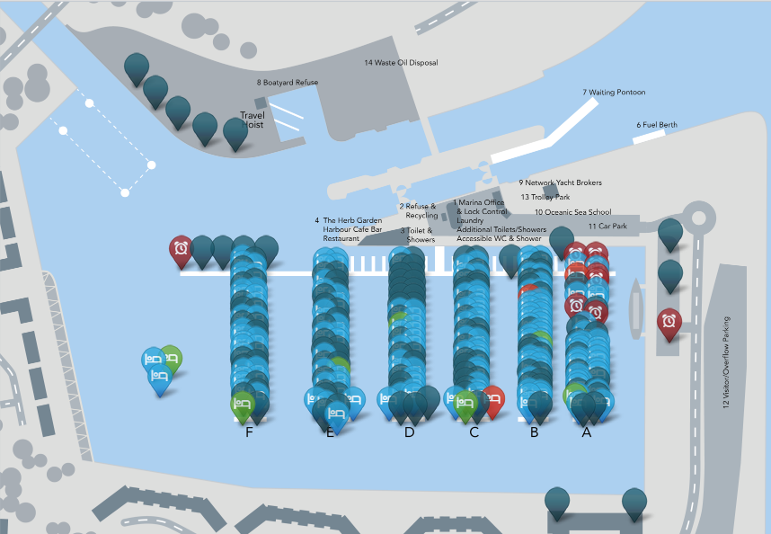
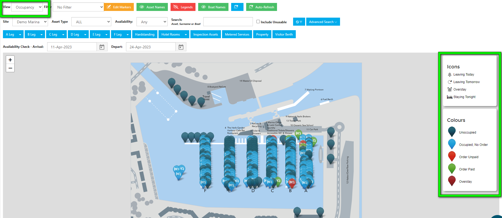
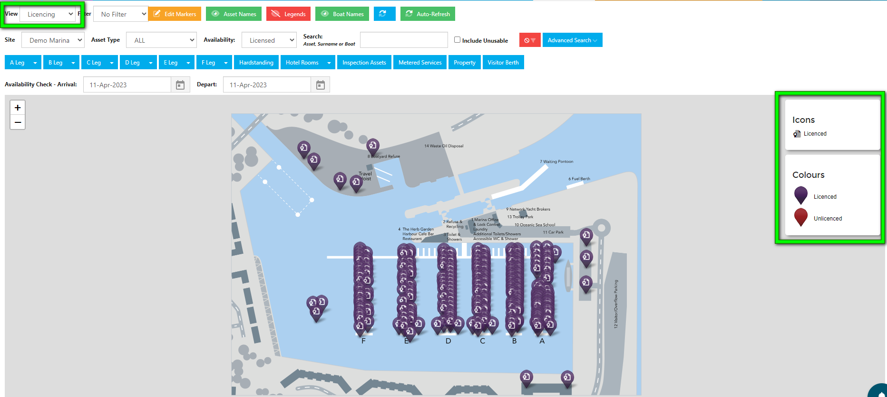
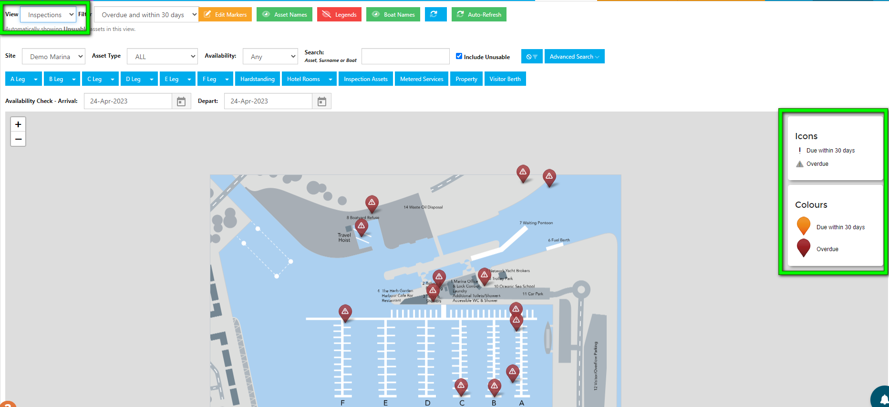
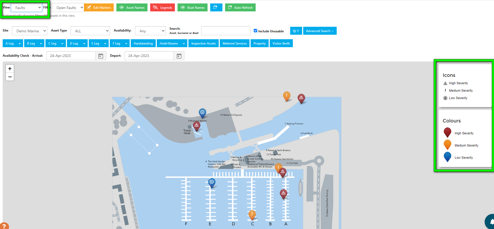

# Mapping Overview

Mapping is an alternative way of viewing Occupancies, Licenses, Inspections and Faults.

You decide how your map looks – it can be the same full-colour plan you use on your website or brochure or a bespoke drawing, uploaded to the system.  We can also use Google Maps on harbours or rivers that cover a large geographical area, with the bonus of flicking between map and satellite views.

Uploaded maps can have an overlay for berth numbers, asset names and even showing the location of safety equipment (the amount of detail is up to you) which the user can switch on and off, providing a clearer or more detailed view as required.

## Map views

Using the same map, you can flick between views to highlight information of value to different team members:

There are four different views on Mapping:-

- Occupancy - the system will always default to this view when you click on Mapping,
- Licensing,
- Inspections,
- Faults.

#### 1. Occupancy view

This view shows you all usable assets, whether they are occupied or not, who is due to depart and overstay occupancies. 

#### 2. Licensing view

Here you can see which assets are licensed and which are not.

#### 3. Inspection view

If you carry out your Asset Inspections in Harbour Assist, you can view overdue and upcoming inspections on the map.

#### 4. Faults view

Logged faults colour coded by severity are displayed in the Faults view.

### Making map changes

We don’t charge extra for uploading a new map. So if you alter the layout of your pontoons, move a line of mooring buoys or install a new launch ramp, it isn’t going to cost you, however it is important the new Map is the ***same size as the original***, or your Markers will show in the wrong place!

