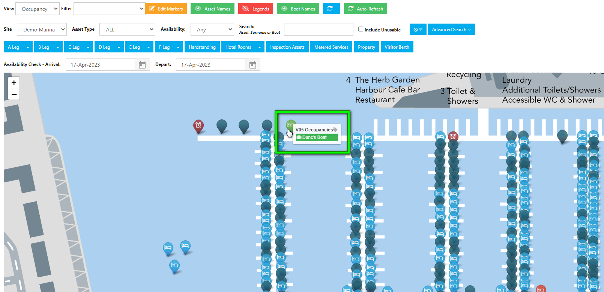
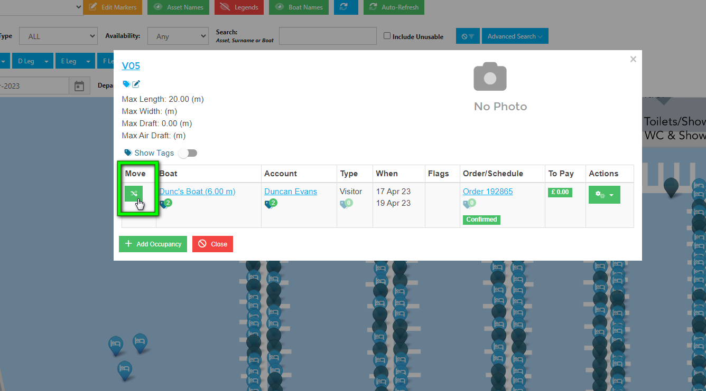
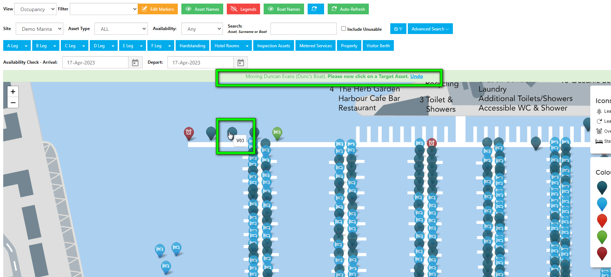
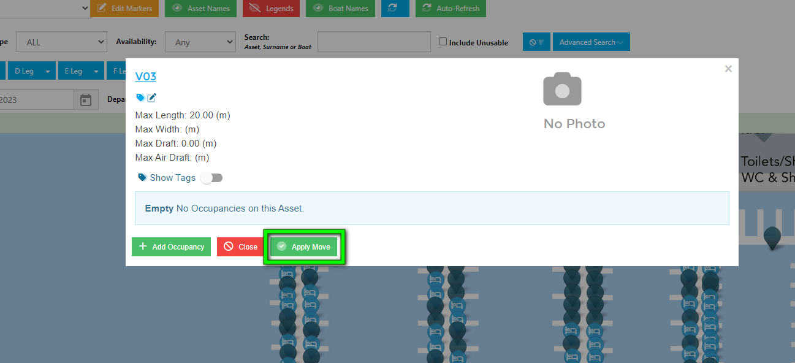
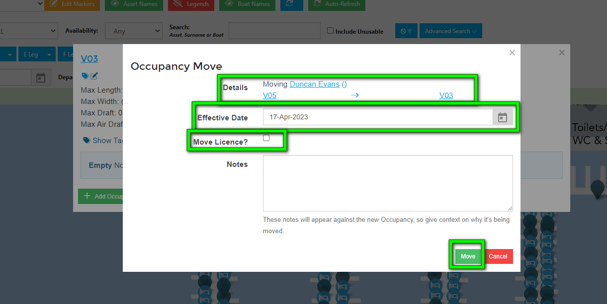
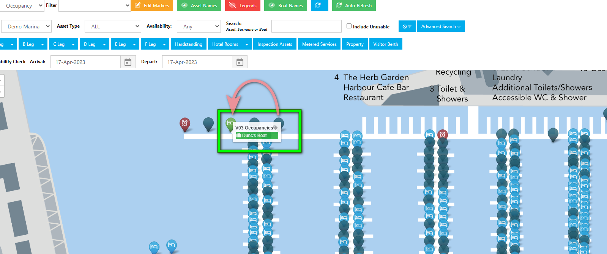

# Moving an Occupancy using Maps

To move an occupancy on the Map, first select the Asset containing the boat you wish to move.

Next, click on the green *Move* button. 

The screen will display all Assets that fit the size of the boat you wish to move.  Assets that are too small will show faded out, however you can still select one of these if you wish by clicking on the marker.

Click on the Asset you want to move the Boat to. If you change your mind, click on *Undo*.

Next, click on *Apply Move*.

The window will display the details of the proposed move.

If the effective date of the move is different to todays date amend this using the calendar picker, tick the box if you need to move the Licence to the new Asset, and add any notes if required.

When finished, click on *Move*.

The Map will update, and the Assets will change to reflect the completed move.

