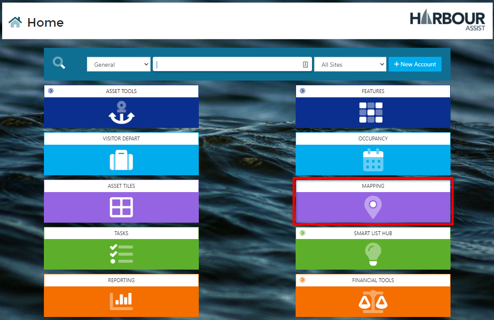
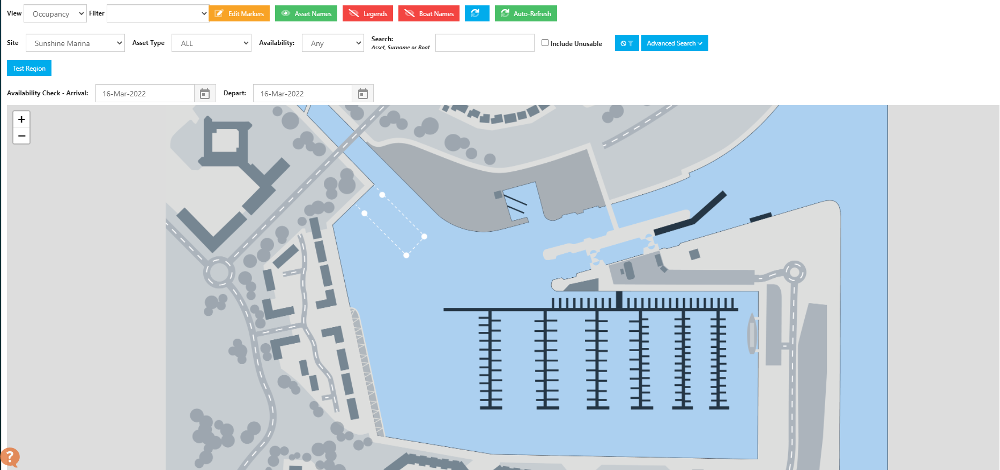
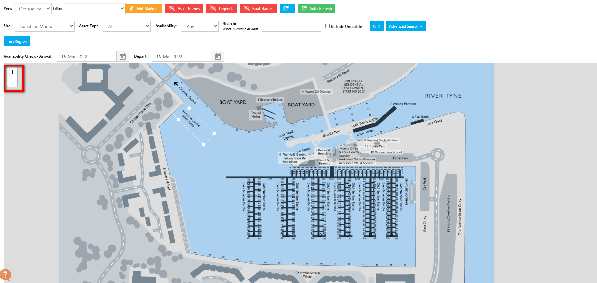
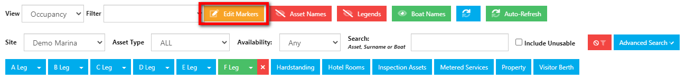
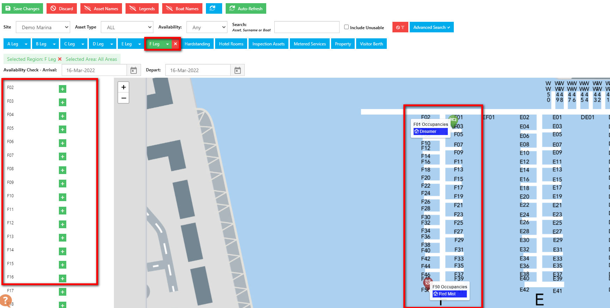
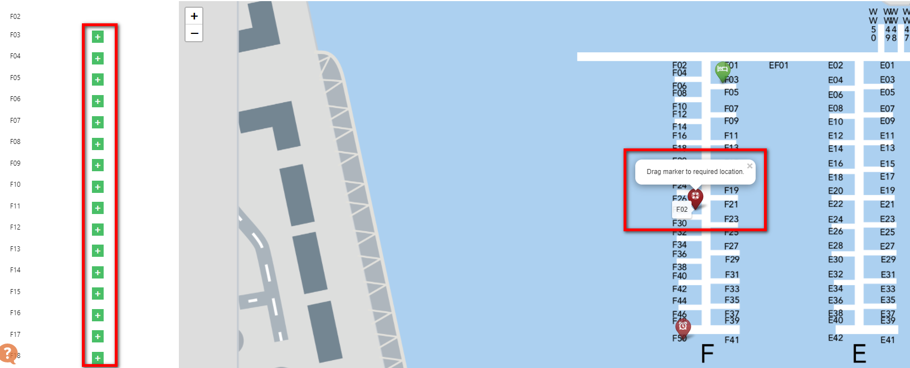
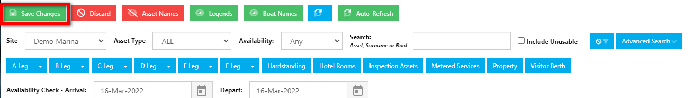
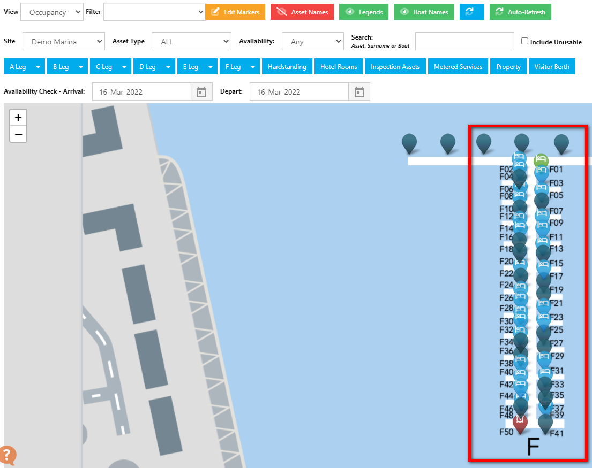

# Populating Maps

Once you have a template uploaded or your GPS map, you can start to populate it with your assets.

From the Home Screen, click on Mapping.

Your screen should look something like this, with an unpopulated map in view.

If your map includes Asset Names it may look something like the image below.

You can zoom in/out of your map by either clicking the **+/-** buttons, or by rotating the middle wheel of your mouse. 

Zooming in on your map will make locating and placing your markers much easier.

Now you are ready to start populating your map.

Firstly click on **Edit Markers**.

This will open a box on the left with a list of all the markers available to use. You may find it easier to work on one area at a time.  I have filtered down to the 'F Leg' so it is only showing markers for that area. 

To populate your markers, click on thenext to the marker you want to place on the map. A marker will appear on your map.

Simply drag the marker to the relevant position on the map by *clicking and holding the left button on your mouse*, unclick the button when you are happy with the position.

?> NB: For the first few markers you place, the Map will automatically zoom straight in on those markers, use the **+/- buttons or the mouse wheel** to zoom back out - *once you have placed a few markers the automatic zoom will stop doing this*.

?> NB: It is advised to click Save followed by Ctrl+F5 to refresh periodically to avoid losing your changes and having to start again.

Repeat this process for each marker until your Map should look something like this.

