# Viewing Maps

Each marker on the map represents an Asset, not a boat. As such, you can have any of your assets showing on the map.  

?> NB: Not all Assets will show on the map on all views.  For instance Assets which don't allow an occupancy such as plant and equipment will not show on the Occupancy view of the map.

There are four different views on Mapping:-

- Occupancy - the system will always default to this view when you click on Mapping,
- Licensing,
- Inspections,
- Faults.

You can select the view at the top of the Mapping page.

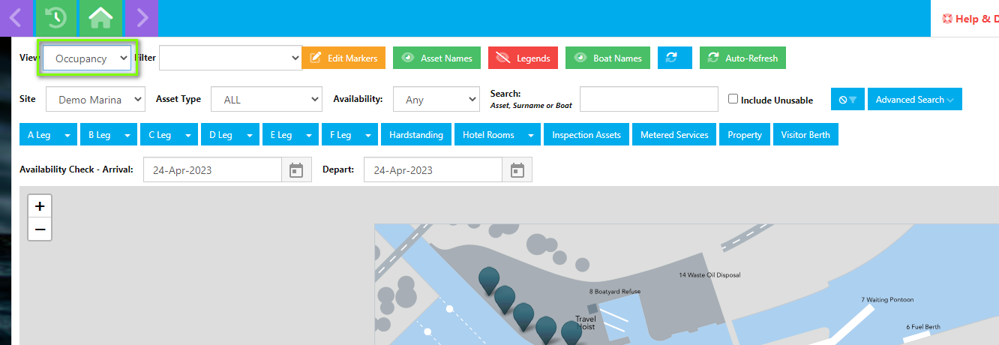

Using the action buttons at the top of the screen you can instruct the map to display or remove information.

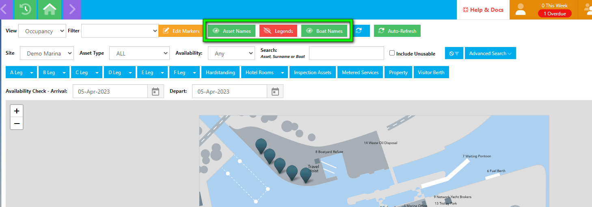

#### Asset Names

Some Map designs come with an overlay of asset names. You can use this action button to switch these on and off.

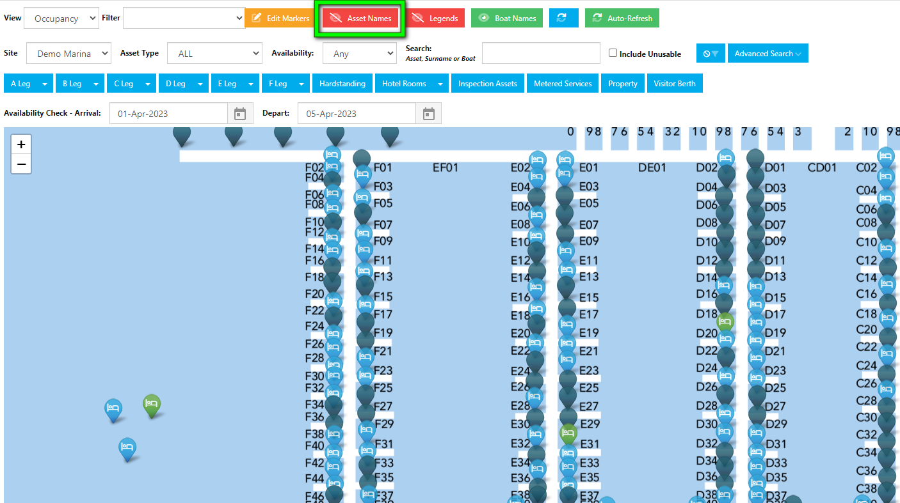

#### Boat Names

You can use this button if you want the map to display all the Boat Names on the map.

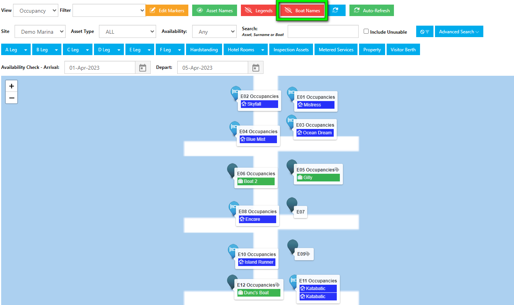

Using this button could clutter the screen, so when switched off, you can still view the Boat Name occupying an asset, by hovering over the marker.

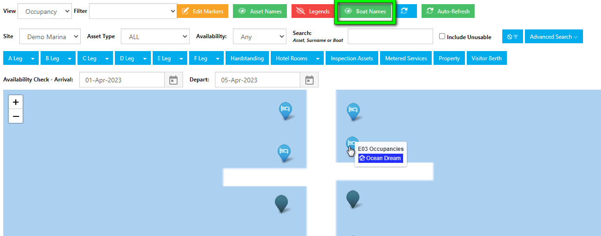

#### Legends

If you are unsure what the different colours and symbols on the markers mean you can switch on the Legends.  The Legends will change depending on which view of the map your are looking at.

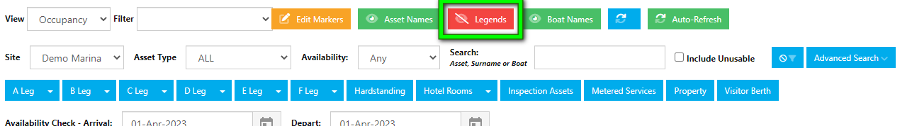

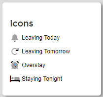                 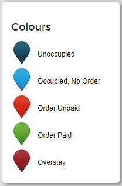                   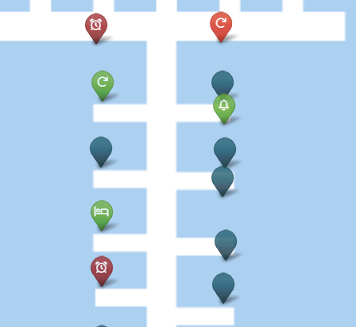

#### Applying Filters

Multi-site customers can select which site map they would like to view.

You can use the filters to view specific Assets, and their availability. You can search by Asset name, Surname of the Occupier or name of the Boat.

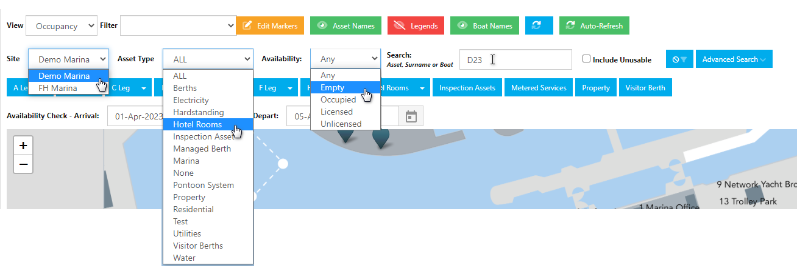

If you want to focus on any Regions or Areas of your site, you can use the blue filters to zoom into the Region or Area you selected.

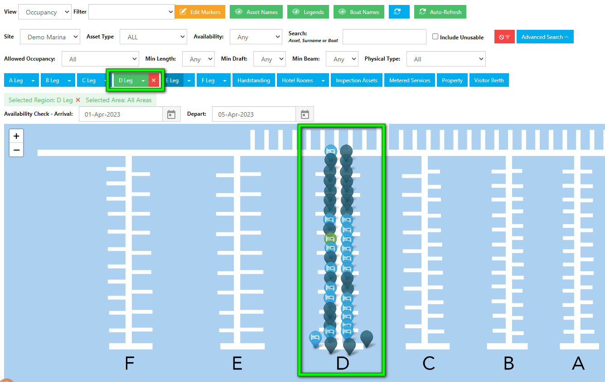

#### Setting a Date Range

You can set a date range using the Calendar Picker to view Assets that are available for that entire date range.

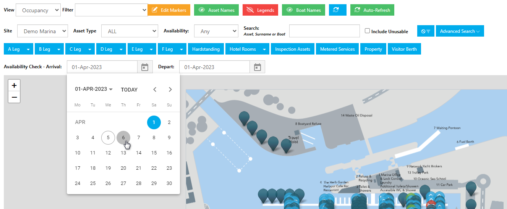

#### Zoom

You can use your mouse wheel to zoom in and out of the map display, or alternatively you can use the **+/-** buttons.

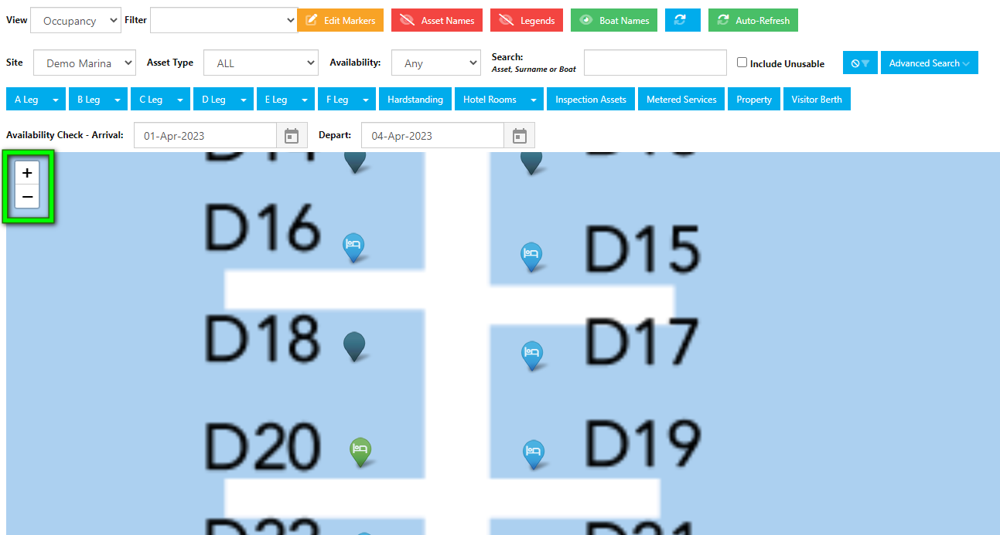

