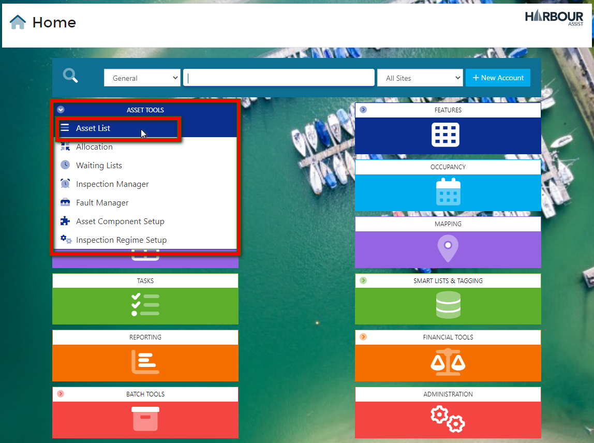

# Meter Readings

## Taking a Meter Reading

Whether you are taking meter readings with an iPad/tablet while you are out and about, or filling out a paper version and entering them in from the office, the process for meter readings is the same.

From the Home Page, go to *Asset Tools*.

From the dropdown box, select *Asset List*.

There are two ways you can enter readings, working down the list of Assets on the left, or by using the Green *Actions* button on the right.

Using the Asset list on the left, click on the *Asset Name*, from the Asset page, go into the *Meter Readings* Tab.

The page will provide you with a history of meter readings, starting with the most recent. Details include when it was created, who the meter reading was taken by, the Start and End readings, Order ID (if the reading has already been invoiced), Account and Boat details.

To record a reading, click *New Reading*.

This will open a box to enter your readings.

You can now enter the details:

1. **Start** - The starting figure automatically populates from the last reading's closing figure,
2. **End** - Enter your new meter reading,
3. **Units** **Used** - The system will calculate this for you,
4. **Date** - This automatically populates with the current date, you can manually change this if the reading was taken on a different date,
5. **Exclude from Drawdown** - Tick this box if you need to exclude this reading from being invoiced. Left unticked, the reading will create an invoice for the Account/Boat licensed to the meter, either when you manually drawdown or on the next batch run. Upon ticking this box, you will be asked to select a reason for the exclusion. Select from the dropdown list and continue.
6. **Notes** - You can add any notes if necessary.

Once complete, click *Save*.

The new reading will appear at the top of the list. The Order Id column confirms this has not yet been invoiced. 

Click *Back To Assets List* and continue to the next Asset.

Alternatively, if you don't need to review the previous readings, you can use the green *Actions* button. 

From the dropdown list, select *Meter Reading*.

This will go straight into the New Reading box without reviewing the history. Enter the details (as shown above), click *Save* and continue onto the next Asset.

When completing a meter reading for the first time, the opening figure (Start) will show as '**0**' - this may require changing to the current reading, or last recorded reading.

## Drawing Down Individual Orders

To draw down an individual Electricity Meter Reading to order, from the Home Page go to *Asset Tools*, and select *Asset List* from the drop-down menu.

Filter your Asset List to show your Electricity Metered Assets.

Select the relevant Asset from the list.

In the Asset Page, go to the Meter Readings Tab.

This will display a history of Meter Readings in date order of the most recent first.

Previously invoiced readings will have an Order Id, any new readings will show as Un-Invoiced.

Next, click on the button.

A window confirming any Un-Invoiced Meter Readings, and the details including Units used and charges applied will pop-up.

Now click **Drawdown to Order**.

This will generate an order for you to either add any further Tariffs or Invoice the customer via their preferred Invoice Format.

 

## Drawing Down in Bulk

You can also drawdown meter readings for bulk invoicing by completing a **Batch Run** for un-invoiced meter readings.

Before you can do a Batch Run, you will need to create a **Batch Type**.

### Creating a Meter Readings Batch Type

From the Home Page go to *Batch Tools*.

From the drop down list, select *Batch Types*.

Click on 

Start to complete the fields in the *Settings* tab:-

1. Give your Batch Type a name.

2. You don't need to create an instalment plan for meter readings, so leave this box unchecked.

3. Leave your order status in Draft format, this way the order is amendable. 

   - Choose the relevant Order Type. 

   - Electricity Meter readings are not Occupancy related, so leave this box empty.

4. Tick the box to include un-invoiced meter readings.

5. (Optional) You can select the specific Renewal Groups to include in the drawdown, or you can leave these unchecked.

   Leaving these unchecked gives you the flexibility to use the Batch Type for any renewal groups when you complete a Batch Run as you get this option in the Batch Run process.

Now you need to add any relevant Tariffs. Click on to the *Tariffs* tab.

Click on *Category* and from the drop-down list, select the Tariff category you wish to include. In this example the category is called Electricity, yours might come under something similar such as *Utilities*.

From the list of available Tariffs, click on the button for any Tariffs you need to include in the Batch Run.

As you work through the list, the Tariff will move from the left of the screen, over to the right of the screen below *Selected Tariffs*.

Once you are happy with the Tariffs, you can create an email template that will accompany the invoice you send to your customers.

Compile the body of the email with your preferred choice of wording.

Use the merge fields for the customers details, such as Surname and Account ID. Using the merge fields ensures the system pulls the specfic names for each account into the emails.

Use the Snippets if you are including things like Quick Pay and Portal links, you can also add any other site specifics such as your site logo.

?> NB: It essential to use the Snippets for links such as Quick Pay. Using the snippets ensures the customer only gets the unique link specific to their own account details. **Never copy and paste Quick Pay links from another email source.**

When you have finished compiling your email template, you can select the relevant invoice template that will accompany the email.

When you have finished, click *Back to Batch Type List*.

Your new Batch Type will now appear in the list.

Now you can process a *Batch Run*.

### Creating a Meter Reading Batch Run

From the Home Page, go to *Batch Tools*.

From the drop down list, select *Batch Runs*.

Click on 

Select your new Electricity Batch Type from the drop down list.

Completing an Electricity Meter Reading Batch Run is slightly different to processing a Renewal Batch Run.

You are not creating an Occupancy, so the first 4 boxes (Order Created/Occupancy to Create/Start Date/Departure Date) can be ignored.

Make sure the option *Include Uninvoiced Meter Readings* is ticked.

Select all relevant Renewal Groups to be included in the Batch Run.

Tick the Pricebook you will be using.

While you can't edit the Tariffs in the Tariff Tab, best practice would be to check the correct Tariffs are listed before you run the Batch.

Any changes will need to be completed in the Electricity *Batch Type* set up.

When finished, click on *Calculate Entries*.

The list generated below are all the Accounts that will be included in the Batch Run. No orders have been generated at this stage, this is an opportunity to review the list and ensure the right entries have been created - if there are any errors, you will need to review the Batch Type and Batch Run set up.

If the list is correct, click on *Generate Orders*.

The Batch Run will generate the orders - for large Batch Runs, this might take a few minutes, so please be patient.

1. Finance provides a summary of the Financial values of the Batch Run.
2. Statistics provides a summary of the customers preferred invoicing format.
3. You can use the links to review the accounts.
4. Status shows the status of the order. *No Units to Invoice* highlights any meters with zero units used since the last meter readings - no order has been generated and these have automatically been deselected from the communications list.
5. Review the values of the orders generated - if any Gross costs look incorrect, you can click on the link in the Order Id and review it. As all orders have been created in Proposed format, they are amendable.

Once you are happy with the entries, click *Convert Invoices*.

This will convert the invoices from Proposed format to Draft format - at this point they become visible on the Customer Portal. 

As you are invoicing the customer retrospectively for units already used, you should confirm the orders prior to dispatching them. Click on *Confirm Orders* and then set the tax point date.

Now you can Download and Print for those that require letters and Dispatch Emails for the others.

