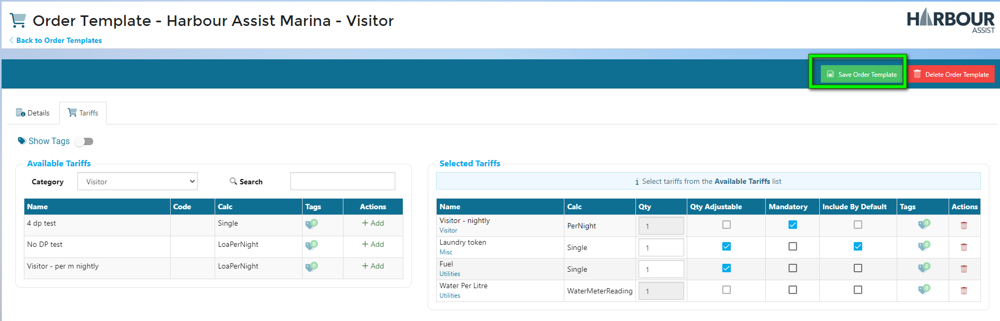

# Quick Orders

## Overview

Quick Orders have been developed to speed up the order creation process for the most popular purchases.

They are created via an order template with defined tariffs (either mandatory or optional) and can be used independently or as part of the Booking Requests process.  

For example – if you sell laundry tokens, you could have a ‘Laundry’ Quick Order Template which when selected automatically creates an order with the tariffs of Washer Tokens and Dryer Tokens, then the User only needs to enter the quantity.

When used in conjunction with Booking Requests, this will enable customers to both book and pay for services in one transaction.

?> More information on Booking Requests can be found  [here](BookingRequests/BookingRequestsOverview.md)

### Quick Orders Overview Video

## Creating a Quick Order Template

?> NB: The Permission of **Administration Quick Order Templates** is required to create a Quick Order Template.

### Creating A quick Order Template Video

From the Home Page, go to Administration.

Next, go to *Quick Order Templates.*

To create a new Template, click on *New Order Template.*

The Order Template details window will appear and you can start creating your template.
1. Give your Template a name.

2. Select the Order Type.

3. Select the status your order will be created in.

4. Tick this box if you want your Quick Order Template available on Harbour Assist or leave unticked if this will only be available through Booking Requests.

5. For multi-site operators, select which site this Quick Order Template will be available on.

6. Tick to always use the default Pricebook or untick and select the Pricebook you wish to use for this Quick Order Template.

  

?> NB: If a Pricebook is selected, this will not update when a new Pricebook is published and made the site default Pricebook.

When you are happy, click Save.

This will create a basic template, the information has populated, now the final details need completing.

If you have selected for the Quick Order Template to be visible in Harbour Assist, you should add a description to help Users select the correct template. 

To select an Icon for your Quick Order Template, click Select Icon. Type in a key word, then click Search.

The search will return a list of available Icons, select the one you prefer, and the Icon will populate itself. If you can’t see an Icon you like, type a new key word and search again.

Now you can choose a colour for your Quick Order Template, to do this, click on the box.
A list of colour swatches will appear, select the colour you want.

Next you will need to add the Tariffs associated to the Quick Order Template.  Click on the Tariffs tab, and from the drop-down list, select the *Tariff Category.*

Select the Tariff(s) you want by clicking Add and the Tariff will move over to the right-hand side.  You can have multiple tariffs available on a Quick Order Template.

If the Quick Order Template is being used as part of the Booking Requests feature, you could add additional Tariffs for optional services the customer could purchase as part of their request.

You can also decide how those Tariffs should be applied.
1.	Choose a quantity. 
?> NB: Some Tariffs will have a quantity automatically applied from the Order Type.
2.	Quantity Adjustable – allows the customer to change the quantity.
3.	Mandatory – decide if the Tariff an optional extra or a minimum requirement.
4.	Include by default – if ticked, the customer will need to remove it from the order if they don’t want it, left unticked, the customer would need to add it to their order if they do want it.
5.	Add a Tariff Tag. (optional)
6.	Use the 'Bin' icon to delete the Tariff to remove it from the list if it is no longer required.

When finished, click *Save Order Template.*

Your new Quick Order Template will appear in the list.
You can edit or delete the Quick Order Template by using the green actions button, or by clicking on the name.

