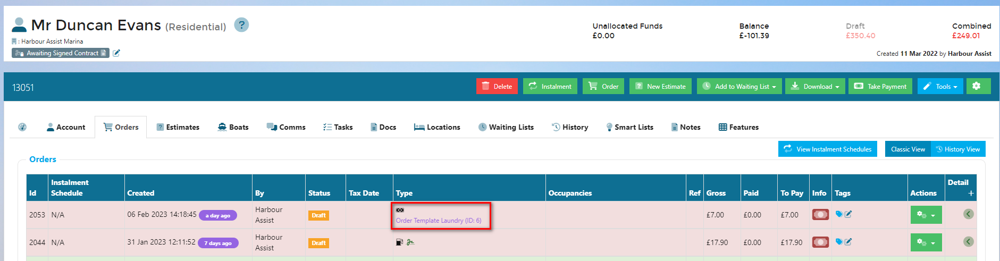

# Using Quick Orders

Once you have created your Quick Order Template, and you have made the Quick Order visible in Harbour Assist, you can raise a Quick Order to save time creating an order from scratch.

### Using Quick Orders Video

## Using Quick Orders in Harbour Assist

?> NB: When creating a Quick Order Template, you will need to ensure the *Visible within Harbour Assist* box is ticked.

?> More information on how to create a Quick Order Template can be found [here](QuickOrders/CreatingQuickOrders.md) 

Raise an order in the usual way from anywhere in the system.

When raising an Order, the window will display all Order Types on the left, and any available Quick Orders on the right. 

?> NB: For multi-site customers, only the Quick Order templates available to the site selected will appear. 

Select the relevant Quick Order, the window will show you the associated Tariffs for this Quick Order Type. You can adjust the quantities, add an optional Tariff or remove a Tariff from the options, then click *Create Order.*

?> NB: You can still adjust quantities and add/remove Tariffs in the order screen.

Once you have finished making any adjustments to the order, you can process it in the normal way.

The Orders tab will show if a Quick Order Template has been used to create the Order.

